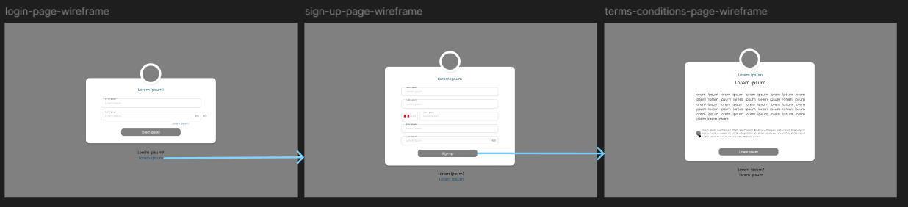
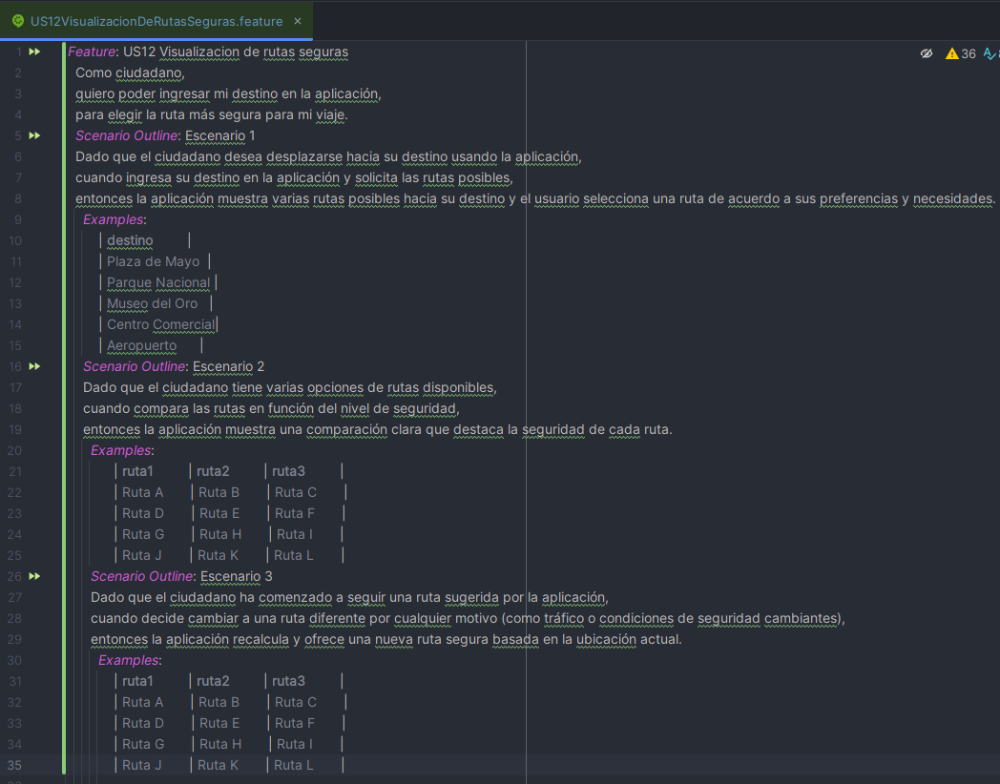
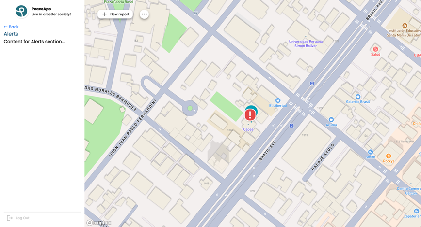

<hr>

# <center>Informe del Trabajo Final</center>

<p align="center">
    <strong>Universidad Peruana de Ciencias Aplicadas</strong><br>
    </img><br>
    <strong>Ingeniería de Software</strong><br>
    <strong>Diseño de Experimento de Ingeniería de Software - 4446</strong><br>
    <strong>Profesor: Lennin Percy Cenas Vasquez</strong><br>
</p>

<center>

#### Startup: **PeaceApp**

#### Product: **PeaceApp**

</center>

## Team  Members:

<div align="center">

|               Member                |    Code    |
| :---------------------------------: | :--------: |
| Arian Martin Rodriguez Vargas | U202212096 |
| Mauricio Abraham Rivo Rojas Sánchez | U202211572 |
|   Ramón Alejandro Jorge Arévalo	    | U20221D126 |
|    Fabia Alejandra Herrera Aguirre	    | U202219422 |
| Leonardo Félix Jesús Linares Tejada | U202211168 |

</div>

# Registro de Versiones del Informe

<table>
    <thead>
    <tr>
        <th>Version</th>
        <th>Fecha</th>
        <th>Participantes</th>
        <th>Observaciones</th>
    </tr>
    </thead>
    <tbody>
    <tr>
        <td>TB1</td>
        <td>29/03/2025</td>
        <td>Mauricio Abraham Rivo Rojas Sánchez	</td>
        <td>
        <ul>
        <li> User stories </li>
        <li> Antecedentes y Problemática </li>
        <li> Product Implementation & Deployment. </li>
        </ul>
        </td>
    </tr>
    <tr>
        <td>TB1</td>
        <td>17/04/2025</td>
        <td>Arian Martín Rodriguez Vargas</td>
        <td>
        <ul>
        <li> Competidores</li>
        <li> Entrevistas</li>
        <li> Needfinding </li>
        <li> Ubiquitous Language</li>
        <li> Software Configuration Management</li>
        </ul>
        </td>
    </tr>
    <tr>
        <td>TB1</td>
        <td>13/04/2025</td>
        <td>Ramón Alejandro Jorge Arévalo</td>
        <td>
        <ul>
        <li> StartUp Profile</li>
        <li> Solution Profile </li>
        <li> Segmento Objetivo </li>
        </ul>
        </td>
    </tr>
    <tr>
        <td rowspan="1">TB1</td>
        <td rowspan="1">20/04/2025</td>
        <td>Fabia Alejandra Herrera Aguirre</td>
        <td>
        <ul>
        <li> Style Guidelines</li>
        <li> Information Architecture </li>
        <li> Landing Page UI Design </li>
        <li> Web Applications UX/UI Design </li>
        <li> Web Application Prototyping</li>
        </ul>
        </td>
    </tr>
    <tr>
        <td rowspan="1">TB1</td>
        <td rowspan="1">16/04/2025</td>
        <td>Leonardo Félix Jesús Lineares Tejada</td>
        <td>
        <ul>
        <li> To-be Scenario Mapping </li>
        <li> User Stories </li>
        <li> Impact Mapping </li>
        <li> Product Backlog</li>
        </ul>
        </td>
    </tr>
    <tr>
        <td>TP1</td>
        <td>14/05/2025</td>
        <td>Mauricio Abraham Rivo Rojas Sánchez	</td>
        <td>
        <ul>
        <li> Testing suites & validation </li>
        <li> Core Integration Tests </li>
        <li> Core Behavior-Driven Development </li>
        </ul>
        </td>
    </tr>
    <tr>
        <td>TP1</td>
        <td>14/05/2025</td>
        <td>Arian Martín Rodriguez Vargas</td>
        <td>
        <ul>
        <li> Testing suites & validation </li>
        <li> Core Entities Unit Tests </li>
        <li> Core System Tests </li>
        </ul>
        </td>
    </tr>
    <tr>
        <td>TP1</td>
        <td>14/05/2025</td>
        <td>Ramón Alejandro Jorge Arévalo</td>
        <td>
        <ul>
        <li> DevOps Practices</li>
        <li> Continuous Integration </li>
        <li> Build & Test Suite Pipeline Components </li>
        </ul>
        </td>
    </tr>
    <tr>
        <td rowspan="1">TP1</td>
        <td rowspan="1">14/05/2025</td>
        <td>Fabia Alejandra Herrera Aguirre</td>
        <td>
        <ul>
        <li> DevOps Practices </li>
        <li> Continuous Deployment </li>
        <li> Production Deployment Pipeline Components </li>
        </ul>
        </td>
    </tr>
    <tr>
        <td rowspan="1">TP1</td>
        <td rowspan="1">14/05/2025</td>
        <td>Leonardo Félix Jesús Lineares Tejada</td>
        <td>
        <ul>
        <li> DevOps Practices </li>
        <li> Continuous Delivery </li>
        <li> Stages Deployment Pipeline Components </li>
        </ul>
        </td>
    </tr>
    </tbody>
</table>

# Project Report Collaboration Insights
En esta sección, registraremos los cambios y logros que se completaron en cada entrega del reporte.

## TB1
La entrega TB1 finalizó con éxito y están documentadas en el siguiente repositorio de Github perteneciente a la organización del equipo: https://github.com/Desarrollo-de-Experimentos/project-report Durante el desarrollo del informe se tuvieron en cuenta los siguientes aspectos:

Se redactaron y estructuraron los contenidos asignados a cada miembro utilizando el formato Markdown. Luego, se realizaron commits para garantizar el avance en el repositorio. Se completaron los siguientes puntos: capitulos I-IV, conclusiones y video exposición, en colaboración del equipo. Se llevaron a cabo reuniones semanales para hacer una revisión de lo elaborado por el grupo.

<div style="text-align: center;">
  
</div><br>

<div style="text-align: center;">
  
</div><br>

<div style="text-align: center;">
  
</div><br>

## TP1
La entrega TP1 finalizó con éxito y los avances están documentados. Adicionalmente, se realizaron pruebas unitarias, integración, sistema y de comportamiento, además, se incluye el propósito, criterio y descripción de cada prueba.

<div style="text-align: center;">
  
</div><br>

<div style="text-align: center;">
  
</div><br>

<div style="text-align: center;">
  
</div><br>


Todos hemos trabajado bajo GitFlow, en base a features y conventional commits para las colaboraciones en los repositorios.

## TB2
La entrega TB2 finalizó con éxito y los avances están documentados. Adicionalmente, se realizaron pruebas unitarias, integración, sistema y de comportamiento, además, se incluye el propósito, criterio y descripción de cada prueba. Además, se realizó y recibió auditorias con otros grupos, y hemos diseñado experimentos.

<div style="text-align: center;">
  
</div><br>

<div style="text-align: center;">
  
</div><br>

<div style="text-align: center;">
  
</div><br>

Todos hemos trabajado bajo GitFlow, en base a features y 
conventional commits para las colaboraciones en los repositorios, al igual que las entregas pasadas.

# Contenido
- [Registro de Versiones del Informe](#registro-de-versiones-del-informe)
- [Project Report Collaboration Insights](#project-report-collaboration-insights)
- [Capítulo I: Introducción](#capítulo-i-introducción)
   * [1.1. Startup Profile](#11-startup-profile)
      + [1.1.1. Descripción de la Startup](#111-descripción-de-la-startup)
      + [1.1.2. Perfiles de integrantes del equipo](#112-perfiles-de-integrantes-del-equipo)
   * [1.2. Solution Profile](#12-solution-profile)
      + [1.2.1. Antecedentes y problemática](#121-antecedentes-y-problemática)
      + [1.2.2. Lean UX Process](#122-lean-ux-process)
         - [1.2.2.1. Lean UX Problem Statements](#1221-lean-ux-problem-statements)
         - [1.2.2.2. Lean UX Assumptions](#1222-lean-ux-assumptions)
         - [1.2.2.3. Lean UX Hypothesis Statements.](#1223-lean-ux-hypothesis-statements)
         - [1.2.2.4. Lean UX Canvas](#1224-lean-ux-canvas)
   * [1.3. Segmentos objetivo](#13-segmentos-objetivo)
- [Capítulo II: Requirements Elicitation & Analysis](#capítulo-ii-requirements-elicitation--analysis)
   * [2.1. Competidores](#21-competidores)
      + [2.1.1. Análisis competitivo](#211-análisis-competitivo)
      + [2.1.2. Estrategias y tácticas frente a competidores](#212-estrategias-y-tácticas-frente-a-competidores)
   * [2.2. Entrevistas](#22-entrevistas)
      + [2.2.1. Diseño de entrevistas](#221-diseño-de-entrevistas)
      + [2.2.2. Registro de entrevistas](#222-registro-de-entrevistas)
      + [2.2.3. Análisis de entrevistas](#223-análisis-de-entrevistas)
   * [2.3. Needfinding](#23-needfinding)
      + [2.3.1. User Personas](#231-user-personas)
      + [2.3.2. User Task Matrix](#232-user-task-matrix)
      + [2.3.3. User Journey Mapping](#233-user-journey-mapping)
      + [2.3.4. Empathy Mapping](#234-empathy-mapping)
      + [2.3.5. As-is Scenario Mapping](#235-as-is-scenario-mapping)
   * [2.4. Ubiquitous Language](#24-ubiquitous-language)
- [Capítulo III: Requirements Specification](#capítulo-iii-requirements-specification)
   * [3.1. To-Be Scenario Mapping](#31-to-be-scenario-mapping)
         - [To-be Scenario Mapping Huésped:](#to-be-scenario-mapping-huésped)
         - [To-be Scenario Mapping Administrador:](#to-be-scenario-mapping-administrador)
         - [To-be Scenario Mapping Dueño:](#to-be-scenario-mapping-dueño)
   * [3.2. User Stories](#32-user-stories)
   * [3.3. Product Backlog](#33-product-backlog)
   * [3.4. Product Backlog](#34-impact-mapping)
- [Capítulo IV: Product Design](#capítulo-iv-product-design)
   * [4.1. Style Guidelines](#41-style-guidelines)
      + [4.1.1. General Style Guidelines](#411-general-style-guidelines)
      + [4.1.2. Web Style Guidelines](#412-web-style-guidelines)
      + [4.1.3. Mobile Style Guidelines](#413-mobile-style-guidelines)
         - [4.1.3.1. iOS Mobile Style Guidelines](#4131-ios-mobile-style-guidelines)
         - [4.1.3.2. Android Mobile Style Guidelines](#4132-android-mobile-style-guidelines)
   * [4.2. Information Architecture](#42-information-architecture)
      + [4.2.1. Organization Systems](#421-organization-systems)
      + [4.2.2. Labeling Systems](#422-labeling-systems)
      + [4.2.3. SEO Tags and Meta Tags](#423-seo-tags-and-meta-tags)
      + [4.2.4. Searching Systems](#424-searching-systems)
      + [4.2.5. Navigation Systems](#425-navigation-systems)
   * [4.3. Landing Page UI Design](#43-landing-page-ui-design)
      + [4.3.1. Landing Page Wireframe](#431-landing-page-wireframe)
      + [4.3.2. Landing Page Mock Up](#432-landing-page-mock-up)
      * [4.4. Mobile Applications UX/UI Design](#44-mobile-applications-uxui-design)
      + [4.4.1. Mobile Applications Wireframes](#441-mobile-applications-wireframes)
      + [4.4.2. Mobile Applications Wireflow Diagrams](#442-mobile-applications-wireflow-diagrams)
      + [4.4.3. Mobile Applications Mock-ups](#443-mobile-applications-mock-ups)
      + [4.4.4. Mobile Applications User Flow Diagrams](#444-mobile-applications-user-flow-diagrams)
   * [4.5. Mobile Applications Prototyping](#45-mobile-applications-prototyping)
      + [4.5.1. Android Mobile Applications Prototyping](#451-android-mobile-applications-prototyping)
      + [4.5.2. iOS Mobile Applications Prototyping](#452-ios-mobile-applications-prototyping)
   * [4.6. Web Applications UX/UI Design](#46-web-applications-uxui-design)
      + [4.6.1. Web Applications Wireframes](#461-web-applications-wireframes)
      + [4.6.2. Web Applications Wireflow Diagrams](#462-web-applications-wireflow-diagrams)
      + [4.6.3. Web Applications Mock-ups](#463-web-applications-mock-ups)
      + [4.6.4. Web Applications User Flow Diagrams](#464-web-applications-user-flow-diagrams)
   * [4.7. Web Applications Prototyping](#47-web-applications-prototyping)
   * [4.8. Domain-Driven Software Architecture](#48-domain-driven-software-architecture)
      + [4.8.1. Software Architecture Context Diagram](#481-software-architecture-context-diagram)
      + [4.8.2. Software Architecture Container Diagrams](#482-software-architecture-container-diagrams)
      + [4.8.3. Software Architecture Components Diagrams](#483-software-architecture-components-diagrams)
   * [4.9. Software Object-Oriented Design](#49-software-object-oriented-design)
      + [4.9.1. Class Diagrams](#491-class-diagrams)
      + [4.9.2. Class Dictionary](#492-class-dictionary)
   * [4.10. Database Design](#410-database-design)
      + [4.10.1. Relational/Non-Relational Database Diagram](#4101-relationalnon-relational-database-diagram)
- [Capítulo V: Product Implementation](#capítulo-v-product-implementation)
   * [5.1. Software Configuration Management](#51-software-configuration-management)
      + [5.1.1. Software Development Environment Configuration](#511-software-development-environment-configuration)
      + [5.1.2. Source Code Management](#512-source-code-management)
      + [5.1.3. Source Code Style Guide & Conventions](#513-source-code-style-guide--conventions)
      + [5.1.4. Software Deployment Configuration](#514-software-deployment-configuration)
   * [5.2. Product Implementation & Deployment](#52-product-implementation--deployment)
      + [5.2.1. Sprint Backlogs](#521-sprint-backlogs)
      + [5.2.2. Implemented Landing Page Evidence](#522-implemented-landing-page-evidence)
      + [5.2.3. Implemented Frontend-Web Application Evidence](#523-implemented-frontend-web-application-evidence)
      + [5.2.4. Implemented Native-Mobile Application Evidence](#524-implemented-native-mobile-application-evidence)
      + [5.2.5. Implemented RESTful API and/or Serverless Backend Evidence](#525-implemented-restful-api-andor-serverless-backend-evidence)
      + [5.2.6. RESTful API documentation](#526-restful-api-documentation)
      + [5.2.7. Team Collaboration Insights](#527-team-collaboration-insights)
   * [5.3. Video About-the-Product](#53-video-about-the-product)
- [Capítulo VI: Product Verification & Validation](#capítulo-vi-product-verification--validation)
   * [6.1. Testing suites & validation](#61-testing-suites--validation)
      + [6.1.1. Core Entities Unit Tests](#611-core-entities-unit-tests)
      + [6.1.2. Core Integration Tests](#612-core-integration-tests)
      + [6.1.3. Core Behavior-Driven Development](#613-core-behavior-driven-development)
      + [6.1.4. Core System Tests](#614-core-system-tests)
   * [6.2. Static testing & Verification](#62-static-testing--verification)
      + [6.2.1. Static Code Analysis](#621-static-code-analysis)
          - [6.2.1.1 Coding standard & Code conventions](#6211-coding-standard--code-conventions)
          - [6.2.2.1 Code Quality & Code Security](#6221-code-quality--code-security)
      + [6.2.2. Reviews](#622-reviews)
   * [6.3. Validation Interviews](#63-validation-interviews)
      + [6.3.1. Diseño de Entrevistas](#631-diseño-de-entrevistas)
      + [6.3.2. Registro de Entrevistas](#632-registro-de-entrevistas)
      + [6.3.3. Evaluaciones según heurísticas](#633-evaluaciones-según-heurísticas)
   * [6.4. Auditoría de Experiencias de Usuario](#64-auditoría-de-experiencias-de-usuario)
      + [6.4.1. Auditoría realizada](#641-auditoría-realizada)
          - [6.4.1.1. Información del grupo auditado](#6411-información-del-grupo-auditado)
          - [6.4.1.2. Cronograma de auditoría realizada](#6412-cronograma-de-auditoría-realizada)
          - [6.4.1.3. Contenido de auditoría realizada](#6413-contenido-de-auditoría-realizada)
      + [6.4.2. Auditoría recibida](#642-auditoría-recibida)
          - [6.4.2.1. Información del grupo auditor](#6421-información-del-grupo-auditor)
          - [6.4.2.2. Cronograma de auditoría recibida](#6422-cronograma-de-auditoría-recibida)
          - [6.4.2.3. Contenido de auditoría recibida](#6423-contenido-de-auditoría-recibida)
          - [6.4.2.4. Resumen de modificaciones para subsanar hallazgos](#6424-resumen-de-modificaciones-para-subsanar-hallazgos)
- [Capítulo VII: DevOps Practices](#capítulo-vii-devops-practices)
   * [7.1. Continuous Integration](#71-continuous-integration)
      + [7.1.1. Tools and Practices](#711-tools-and-practices)
      + [7.1.2. Build & Test Suite Pipeline Components](#712-build--test-suite-pipeline-components)
   * [7.2. Continuous Delivery](#72-continuous-delivery)
      + [7.2.1. Tools and Practices](#721-tools-and-practices)
      + [7.2.2. Stages Deployment Pipeline Components](#722-stages-deployment-pipeline-components)
   * [7.3. Continuous Deployment](#73-continuous-deployment)
      + [7.3.1. Tools and Practices](#731-tools-and-practices)
      + [7.3.2. Production Deployment Pipeline Components](#732-production-deployment-pipeline-components)
   * [7.4. Continuous Monitoring](#74-continuous-monitoring)
      + [7.4.1. Tools and Practices](#741-tools-and-practices)
      + [7.4.2. Monitoring Pipeline Components](#742-monitoring-pipeline-components)
      + [7.4.3. Alerting Pipeline Components](#743-alerting-pipeline-components)
      + [7.4.4. Notification Pipeline Components](#744-notification-pipeline-components)
- [Capítulo VIII: Experiment-Driven Development](#capítulo-viii-experiment-driven-development)
   * [8.1. Experiment Planning](#81-experiment-planning)
      + [8.1.1. As-Is Summary](#811-as-is-summary)
      + [8.1.2. Raw Material: Assumptions, Knowledge Gaps, Ideas, Claims](#812-raw-material-assumptions-knowledge-gaps-ideas-claims)
      + [8.1.3. Experiment-Ready Questions](#813-experiment-ready-questions)
      + [8.1.4. Question Backlog](#814-question-backlog)
      + [8.1.5. Experiment Cards](#815-experiment-cards)
   * [8.2. Experiment Design](#82-experiment-design)
      + [8.2.1. Hypotheses](#821-hypotheses)
      + [8.2.2. Measures](#822-measures)
      + [8.2.3. Conditions](#823-conditions)
      + [8.2.4. Scale Calculations and Decisions](#824-scale-calculations-and-decisions)
      + [8.2.5. Methods Selection](#825-methods-selection)
      + [8.2.6. Data Analytics: Goals, KPIs and Metrics Selection](#826-data-analytics-goals-kpis-and-metrics-selection)
      + [8.2.7. Web and Mobile Tracking Plan](#827-web-and-mobile-tracking-plan)
   * [8.3. Experimentation](#83-experimentation)
      + [8.3.1. To-Be User Stories](#831-to-be-user-stories)
      + [8.3.2. To-Be Product Backlog](#832-to-be-product-backlog)
- [Conclusiones](#conclusiones)
   * [Recomendaciones](#recomendaciones)
- [Video About-the-Team](#video-about-the-team)
- [Bibliografía](#bibliografía)


# Student Outcome
En Ingeniería de Software, el logro de curso contribuye a alcanzar el:

ABET – EAC - Student Outcome 4: La capacidad de reconocer responsabilidades éticas y profesionales en situaciones de ingeniería y hacer juicios informados, que deben considerar el impacto de las soluciones de ingeniería en contextos globales, económicos, ambientales y sociales.

<table> <tr> <th>Criterio Específico</th> <th>Acciones Realizadas</th> <th>Conclusiones</th> </tr> <tr> <td>4.c.1 Reconoce responsabilidad ética y profesional en situaciones de ingeniería de software</td> <td> <strong>TB1:</strong><br/> Mauricio Rojas: En este entregable, trabajé responsablemente con mi equipo y mantuve constante comunicación para avanzar de la mejor manera. Así, reconozco responsabilidad ética y profesional en situaciones de ingeniería de software.<br/> Ramon Jorge: Me enfoqué en apoyar a mi grupo con los puntos necesarios, en especial el StartUp Profile y todos los puntos del Solution Profile, incluyendo el Lean UX Process.<br/> Arian Rodriguez: Cumplí con todos los puntos asignados, realicé análisis de competidores y del mercado objetivo, así como la definición de segmentos y necesidades del usuario.<br/> Fabia Herrera: Apoyé con el diseño de la interfaz de usuario, asegurando que fuera intuitiva, además de definir la arquitectura de la información y el diseño de la página de inicio.<br/> Leonardo Linares: Reconocí la responsabilidad ética y profesional mediante el desarrollo de User Stories, To-Be Scenario Mapping y los wireframes de la aplicación.<br/><br/> <strong>TP1:</strong><br/> Mauricio Rojas: Trabajé en conjunto con mi grupo para realizar los testing suites, centrándome en los tests de integración y comportamiento (BDD).<br/> Ramon Jorge: Ayudé a mejorar secciones del informe, como los wireframes.<br/> Arian Rodriguez: Realicé pruebas unitarias con JUnit a partir de investigación propia.<br/> Fabia Herrera: Apoyé en la mejora continua de la interfaz de usuario y arquitectura de la información.<br/> Leonardo Linares: Contribuí en el capítulo de DevOps Practices, asegurando la validez de la información sobre integración, entrega y despliegue continuo.<br/><br/> <strong>TB2:</strong><br/> Mauricio Rojas: Contribuí activamente en la validación final de funcionalidades y documentación técnica, asegurando calidad y cumplimiento de estándares.<br/> Ramon Jorge: Apoyé en la integración final del sistema, manteniendo comunicación continua con el equipo.<br/> Arian Rodriguez: Revisé y validé funcionalidades implementadas y ayudé en la documentación de cierre del proyecto.<br/> Fabia Herrera: Revisé la experiencia de usuario final e hice ajustes para mejorar la usabilidad antes de la entrega.<br/> Leonardo Linares: Apoyé con el capítulo de monitoreo continuo, describiendo herramientas y prácticas utilizadas. </td> <td> <strong>TB1:</strong> Se reconoció la responsabilidad ética y profesional mediante el cumplimiento de tareas asignadas, la colaboración activa y la contribución en diseño, análisis y planificación del sistema. Cada integrante asumió compromisos claves para asegurar el avance responsable del proyecto.<br/><br/> <strong>TP1:</strong> Se reflejó compromiso profesional al aplicar pruebas de diversos niveles (unitarias, integración, sistema, BDD) siguiendo buenas prácticas y documentando el proceso DevOps. La ética profesional se evidenció en la validación y mejora de funcionalidades.<br/><br/> <strong>TB2:</strong> El equipo mostró responsabilidad ética y profesional en las validaciones finales, documentación, revisión de calidad y preparación para el cierre del proyecto. La comunicación constante y el compromiso con la calidad evidencian una práctica ética sólida. </td> </tr> <tr> <td>4.c.2 Emite juicios informados considerando el impacto de las soluciones de ingeniería de software en contextos globales, económicos, ambientales y sociales</td> <td> <strong>TB1:</strong><br/> Mauricio Rojas: Emití juicios sobre el impacto de nuestra solución para proponer mejoras y añadidos al sistema.<br/> Ramon Jorge: Identificamos detalles del problema y potenciales mejoras traducidas en User Stories. También colaboré en identificar segmentos objetivos y desarrollar Wireflows.<br/> Arian Rodriguez: Analicé cómo PeaceApp puede contribuir a mejorar la seguridad ciudadana en Lima. También identifiqué oportunidades de diferenciación en el mercado.<br/> Fabia Herrera: Consideré el impacto de la interfaz en la percepción de seguridad del usuario.<br/> Leonardo Linares: Tomé decisiones informadas considerando el impacto del sistema mediante User Stories, Impact Mapping y wireframes.<br/><br/> <strong>TP1:</strong><br/> Mauricio Rojas: Validé los impactos funcionales mediante pruebas de integración y comportamiento sobre clases clave.<br/> Ramon Jorge: Realicé la sección de integración continua considerando el contexto de pruebas anteriores.<br/> Arian Rodriguez: Integré pruebas de sistema con Selenium IDE para evaluar posibles comportamientos reales del usuario.<br/> Fabia Herrera: Documenté el proceso de Continuous Deployment, considerando la usabilidad e impacto en la vida diaria.<br/> Leonardo Linares: Contribuí al desarrollo de Continuous Delivery, destacando herramientas clave y automatización.<br/><br/> <strong>TB2:</strong><br/> Mauricio Rojas: Reflexioné sobre los impactos futuros de la aplicación en seguridad ciudadana y su escalabilidad.<br/> Ramon Jorge: Analicé la adaptabilidad de la solución a otros distritos y contextos socioeconómicos.<br/> Arian Rodriguez: Evalué el impacto del sistema final en la comunidad respecto a los objetivos iniciales.<br/> Fabia Herrera: Analicé cómo el diseño de interfaz influye en la adopción por parte de distintos grupos sociales.<br/> Leonardo Linares: Contribuí en la documentación del monitoreo continuo y apoyé en entrevistas para comprender el impacto real del sistema. </td> <td> <strong>TB1:</strong> Se emitieron juicios informados sobre el impacto del sistema en contextos reales, identificando claramente los problemas sociales a resolver, los usuarios objetivo y los beneficios esperados de la aplicación.<br/><br/> <strong>TP1:</strong> Se evaluaron los impactos de las funcionalidades implementadas mediante pruebas orientadas a validar los requerimientos definidos. Se identificaron mejoras antes del despliegue y se garantizó que la solución esté alineada con las necesidades sociales.<br/><br/> <strong>TB2:</strong> Se profundizó el análisis del impacto de la solución en el entorno social, económico y tecnológico. Se reflexionó sobre la escalabilidad, adaptabilidad e impacto positivo a largo plazo, y se propusieron mejoras finales alineadas con el contexto real de uso. </td> </tr> </table>


---

# Capítulo I: Introducción

## 1.1. Startup Profile

### 1.1.1. Descripción de la Startup

En respuesta a la creciente inseguridad ciudadana en Perú, PeaceApp nace como una solución innovadora para mejorar la seguridad en las calles. En Lima Metropolitana, el 89,9% de la población percibe su entorno como inseguro (INEI, 2024), una cifra alarmante que no podemos ignorar.
Misión: Nuestra misión es garantizar la seguridad de nuestros usuarios, para que puedan transitar sin miedo alguno por las distintas calles del Perú.
Visión: Vemos el mundo en constante cambio y buscamos ser parte de ello. Creemos que todas las personas deben poder sentirse seguras de vivir y transitar en su propio país, y que los gobiernos deben encargarse de ello. Por eso, aspiramos a ser reconocidos como líderes en el mercado de seguridad, gracias a nuestra labor en beneficio de todos nuestros usuarios.
¿Cómo lo logramos? PeaceApp se presenta como una herramienta esencial para cualquier ciudadano preocupado por su seguridad. Con nuestra aplicación, los usuarios pueden acceder a un mapa interactivo que muestra los niveles de seguridad en diferentes zonas, permitiendo tomar decisiones más informadas. Además, ofrecemos la posibilidad de denunciar crímenes de forma rápida y sencilla, adjuntando fotos, audios o videos, ya sea de manera pública o anónima.
Sin embargo, PeaceApp va más allá: permite a los usuarios compartir su ubicación en tiempo real con sus contactos de confianza para que puedan monitorear su trayecto, brindando tranquilidad en sus desplazamientos. Además, contamos con un sistema de marcación rápida que facilita el envío de alertas de emergencia a la Policía Nacional del Perú (PNP) y a los bomberos en situaciones críticas.
Con PeaceApp, construimos un Perú más seguro, paso a paso.


### 1.1.2. Perfiles de integrantes del equipo

<div style="text-align: center;">
  
</div><br>

<div style="text-align: center;">
  
</div><br>

<div style="text-align: center;">
  
</div><br>

<div style="text-align: center;">
  
</div><br>

<div style="text-align: center;">
  
</div><br>

## 1.2. Solution Profile

### 1.2.1. Antecedentes y problemática

**What (Qué)**: PeaceApp es un sistema de software diseñada para empoderar a los usuarios en su vida diaria, ayudándolos a navegar de manera más segura por las calles de Lima Metropolitana. Al crear una comunidad entre ciudadanos y autoridades, PeaceApp garantiza el acceso a información detallada y confiable sobre la seguridad en tiempo real, fomentando una red de colaboración que beneficia a todos.

**When (Cuándo):** PeaceApp estará disponible las 24 horas del día, los 7 días de la semana, ofreciendo asistencia continua y actualizada en cualquier momento que los usuarios lo necesiten.

**Where (Dónde):** PeaceApp puede ser utilizada en cualquier lugar y momento, siempre que el usuario cuente con una conexión a internet. La aplicación se adapta automáticamente a la ubicación del usuario, actualizando la información de seguridad local en tiempo real para brindar datos precisos y relevantes.

**Who (Quién):** PeaceApp está dirigida a los ciudadanos que transitan por las calles de Lima Metropolitana. Los usuarios no solo podrán beneficiarse de la información proporcionada, sino que también tendrán la capacidad de contribuir al bienestar de la comunidad al reportar incidentes y situaciones de riesgo, ayudando a mantener la plataforma actualizada y confiable para todos.

**Why (Por qué):** PeaceApp surge como respuesta al preocupante aumento de la delincuencia en Lima y en todo el país. Nuestro objetivo es proporcionar a los ciudadanos una herramienta que les permita estar informados sobre los sucesos más recientes en su entorno, incrementando su seguridad personal y ayudando a otros transeúntes a evitar situaciones peligrosas.

**How (Cómo):** PeaceApp se mantiene actualizada gracias al constante aporte de los usuarios, quienes reportan incidentes y colaboran con la comunidad. Además, la aplicación utiliza tecnología avanzada de geolocalización y análisis de datos para ofrecer información precisa en tiempo real.

**How Much (Cuánto):** PeaceApp estará disponible de forma gratuita para todos los usuarios. Sin embargo, para sostener el desarrollo y mantenimiento de la plataforma, la aplicación incluirá anuncios integrados.


### 1.2.2. Lean UX Process

#### 1.2.2.1. Lean UX Problem Statements

El propósito de nuestro servicio es empoderar a los ciudadanos ayudándolos a moverse de manera segura por su entorno. Con nuestra aplicación, los usuarios acceden a un mapa de calor que muestra la peligrosidad de las diferentes zonas de Lima Metropolitana, actualizado en tiempo real según los reportes enviados por otros usuarios. Hemos identificado una creciente insatisfacción en la población respecto a la seguridad en las calles, ya que los hurtos y delitos son una preocupación constante. Según el último resultado de la ENAPRES para el semestre móvil Ene-Jun 2024, publicado por el INEI, el 27.7% de la población mayor de 15 años en Perú ha sido víctima de algún hecho delictivo.
Ante ello, ¿cómo podemos transformar la percepción de inseguridad en Lima y ofrecer a los ciudadanos una herramienta que realmente impacte en su día a día?

#### 1.2.2.2. Lean UX Assumptions
Ahora que hemos analizado la problemática y contamos con una visión clara de cómo abordar la solución, es crucial identificar qué empresas comparten características similares a las nuestras y cómo han evolucionado con el tiempo. Esto nos permitirá aprender de su experiencia y adaptarnos mejor al mercado.

**Assumptions:**
1.	Los ciudadanos de Lima necesitan una aplicación que les ofrezca rutas seguras para moverse por la ciudad. Con el aumento de la delincuencia, es esencial que los usuarios puedan planificar sus trayectos de manera informada y evitar zonas peligrosas.

2.	Los ciudadanos valoran sentirse parte de una comunidad que les permita reportar incidentes y ver esos reportes reflejados en un mapa interactivo. La posibilidad de contribuir a la seguridad de su entorno genera un sentido de pertenencia y confianza en la aplicación.

3.	Actualmente, no existe una competencia relevante en el mercado que ofrezca una solución integral como la nuestra. Esto nos posiciona como pioneros y líderes potenciales en el sector de la seguridad ciudadana en Lima.

4.	Las entidades que utilicen nuestra aplicación obtendrán datos valiosos que les ayudarán a combatir la criminalidad de manera más efectiva. Al tener acceso a información en tiempo real sobre las zonas más conflictivas, podrán tomar decisiones informadas.

5.	Los ciudadanos comunes estarán interesados en nuestra aplicación, ya que les proporciona una herramienta práctica para mejorar su seguridad diaria. La simplicidad y utilidad de la aplicación atraerán a un público amplio.

6.	Las entidades públicas de Perú necesitan este tipo de soluciones tecnológicas para mejorar su capacidad de respuesta ante la criminalidad. Nuestra aplicación les permitirá actuar de manera más proactiva y estratégica.

**Business Outcomes:**
•	Generar ingresos sostenibles a través de la venta de la aplicación a entidades públicas y privadas.
•	Mejorar la calidad de vida de los ciudadanos del Perú al reducir su exposición a riesgos en las calles.
•	Contribuir a la disminución de la delincuencia en el país al facilitar la detección de zonas peligrosas y la respuesta oportuna.

**User Outcomes:**
1.	¿Quién es el usuario? Cualquier ciudadano que viva o trabaje en zonas donde las entidades están asociadas con nuestra plataforma.
2.	¿Dónde encaja nuestro producto en su vida diaria? Nuestra aplicación se convierte en una herramienta indispensable para planificar trayectos seguros y reportar incidentes, brindando tranquilidad en su rutina diaria.
3.	¿Qué desafíos enfrenta nuestro producto? Un desafío importante es que nuestra generación de ingresos depende de la capacidad de atraer y mantener asociaciones con entidades públicas y privadas.
4.	¿Cuándo y cómo es usado nuestro producto? Los usuarios utilizan la aplicación al desplazarse por áreas desconocidas o al desear reportar incidentes para proteger a otros. La aplicación se convierte en una herramienta diaria para asegurar trayectos más seguros.
5.	¿Qué características son importantes? La aplicación debe ser intuitiva y fácil de usar, con acceso rápido a la información relevante y una navegación clara. La actualización en tiempo real es fundamental para su efectividad.
6.	¿Cómo debe verse y comportarse nuestro producto? La aplicación debe ser visualmente atractiva, con una paleta de colores que sea agradable y fácil de leer. El proceso de registro debe ser simple y accesible para todos los usuarios, maximizando la usabilidad.
User Benefits:
1.	Evitar robos y otros incidentes peligrosos al moverse por la ciudad, gracias a la información proporcionada en tiempo real.
2.	Acceso a un mapa de calor que muestra zonas peligrosas y rutas seguras, ayudando a los usuarios a tomar decisiones informadas.
3.	Sentirse parte de una comunidad que contribuye a la seguridad colectiva, fortaleciendo el sentido de pertenencia y confianza.


#### 1.2.2.3. Lean UX Hypothesis Statements
•	Hypothesis Statement 01:

Creemos que la aplicación logrará formar una comunidad activa y comprometida con la seguridad ciudadana.
Sabremos que hemos tenido éxito cuando se observe un aumento constante en la cantidad de usuarios registrados diariamente y estos participen en la aplicación realizando reportes.

•	Hypothesis Statement 02: 

Creemos que los ciudadanos valorarán la posibilidad de reportar incidentes y recibir información en tiempo real sobre la seguridad de su entorno.
Sabremos que hemos tenido éxito cuando veamos un alto porcentaje de usuarios activos que reporten incidentes con regularidad y utilicen la aplicación para consultar el mapa de calor antes de desplazarse.

•	Hypothesis Statement 03:

Creemos que nuestra aplicación será capaz de reducir la percepción de inseguridad en las zonas donde se implemente.
Sabremos que hemos tenido éxito cuando encuestas de percepción de seguridad reflejen una disminución del miedo al crimen en las áreas donde los usuarios utilizan PeaceApp activamente.

•	Hypothesis Statement 04:
Creemos que la implementación de anuncios en la versión gratuita de la aplicación no afectará negativamente la experiencia del usuario.
Sabremos que hemos tenido éxito cuando mantengamos un alto índice de retención de usuarios en la versión gratuita y obtengamos ingresos sostenibles a través de la publicidad.

•	Hypothesis Statement 05:

Creemos que la aplicación será intuitiva y fácil de usar para personas de todas las edades y niveles de experiencia tecnológica.
Sabremos que hemos tenido éxito cuando las pruebas de usabilidad muestren que la mayoría de los usuarios completan tareas clave en la aplicación sin dificultad.

•	Hypothesis Statement 06:

Creemos que el uso de geolocalización en tiempo real mejorará la precisión y relevancia de los datos de seguridad proporcionados a los usuarios.
Sabremos que hemos tenido éxito cuando los usuarios confíen en la información del mapa de calor y se apoyen en ella para tomar decisiones sobre sus rutas diarias.

•	Hypothesis Statement 07: 

Creemos que la posibilidad de compartir la ubicación en tiempo real con contactos de confianza aumentará la sensación de seguridad entre los usuarios.
Sabremos que hemos tenido éxito cuando una cantidad significativa de usuarios utilicen esta función regularmente.


#### 1.2.2.4. Lean UX Canvas


**Enlace al esquema hecho en Miro: https://tinyurl.com/ymmmjj7t**

## 1.3. Segmentos objetivo
| Variable | Segmento |
|------------------|----------------|
| Geográfica | Ubicación: Lima Metropolitana, con especial enfoque en zonas con altos índices de delincuencia y tráfico peatonal. |
| Demográfica | Edad: Adultos jóvenes y mayores (18-65 años) Género: Hombres y mujeres. Nivel socioeconómico: C1, C2 y C3, quienes suelen transitar por las calles de Lima para trabajo, estudio o actividades personales. Ocupación: Estudiantes, profesionales, trabajadores informales, y amas de casa. |
| Psicológica | Actitudes y valores: Personas preocupadas por su seguridad personal y la de sus seres queridos, con alta sensibilidad a temas de delincuencia y seguridad. Motivaciones: Buscan tranquilidad al transitar por la ciudad, desean estar informados sobre situaciones de riesgo y prefieren tomar decisiones basadas en información confiable. Estilo de vida: Ciudadanos activos que suelen desplazarse frecuentemente por la ciudad. |
| Función de comportamiento | Necesidades: Acceso a información en tiempo real sobre la seguridad en su entorno inmediato. Comportamiento de compra/uso: Uso frecuente de aplicaciones móviles para obtener información y comunicación, propensos a adoptar nuevas tecnologías que mejoren su seguridad. Lealtad: Usuarios que buscan plataformas confiables y colaborativas que les permitan contribuir a la seguridad comunitaria. |

---

# Capítulo II: Requirements Elicitation & Analysis

## 2.1. Competidores

| Principales competidores | Características | Diferencias | Limitaciones |
|---------------------------|-----------------|-------------|--------------|
| Safecity | Reportes Anónimos: Permite a los usuarios reportar incidentes de manera completamente anónima. Mapeo de Seguridad: Los datos se usan para crear mapas interactivos que muestran las áreas donde se reportan más incidentes. Colaboración con ONG: SafeCity colabora con organizaciones no gubernamentales para utilizar los datos recopilados en campañas de concientización y políticas públicas. | Foco en el Acoso: Mientras que PeaceApp abarca una amplia gama de incidentes, SafeCity se especializa en el reporte y la prevención del acoso. Análisis de Datos: SafeCity ofrece un análisis más profundo de los datos para propósitos educativos y de políticas públicas. | Especificidad: El enfoque en el acoso puede limitar su utilidad para usuarios que buscan una herramienta más general de seguridad. Cobertura Limitada: SafeCity no está disponible en todas las ciudades, a diferencia de PeaceApp que se enfoca en Lima Metropolitana. |
| Nextdoor | Foros Comunitarios: Espacios donde los vecinos pueden discutir temas de seguridad, reportar incidentes, y organizar eventos. Alertas de Seguridad: Los usuarios pueden recibir notificaciones sobre incidentes de seguridad en su área. Redes de Vecindario: Permite la creación de grupos privados basados en la ubicación del usuario. | Enfoque en la Comunidad: Nextdoor es más una red social con un enfoque amplio, mientras que PeaceApp está específicamente diseñada para la seguridad ciudadana. Cobertura: Disponible en varias ciudades a nivel internacional, no se limita solo a Lima. | No Específica de Seguridad: Aunque tiene funcionalidades de seguridad, Nextdoor es una plataforma de propósito general, no una aplicación de seguridad dedicada. Privacidad: La naturaleza social de la plataforma puede plantear preocupaciones sobre la privacidad, especialmente en temas de seguridad. |
| Waze | Alcance: Aunque es principalmente una aplicación de navegación, Waze permite reportar incidentes en la vía pública, incluyendo accidentes y peligros. Interacción: Los usuarios pueden reportar incidentes que otros conductores verán en tiempo real. Popularidad: Amplia base de usuarios, lo que incrementa la cantidad de reportes en tiempo real. | Waze no está específicamente diseñada para la seguridad personal o la prevención de delitos, sino para la navegación y tráfico. Su comunidad está más orientada a conductores que a peatones o personas que transitan a pie. | No está enfocada en la seguridad ciudadana de forma específica. La información sobre incidentes podría no ser tan detallada ni orientada a la prevención de delitos. |

### 2.1.1. Análisis competitivo

<table border="1" style="border-collapse: collapse; width: 100%;">
    <thead>
        <tr>
            <th colspan="7" style="text-align: center;">Competitive Analysis Landscape</th>
        </tr>
        <tr>
            <td colspan="2">¿Por qué llevar a cabo este análisis?</td>
            <td colspan="5">Porque de esta manera, se conoce a los potenciales competidores en el mercado, evaluamos y analizamos lo que ofrecen para aprovechar algunos puntos débiles encontrados y de esta manera diferenciarnos de ellos.</td>
        </tr>
    </thead>
    <tbody>
        <tr style="text-align: center;">
            <td colspan="2">Empresas</td>
            <td><strong>SafeCity</strong><br></td>
            <td><strong>NextDoor</strong><br></td>
            <td><strong>Waze</strong><br></td>
            <td><strong>PeaceaApp</strong><br></td>
        </tr>
        <tr>
            <td rowspan="2" style="writing-mode: vertical-lr; text-align: center;">Perfil</td>
            <td>Overview</td>
            <td>SafeCity es una aplicación que permite a los usuarios reportar incidentes de acoso y violencia en tiempo real, principalmente enfocada en la seguridad de las mujeres. La plataforma utiliza estos reportes para crear mapas de calor que visualizan las áreas más peligrosas, ayudando a otros usuarios a evitar esas zonas.</td>
            <td>Nextdoor es una red social privada para vecindarios, que conecta a los residentes de una misma comunidad para discutir temas locales, compartir recomendaciones, organizar eventos y mantenerse informados sobre lo que ocurre en su entorno.</td>
            <td>Waze es una aplicación de navegación que utiliza la información proporcionada por los usuarios para ofrecer rutas en tiempo real, evitando tráfico, accidentes y otros obstáculos en la carretera.</td>
            <td>PeaceApp es una aplicación móvil enfocada en mejorar la seguridad ciudadana en Lima Metropolitana, proporcionando información en tiempo real sobre incidentes y riesgos en las calles.</td>
        </tr>
        <tr>
            <td>¿Qué valor ofrece a los clientes?</td>
            <td>Seguridad y prevención: Proporciona a los usuarios una herramienta para identificar y evitar áreas peligrosas basadas en reportes en tiempo real. Empoderamiento: Empodera a las mujeres y a otras víctimas al darles una plataforma para denunciar incidentes de acoso. Comunicación anónima: Permite reportes anónimos, lo que ayuda a aumentar la cantidad de reportes sin temor a represalias.</td>
            <td>Conexión comunitaria: Facilita la interacción entre vecinos, fortaleciendo la sensación de comunidad.
            Seguridad y vigilancia vecinal: Permite a los usuarios reportar y discutir incidentes de seguridad, fomentando una red de vigilancia vecinal.
            Recursos locales: Ofrece una plataforma para que los usuarios compartan recomendaciones de servicios y negocios locales, creando un entorno de apoyo mutuo.
            </td>
            <td>Eficiencia en desplazamientos: Proporciona rutas optimizadas en tiempo real, ahorrando tiempo y evitando atascos.
            Seguridad en la conducción: Informa sobre peligros en la carretera, como accidentes y obstáculos, ayudando a los conductores a tomar decisiones informadas.
            Comunidad activa: Los usuarios contribuyen activamente con información sobre el tráfico, lo que enriquece la precisión y utilidad de la aplicación.
            </td>
            <td>Seguridad en tiempo real: Los usuarios reciben alertas sobre situaciones de riesgo en su entorno.
            Colaboración ciudadana: Facilita la comunicación entre ciudadanos y autoridades para reportar incidentes.
            Empoderamiento: Permite a los usuarios contribuir activamente a la seguridad de su comunidad.
            Accesibilidad: Interfaz fácil de usar para personas de todas las edades.
            Prevención de riesgos: Ayuda a los usuarios a evitar áreas peligrosas y mejorar su seguridad personal.
            </td>
        </tr>
        <tr>
            <td rowspan="2" style="writing-mode: vertical-lr; text-align: center;">Perfil de Marketing</td>
            <td>Mercado objetivo</td>
            <td><strong>Demográfico:</strong> Principalmente mujeres de todas las edades, especialmente en áreas urbanas donde el acoso y la violencia de género son más prevalentes.
            <strong>Geográfico:</strong> Focalizado en ciudades con altos índices de violencia y acoso, especialmente en India y otros países donde la inseguridad para las mujeres es una preocupación significativa.
            <strong>Psicológico:</strong> Individuos conscientes de la seguridad y que buscan activamente herramientas para protegerse y empoderarse frente a situaciones de acoso.
            <strong>Comportamiento:</strong> Usuarios que valoran la seguridad personal y están dispuestos a contribuir a una comunidad compartiendo incidentes para prevenir futuros ataques.
            </td>
            <td><strong>Demográfico:</strong> Adultos de todas las edades, propietarios de viviendas y residentes de vecindarios interesados en conectarse con sus vecinos.
            <strong>Geográfico:</strong> Vecindarios en áreas urbanas y suburbanas en Estados Unidos, Reino Unido, y otros países donde la vida comunitaria es fuerte.
            <strong>Psicológico:</strong> Personas que valoran la interacción comunitaria, la seguridad en el vecindario y el acceso a recursos locales.
            <strong>Comportamiento:</strong> Usuarios que buscan construir relaciones más estrechas con sus vecinos y mantenerse informados sobre lo que ocurre en su comunidad.
            </td>
            <td><strong>Demográfico:</strong> Conductores de todas las edades, especialmente aquellos que conducen diariamente en áreas urbanas congestionadas.
            <strong>Geográfico:</strong> Principalmente en ciudades grandes con problemas de tráfico significativos a nivel mundial.
            <strong>Psicológico:</strong> Conductores que valoran la eficiencia en sus desplazamientos y están dispuestos a utilizar la tecnología para evitar el tráfico.
            <strong>Comportamiento:</strong> Usuarios que buscan optimizar sus rutas y minimizar el tiempo de viaje mediante la navegación en tiempo real.
            </td>
            <td> <strong>Demográfico:</strong> Ciudadanos de todas las edades, en su mayoría residentes urbanos, que están preocupados por la seguridad personal y buscan soluciones para prevenir situaciones de riesgo.
            <strong>Geográfico:</strong> Enfocado en Lima Metropolitana, una ciudad con desafíos de seguridad que requiere atención y recursos adicionales para mejorar la seguridad ciudadana.
            <strong>Psicológico:</strong> Individuos que valoran su seguridad y buscan herramientas efectivas para mantenerse informados y protegidos en su entorno. Personas proactivas que quieren colaborar con la comunidad para mejorar la seguridad.
            <strong>Comportamiento:</strong> Usuarios que frecuentemente se enfrentan a situaciones de inseguridad y están dispuestos a participar activamente reportando incidentes y compartiendo información para mantener la comunidad segura.
            </td>
        </tr>
        <tr>
            <td>Estrategias de marketing</td>
            <td>Campañas de concienciación: Colaboraciones con ONG y movimientos feministas para sensibilizar sobre la seguridad de las mujeres y promover el uso de la aplicación.
            Publicidad digital: Anuncios segmentados en redes sociales y plataformas digitales que lleguen a mujeres en áreas urbanas.
            Marketing comunitario: Promoción de la aplicación en comunidades locales y eventos relacionados con la seguridad de las mujeres.
            Relaciones públicas: Historias de éxito de la aplicación difundidas en medios de comunicación para destacar su impacto positivo.
            </td>
            <td>Publicidad en redes sociales: Campañas dirigidas a residentes de vecindarios específicos para fomentar la conexión entre vecinos.
            Marketing de boca en boca: Incentivar a los usuarios actuales para que inviten a sus vecinos a unirse a la plataforma.
            Colaboraciones con asociaciones vecinales: Trabajar con asociaciones de vecinos para promover el uso de la aplicación como herramienta de comunicación comunitaria.
            Email marketing: Enviar correos electrónicos personalizados con contenido relevante para diferentes vecindarios.</td>
            <td> Marketing de alianzas: Colaboraciones con empresas automotrices y servicios de transporte para integrar Waze en sus sistemas.
            Publicidad geolocalizada: Anuncios dirigidos a conductores en áreas específicas durante sus desplazamientos.
            Eventos en carretera: Patrocinio de eventos relacionados con el transporte y la seguridad vial para aumentar la visibilidad de la aplicación.
            Programas de incentivos: Ofrecer recompensas o beneficios a los usuarios que contribuyen activamente con información sobre el tráfico y peligros en la carretera.
            </td>
            <td> Campañas de concienciación: Colaborar con entidades locales y organizaciones comunitarias para sensibilizar sobre la importancia de la seguridad personal y promover PeaceApp como una herramienta esencial.
            Publicidad digital: Implementar campañas en redes sociales y plataformas digitales dirigidas a residentes de Lima Metropolitana, destacando las funcionalidades de la app y cómo contribuye a la seguridad.
            Marketing comunitario: Promover la aplicación en eventos locales relacionados con la seguridad y fomentar el uso entre grupos comunitarios que se preocupan por la seguridad pública.
            Relaciones públicas: Publicar historias de éxito y casos de uso en medios locales para demostrar el impacto positivo de PeaceApp en la mejora de la seguridad y la colaboración ciudadana.
            </td>
        </tr>
        <tr>
            <td rowspan="3" style="writing-mode: vertical-lr; text-align: center;">Perfil de Producto</td>
            <td>Productos & Servicios</td>
            <td>
                Aplicación móvil: SafeCity permite a los usuarios reportar incidentes de acoso y violencia en tiempo real, creando un mapa de puntos críticos de seguridad en ciudades. También ofrece alertas de seguridad basadas en la ubicación y consejos preventivos.
                Plataforma de datos: Ofrece un acceso a datos agregados para ONGs, gobiernos y organizaciones comunitarias para analizar y abordar problemas de seguridad.
                Comunidad: Fomenta la creación de una comunidad de apoyo y concienciación, donde los usuarios pueden compartir experiencias y obtener apoyo.
            </td>
            <td>
               Red social vecinal: Nextdoor conecta a los vecinos para discutir temas locales, compartir recomendaciones, organizar eventos, y vender o comprar artículos.
                Servicios de anuncios locales: Ofrece a las pequeñas empresas y servicios locales la posibilidad de anunciarse directamente en su comunidad.
                Alerta de seguridad: Funcionalidad para alertar a los vecinos sobre situaciones de seguridad y eventos importantes en el vecindario.
            </td>
            <td>
                Aplicación de navegación: Waze ofrece navegación GPS en tiempo real con información sobre el tráfico, accidentes, y rutas alternativas, basada en la colaboración de los usuarios.
                Alertas de tráfico: Los usuarios pueden reportar incidentes, cámaras de velocidad, y otros peligros en la carretera.
                Integración con otros servicios: Waze se integra con servicios de música, mapas y otras aplicaciones, ofreciendo una experiencia de conducción más rica.
            </td>
            <td>
                 Aplicación móvil: PeaceApp permite a los usuarios acceder a información en tiempo real sobre la seguridad en las calles de Lima Metropolitana. Los usuarios pueden reportar incidentes y situaciones de riesgo, contribuyendo a un mapa colaborativo que muestra las áreas más peligrosas. También proporciona alertas basadas en la ubicación y recomendaciones de seguridad personal.
                Plataforma de datos: Ofrece datos agregados para autoridades locales y organizaciones de seguridad que les permiten analizar patrones de criminalidad y planificar intervenciones más efectivas.
                Comunidad: Fomenta la colaboración entre ciudadanos y autoridades, creando una comunidad comprometida con la mejora de la seguridad pública. Los usuarios pueden compartir experiencias y obtener consejos útiles sobre cómo evitar situaciones peligrosas.
            </td>
        </tr>
        <tr>
            <td>Precios & Costos</td>
            <td>
               Modelo freemium: La aplicación es gratuita para usuarios individuales, mientras que las organizaciones pueden acceder a servicios premium, como análisis de datos detallados y reportes personalizados, mediante suscripciones.
                Costos: Incluyen desarrollo y mantenimiento de la aplicación, hosting de la plataforma de datos, y costos operativos asociados con campañas de concienciación y relaciones comunitarias.
            </td>
            <td>
                 Gratuito para usuarios: No hay costo para los usuarios que se inscriben y utilizan la plataforma.
                Publicidad pagada: Las empresas locales y los proveedores de servicios pueden pagar por anuncios dirigidos en su vecindario, lo que constituye la principal fuente de ingresos.
                Costos: Desarrollo y mantenimiento de la plataforma, moderación de contenido, soporte al cliente y costos de marketing.
            </td>
            <td>
               Gratuito: La aplicación es gratuita para todos los usuarios. Los ingresos se generan principalmente a través de publicidad geolocalizada.
                Publicidad geolocalizada: Waze ofrece a las empresas la posibilidad de mostrar anuncios en la aplicación basados en la ubicación del usuario.
                Costos: Incluyen el desarrollo y mantenimiento de la aplicación, costos de servidores para manejar grandes volúmenes de datos, y la gestión de asociaciones con empresas de publicidad y automotrices.
            </td>
            <td>
                Modelo freemium: La aplicación es gratuita para los usuarios individuales. Sin embargo, se ofrece un servicio premium para empresas y organizaciones, que incluye acceso a análisis avanzados de datos, reportes personalizados y funciones adicionales de seguridad, disponibles a través de suscripciones mensuales o anuales.
                Costos: Los costos principales incluyen el desarrollo y mantenimiento de la aplicación móvil, el hosting de la plataforma de datos, gastos en campañas de marketing, y costos operativos para la colaboración con autoridades locales y la gestión de la comunidad de usuarios.
            </td>
        </tr>
        <tr>
            <td>Canales de distribución (Web y/o Móvil)</td>
            <td>
                Móvil: Disponible como aplicación móvil en Android y iOS.
                Web: Una plataforma web complementaria permite el acceso a mapas de seguridad y la participación en foros comunitarios.
            </td>
            <td>
                Móvil: Disponible como aplicación móvil en Android y iOS.
                Web: La plataforma también está accesible vía navegador web, permitiendo una experiencia completa en escritorio.
            </td>
            <td>
                Móvil: Disponible como aplicación móvil en Android y iOS.
                Web: Aunque la experiencia principal es móvil, Waze también ofrece una plataforma web para la planificación de rutas.
            </td>
            <td>
                Móvil: PeaceApp está disponible como una aplicación móvil tanto en Android como en iOS, ofreciendo a los usuarios acceso en cualquier momento y lugar.
                Web: Una plataforma web complementaria permite a los usuarios acceder a mapas interactivos de seguridad, reportar incidentes desde sus computadoras, y participar en foros comunitarios para compartir información y consejos de seguridad.
            </td>
        </tr>
        <tr>
            <td rowspan="4" style="writing-mode: vertical-lr; text-align: center;">Análisis SWOT</td>
            <td>Fortalezas</td>
            <td>
                Enfoque en la seguridad personal: SafeCity se especializa en la seguridad de los usuarios, permitiéndoles reportar incidentes de manera anónima y acceder a mapas de seguridad en tiempo real.
                Impacto social positivo: Fomenta la conciencia y la acción comunitaria sobre temas de seguridad, lo que puede aumentar la confianza y lealtad de los usuarios.
                Colaboraciones con ONGs y gobiernos: La plataforma ofrece datos valiosos que pueden ser utilizados por organizaciones para tomar decisiones informadas en temas de seguridad.
            </td>
            <td>
               Red social hiperlocal: Nextdoor se enfoca en conectar a los vecinos, lo que crea una comunidad cercana y de apoyo mutuo.
                Diversidad de funcionalidades: Ofrece una amplia gama de servicios, desde discusiones locales hasta venta de artículos, lo que aumenta la retención de usuarios.
                Gran base de usuarios: Al estar presente en muchos países, cuenta con una amplia comunidad y reconocimiento de marca.
            </td>
            <td>
               Navegación en tiempo real: Ofrece actualizaciones en vivo sobre tráfico y rutas alternativas, lo que es altamente valorado por los usuarios.
                Colaboración de la comunidad: Los usuarios pueden reportar incidentes en tiempo real, mejorando la precisión y utilidad de la información.
                Integración con otros servicios: Waze se integra con aplicaciones de música y otros servicios, ofreciendo una experiencia de conducción completa.
            </td>
            <td>
                 Enfoque en la seguridad urbana: PeaceApp está diseñada específicamente para mejorar la seguridad en las calles de Lima Metropolitana, ofreciendo a los usuarios la capacidad de reportar incidentes y acceder a información de seguridad en tiempo real.
                Colaboración ciudadana: La aplicación promueve la colaboración entre los ciudadanos y las autoridades, lo que refuerza la confianza en la comunidad y aumenta la eficacia en la prevención del crimen.
            </td>
        </tr>
        <tr>
            <td>Debilidades</td>
            <td>
                Alcance limitado: Aunque es fuerte en áreas urbanas, su impacto puede ser limitado en zonas rurales o en regiones con baja penetración de smartphones.
                Dependencia del usuario: La eficacia de la aplicación depende de la cantidad y calidad de los reportes generados por los usuarios.
                Modelo freemium restringido: Las opciones premium pueden no ser atractivas para todas las organizaciones, limitando su base de ingresos.
            </td>
            <td>
                Problemas de privacidad: Ha enfrentado críticas sobre la privacidad y la gestión de datos personales, lo que puede afectar la confianza de los usuarios.
                Moderación de contenido: Mantener la calidad del contenido y evitar el mal uso de la plataforma puede ser un desafío constante.
                Alto nivel de competencia: Compite con otras plataformas sociales y aplicaciones de comunicación local, lo que puede diluir su propuesta de valor.
            </td>
            <td>
                Dependencia de la comunidad: La calidad de la información depende de la participación activa de los usuarios.
                Consumo de datos y batería: La aplicación puede consumir mucha batería y datos móviles, lo que puede ser una limitación para algunos usuarios.
                Monetización limitada: Aunque tiene publicidad, el modelo de ingresos puede no ser suficiente a largo plazo sin diversificación.
            </td>
            <td>
                 Penetración limitada fuera de Lima: La efectividad de PeaceApp está inicialmente limitada a Lima Metropolitana, lo que podría restringir su impacto en otras ciudades o áreas rurales.
                Dependencia de la participación del usuario: La calidad y utilidad de la información en la aplicación dependen en gran medida de la cantidad y precisión de los reportes generados por los usuarios.
                Costos operativos: Mantener la plataforma actualizada y funcional requiere una inversión constante en tecnología y operaciones, lo que podría ser un desafío a largo plazo.
            </td>
        </tr>
        <tr>
            <td>Oportunidades</td>
            <td>
                Expansión geográfica: Ampliar su presencia a más ciudades y países puede aumentar su impacto y base de usuarios.
                Integración con otras plataformas: Colaboraciones con aplicaciones de transporte o redes sociales pueden mejorar la visibilidad y funcionalidad de SafeCity.
                Aumento en la demanda de seguridad: Con el incremento de preocupaciones de seguridad, hay una creciente necesidad de soluciones tecnológicas como SafeCity.
            </td>
            <td>
                Expansión de servicios: Puede integrar nuevas funcionalidades, como marketplaces locales más robustos o herramientas para la organización de eventos comunitarios.
                Alianzas con negocios locales: Colaborar con pequeños negocios para ofrecer promociones exclusivas podría fortalecer su propuesta de valor.
                Creciente demanda de comunidades: La necesidad de conexión a nivel local está en aumento, lo que puede aumentar la adopción de la plataforma.
                Praesent et diam eget libero egestas mattis sit amet vitae augue.
            </td>
            <td>
                Expansión a nuevas funciones: Integración con servicios de emergencia o mayor personalización de rutas puede atraer a más usuarios.
                Colaboración con gobiernos locales: Waze podría colaborar con gobiernos para mejorar la gestión del tráfico en tiempo real.
                Crecimiento en el uso de automóviles: A medida que más personas optan por conducir en lugar de utilizar transporte público, la base de usuarios puede crecer.
            </td>
            <td>
                 Expansión a otras ciudades: Existe una gran oportunidad de expandir PeaceApp a otras ciudades peruanas y latinoamericanas que también enfrentan problemas de inseguridad.
                Alianzas estratégicas: Colaborar con gobiernos locales, ONGs y empresas de tecnología podría mejorar la visibilidad y efectividad de PeaceApp.
                Creciente preocupación por la seguridad: Con el aumento de la delincuencia, existe una demanda creciente por aplicaciones como PeaceApp que ofrezcan soluciones tecnológicas para mejorar la seguridad.
            </td>
        </tr>
        <tr>
            <td>Amenazas</td>
            <td>
                Competencia creciente: Nuevas aplicaciones de seguridad y herramientas similares pueden reducir la cuota de mercado de SafeCity.
                Regulaciones sobre datos: Cambios en la legislación sobre privacidad y seguridad de datos pueden impactar la operación de la aplicación.
                Dependencia tecnológica: Problemas técnicos o de conectividad pueden afectar la confiabilidad de los datos y la confianza de los usuarios.
            </td>
            <td>
                 Cambios en la privacidad de datos: Las nuevas regulaciones podrían afectar su modelo de negocio basado en publicidad.
                Competencia de grandes plataformas: Redes sociales más grandes pueden replicar sus características y capturar su mercado.
                Saturación del mercado: La aparición de nuevas aplicaciones hiperlocales podría fragmentar la audiencia.
            </td>
            <td>
                Competencia de servicios de mapas: Competidores como Google Maps (que pertenece a la misma empresa matriz) y Apple Maps están mejorando sus capacidades, lo que podría reducir la relevancia de Waze.
                Problemas de privacidad: El manejo de datos de localización puede ser un tema sensible y puede generar desconfianza si no se gestiona adecuadamente.
                Cambio en hábitos de movilidad: Un cambio hacia transporte público o movilidad compartida podría disminuir el uso de la aplicación.
            </td>
            <td>
                Competencia en el mercado: La presencia de otras aplicaciones de seguridad podría limitar el crecimiento de PeaceApp, especialmente si estas ofrecen funcionalidades similares o más avanzadas.
                Cambios regulatorios: La evolución de las normativas sobre privacidad de datos podría afectar la forma en que PeaceApp maneja y utiliza la información de los usuarios.
                Riesgos tecnológicos: Fallos en la plataforma o problemas de conectividad podrían comprometer la confianza de los usuarios en la aplicación y su capacidad para proporcionar información precisa.
            </td>
        </tr>
    </tbody>
</table>

### 2.1.2. Estrategias y tácticas frente a competidores

#### 1. Diferenciación por Especialización Local:
**Estrategia:** Centrar a PeaceApp en Lima Metropolitana, destacando un profundo conocimiento de la dinámica local de la seguridad y creando alianzas estratégicas con autoridades locales y comunidades.
**Táctica:** Desarrollar campañas de comunicación que subrayen la experiencia y el enfoque exclusivo de PeaceApp en Lima, diferenciándola de aplicaciones más generalizadas como Waze y Nextdoor.

#### 2. Fomento de la Participación Ciudadana:
**Estrategia:** Potenciar la participación de los usuarios en la plataforma, incentivando el reporte de incidentes y la colaboración comunitaria.
**Táctica:** Implementar un sistema de recompensas por participación, donde los usuarios más activos reciban reconocimientos o beneficios dentro de la aplicación.

#### 3. Alianzas Estratégicas:
**Estrategia:** Establecer asociaciones con organizaciones locales, ONGs, y fuerzas del orden para fortalecer la credibilidad y eficacia de PeaceApp.
**Táctica:** Firmar acuerdos con estas entidades para la integración de PeaceApp en sus programas de seguridad ciudadana, asegurando un flujo constante de datos y apoyo mutuo.

#### 4. Expansión Geográfica Controlada:
**Estrategia:** Una vez consolidada en Lima, expandirse estratégicamente a otras ciudades peruanas con alta incidencia de delitos, ofreciendo un enfoque similar al aplicado en Lima.
**Táctica:** Realizar estudios de mercado para identificar las ciudades más adecuadas para la expansión y adaptar la estrategia de comunicación y marketing a las particularidades de cada región.

#### 5. Innovación en Funcionalidades:
**Estrategia:** Introducir funcionalidades adicionales que no estén presentes en las aplicaciones competidoras, mejorando la propuesta de valor de PeaceApp.
**Táctica:** Desarrollar herramientas como alertas personalizadas, integración con sistemas de transporte y un botón de pánico que conecte directamente con las autoridades locales.


## 2.2. Entrevistas

El objetivo realizar las entrevistas es para poder comprender las preocupaciones, necesidades y expectativas de nuestro segmento objetivo, en este caso los ciudadanos preocupados por su seguridad en espacios públicos, en relación con su seguridad en espacios públicos. La información recolectada guiará el desarrollo de funcionalidades clave en la aplicación móvil, buscando mejorar la seguridad y tranquilidad de los usuarios en su entorno.

### 2.2.1. Diseño de entrevistas

Para la primera parte necesitaremos alguanos de sus datos personales: Nombres y Apellidos, edad, pasatiempos y ocupación
**Segmento Objetivo: Ciudadanos preocupados por su seguridad en espacios públicos**
1.	¿Puede describir alguna situación reciente en un espacio público donde se haya sentido inseguro o preocupado por su seguridad?
Objetivo: Captar experiencias personales y contextos específicos que generan inseguridad.

2.	¿Qué medidas toma actualmente para sentirse más seguro cuando se encuentra en espacios públicos?
Objetivo: Conocer las prácticas o herramientas que ya utilizan para protegerse.

3.	¿Qué aspectos de los espacios públicos (iluminación, vigilancia, presencia policial, etc.) le generan mayor preocupación en términos de seguridad?
Objetivo: Identificar factores específicos que afectan la percepción de seguridad.

4.	¿Cómo reaccionaría si fuera testigo o víctima de una situación peligrosa en un espacio público?
Objetivo: Comprender las respuestas típicas de los ciudadanos ante situaciones de inseguridad.

5.	¿Qué tipo de información o alertas le gustaría recibir a través de una aplicación móvil para mejorar su seguridad en espacios públicos?
Objetivo: Definir las funcionalidades más valiosas para los usuarios.

6.	¿Qué tan cómodo se siente utilizando aplicaciones móviles para reportar incidentes de seguridad o recibir alertas?
Objetivo: Evaluar el nivel de comodidad y experiencia con tecnologías de seguridad.

7.	¿Ha utilizado alguna vez una aplicación móvil enfocada en la seguridad ciudadana? Si es así, ¿qué le gustó o no le gustó de esa experiencia?
Objetivo: Identificar experiencias previas y posibles mejoras.

8.	¿Considera útil la posibilidad de compartir su ubicación en tiempo real con familiares o amigos cuando se encuentra en un espacio público?
Objetivo: Evaluar el interés en funciones de seguridad basadas en la ubicación.

9.	¿Qué otras características o herramientas le gustarían que una aplicación móvil incluyera para ayudarle a sentirse más seguro en espacios públicos?
Objetivo: Recopilar ideas adicionales para funcionalidades en la aplicación.

10.	¿Qué aspectos de una aplicación móvil de seguridad le harían sentir más confiado en su uso regular? (Ej.: facilidad de uso, protección de datos, confiabilidad, etc.)
Objetivo: Identificar los requisitos esenciales para que la aplicación sea adoptada ampliamente.

### 2.2.2. Registro de entrevistas

#### Entrevista N°1: Mauricio Rojas

Enlace de la entrevista: https://drive.google.com/file/d/1REsuCUqFDAdWCagLSZQ4V-vY_ATyK34o/view?usp=sharing 
<br><br>

**Nombre:** Mauricio Rojas
**Edad:** 22 años
**Pasatiempos:** Salir con amigos y con mascotas.
**Ocupación:** Estudiante Universitario
Mauricio se siente inseguro en zonas congestionadas cerca de su universidad, especialmente después de presenciar un robo que generó tensión entre los transeúntes. Para protegerse, se mantiene cauteloso y evita zonas peligrosas cuando es posible, prestando atención a su entorno. La falta de iluminación y vigilancia en las calles aumenta su sensación de inseguridad. Ante un incidente, su reacción sería grabarlo y difundirlo para garantizar que se realice una denuncia. Aunque no ha usado aplicaciones de seguridad ciudadana, le gustaría recibir alertas sobre zonas peligrosas y se siente cómodo usando tecnología para mantenerse informado. Considera útil compartir su ubicación en zonas desconocidas y valora la inclusión de foros en una app donde los usuarios puedan compartir experiencias. También le interesa que la aplicación sea confiable, especialmente en la protección de datos y en la actualización de información basada en los reportes de los usuarios.

#### Entrevista N°2: Renzo Castañeda

Enlace de la entrevista: https://youtu.be/aGVoMGzdqlE 
<br><br>

**Nombre:** Renzo Castañeda
**Edad:** 22 años
**Pasatiempos:** Pasear en moto y salir amigos.
**Ocupación:** Estudiante Universitario (Arquitectura)
El entrevistado se siente inseguro en espacios públicos, especialmente en parques, y toma medidas como evitar zonas oscuras y caminar acompañado. Le preocupa la falta de vigilancia y la iluminación deficiente en estos lugares. Ante situaciones peligrosas, prefiere no resistirse y buscaría ayuda para contactar a las autoridades. Valora recibir alertas sobre robos o zonas peligrosas a través de una aplicación móvil, aunque no ha usado una app de seguridad antes, conoce su potencial y está interesado en funciones como alarmas y mapas de riesgo. Además, considera útil compartir su ubicación en tiempo real, pero prefiere hacerlo de forma anónima para evitar posibles represalias.

#### Entrevista N° 3: Pilar Ubillus
 
Enlace de la entrevista: https://youtu.be/ELc5lbcRJCM
<br><br>

**Nombre:** Pilar Ubillus
**Edad:** 24 años
**Pasatiempos:** Ver películas
**Ocupación:** Estudiante Universitaria (Psicología)
Pilar se sintió insegura al salir de noche debido a la falta de iluminación en las calles. Para sentirse más segura, guarda sus objetos de valor en su ropa y evita caminar sola. La escasa iluminación y la falta de vigilancia son sus principales preocupaciones en cuanto a la seguridad en espacios públicos. En caso de un robo, no opondría resistencia para evitar un daño mayor, y si fuera testigo, ayudaría a la víctima. Le gustaría recibir información a través de una aplicación móvil sobre la proximidad de puestos de serenazgo, comisarías y zonas peligrosas, y se siente cómoda usando aplicaciones de seguridad. Aunque no ha utilizado una app de seguridad ciudadana, considera útil compartir su ubicación en tiempo real con su familia y valora la inclusión de botones de pánico y mapas de zonas peligrosas en la aplicación. Para confiar en una app de este tipo, destaca la importancia de que sea intuitiva y proteja sus datos personales.

#### Entrevista N° 4: Paolo Cisneros
 
Enlace de la entrevista: https://youtu.be/Ufd3r_rPLV4
<br><br>

**Nombre:** Paolo Cisneros López
**Edad:** 22 años
**Pasatiempos:** Programar, aprender nuevas tecnologías de código.
**Ocupación:** Estudiante universitario (Ingeniería de Software)
Paolo es un estudiante universitario de la carrera de Ingeniería de Software de la Universidad Peruana de Ciencias Aplicadas, reside en el distrito de Surco y nos comenta su angustia con la inseguridad que vive día a día. Cada día que ha salido, ha sido testigo de un robo, nos ofrece el ejemplo reciente de un acto delictivo en la zona de "La bolichera de Surco" donde presenció este hurto, sin embargo, no pudo realizar algo más que este a su alcance. Al proponerle esta propuesta de solución le pareció una idea interesante y que fácilmente, él podría ser un usuario de esta aplicación. Nos comenta que la interacción pensada para este aplicativo brindará una experiencia al usuario única al reportar incidencias en tiempo real.


### 2.2.3. Análisis de entrevistas

Los entrevistados, expresan una profunda preocupación por la inseguridad en sus entornos diarios, especialmente en áreas cercanas a su universidad y en espacios públicos como parques y calles con poca iluminación. Esta sensación de inseguridad está influenciada por la falta de vigilancia, la deficiente iluminación en las zonas que frecuentan, y la frecuencia con la que han sido testigos de actos delictivos, lo que genera una necesidad apremiante de soluciones tecnológicas que puedan mitigar estos riesgos.
Intereses y Requerimientos Principales:
1. Reportes en Tiempo Real:
•	Interés en una aplicación que les permita reportar incidencias de forma inmediata. Esta funcionalidad es vista como un mecanismo para alertar a otros usuarios y facilitar la intervención de las autoridades en casos de emergencia.
2. Alertas de Zonas Peligrosas:
•	La capacidad de recibir notificaciones sobre áreas peligrosas es una función altamente valorada. Estas alertas podrían ayudar a los usuarios a evitar situaciones riesgosas al informarles sobre robos recientes u otros incidentes delictivos en su entorno.
3. Compartir Ubicación en Tiempo Real:
•	Ambos usuarios consideran útil compartir su ubicación en tiempo real, pero hay una fuerte preferencia por hacerlo de manera anónima para evitar posibles represalias o problemas de privacidad. Esto sugiere la necesidad de implementar medidas robustas de protección de datos y opciones para mantener el anonimato.


## 2.3. Needfinding

### 2.3.1. User Personas
 

### 2.3.2. User Task Matrix

| Task Matrix                                                                 | Mauricio Rojas       |                   | Pilar Ubillus       |                   | Renzo Castañeda     |                   | Paolo Cisneros      |                   |
|-----------------------------------------------------------------------------|----------------------|-------------------|----------------------|-------------------|----------------------|-------------------|----------------------|-------------------|
|                                                                             | Frecuencia           | Importancia       | Frecuencia           | Importancia       | Frecuencia           | Importancia       | Frecuencia           | Importancia       |
| Consultar a familiares o amigos sobre la seguridad de una zona antes de visitarla | Siempre              | Alta              | Casi siempre         | Alta              | Casi siempre         | Alta              | Casi siempre         | Alta              |
| Buscar en Internet o en redes sociales noticias sobre incidentes en su área | A veces              | Media             | Casi nunca           | Baja              | A veces              | Media             | A veces              | Media             |
| Evitar salir en horarios o lugares que son conocidos como peligrosos        | Siempre              | Alta              | Siempre              | Alta              | Siempre              | Alta              | Siempre              | Alta              |
| Llamar a la policía o a servicios de emergencia en caso de sentirse en peligro | Casi nunca          | Baja              | Nunca                | Baja              | Casi nunca           | Baja              | Casi nunca           | Baja              |
| Organizarse con vecinos para mejorar la seguridad en la comunidad           | Nunca                | Baja              | Nunca                | Baja              | Nunca                | Baja              | Nunca                | Baja              |
| Usar aplicaciones de mapas para evitar zonas peligrosas conocidas           | Nunca                | Baja              | Nunca                | Baja              | Nunca                | Baja              | Nunca                | Baja              |


### 2.3.3. User Journey Mapping
 


### 2.3.4. Empathy Mapping
 
Con ayuda del gráfico Empathy Mapping podemos conocer las necesidades, frustraciones de nuestro segmento objetivo: Ciudadanos preocupados por su seguridad en espacios públicos. Esto nos ofrece una comprensión más profunda de cómo se siente nuestro usuario y abordar una solución que realmente los ayuden.

### 2.3.5. As-is Scenario Mapping

| FASES     | Búsqueda de información actualizada                                                                 | Planificación para realizar un viaje a un sitio en específico                                                                 | Contribución a la actualización de inseguridad ciudadana                                                                 |
|-----------|-----------------------------------------------------------------------------------------------------|-------------------------------------------------------------------------------------------------------------------------------|----------------------------------------------------------------------------------------------------------------------------|
| **DOING** | El usuario ingresa a internet, ve noticieros para encontrar las condiciones de seguridad de los sitios que visitará. | El usuario ingresa a su aplicación que ofrece un mapa y recopila el recorrido que debe realizar para llegar a su destino.     | El usuario ofrece a sus conocidos, amigos, familiares información de aquellas rutas y zonas inseguras que es de su conocimiento. |
| **THINKING** | El usuario piensa que la información es difícil de obtener, ya que muchas veces los reportes y denuncias llega a ser confidencial por el lado de la policía nacional. | El usuario piensa que alguno de los recorridos que ofrece el mapa contiene zonas no muy seguras y llega a ser peligroso para cualquier transeúnte. | El usuario piensa que brindar esta información es necesaria e importante para ayudar a sus seres más queridos y estén seguros ante cualquier incidente. |
| **FEELING** | El usuario siente frustración al no encontrar información relevante, números de incidentes delictivos dentro de una zona específica. | El usuario se siente preocupado al intentar llevar el recorrido ofrecido por la aplicación sin tener otra opción.              | El usuario se siente feliz y satisfecho por brindar la ayuda necesaria para aquellas personas que necesiten el estado de inseguridad de alguna ruta. |


## 2.4. Ubiquitous Language

El lenguaje obicuo es un conjunto de términos y definiciones que se utilizan en el desarrollo de software para asegurar que todos los miembros del equipo tengan una comprensión común de los conceptos y funcionalidades del sistema. A continuación, se presentan algunos términos clave relacionados con la aplicación PeaceApp:

**User Stories:** Historias de usuario que describen las necesidades y expectativas de los usuarios en relación con la aplicación.
**Seguridad Ciudadana:** Concepto que abarca la protección y bienestar de los ciudadanos en espacios públicos, especialmente en relación con la delincuencia y el crimen.
**Landing Page:** Página web de presentación de la aplicación, diseñada para atraer a nuevos usuarios y proporcionar información sobre sus características y beneficios.
**Mapa de calor:** Herramienta visual que muestra las áreas con mayor incidencia de delitos, ayudando a los usuarios a identificar zonas peligrosas.
**Interfaz de Usuario:** Diseño y disposición de los elementos visuales en la aplicación, que facilitan la interacción del usuario con las funcionalidades.
**Reportes de Incidentes:** Funcionalidad que permite a los usuarios informar sobre situaciones peligrosas o delictivas en tiempo real, contribuyendo a la actualización de la información de seguridad.
**Alertas de Seguridad:** Notificaciones enviadas a los usuarios sobre incidentes recientes o zonas peligrosas, ayudando a prevenir situaciones de riesgo.

---

# Capítulo III: Requirements Specification

## 3.1. To-Be Scenario Mapping

| FASES      | Búsqueda de información actualizada                                                                                          | Planificación para realizar un viaje a un sitio en específico                                                                     | Contribución a la actualización de inseguridad ciudadana                                                                                   |
|------------|------------------------------------------------------------------------------------------------------------------------------|------------------------------------------------------------------------------------------------------------------------------------|----------------------------------------------------------------------------------------------------------------------------------------------------------------------------------|
| **DOING**   | El usuario ingresa a nuestra aplicación móvil, busca y visualiza la zona que requiere comprobar su estado de seguridad.     | El usuario ingresa a nuestra aplicación móvil y planea su recorrido por realizar                                                  | El usuario ingresa a nuestra aplicación móvil, selecciona una zona en específico y la categoriza con puntuación y grado de inseguridad.   |
| **THINKING**| El usuario piensa que la información es fácil de buscar y obtener en esta aplicación, además que ofrece posibilidad de actualizarla. | El usuario piensa que es de gran utilidad conocer el grado de inseguridad de cada zona que planea visitar.                        | El usuario piensa que brindar esta información es necesaria e importante para todas las personas que utilicen la aplicación y así puedan considerarlo. |
| **FEELING** | El usuario se siente satisfecho por la funcionalidad ofrecida por la aplicación móvil, una búsqueda rápida por zonas, etiquetando su grado de inseguridad. | El usuario se siente seguro al observar y tener varias posibilidades en diferentes zonas por las cuales puede trasladarse.        | El usuario se siente feliz y satisfecho por brindar la ayuda necesaria para aquellas personas que necesiten el estado de inseguridad de alguna ruta. |


## 3.2. User Stories

| User Story ID | Epic ID | Title                                      | Description                                                                                                                                                  |
|---------------|---------|--------------------------------------------|--------------------------------------------------------------------------------------------------------------------------------------------------------------|
| EP01          | EP01    | Interfaz de Usuario y Navegación           | Como usuario, quiero interactuar con una interfaz clara y fácil de navegar, para acceder a las funciones de la aplicación sin complicaciones.               |
| EP02          | EP02    | Registro, Inicio de Sesión y Perfil        | Como usuario, quiero poder registrarme, iniciar sesión y personalizar mi perfil, para gestionar mi cuenta y preferencias dentro de la aplicación.           |
| EP03          | EP03    | Mapa Interactivo y Reportes                | Como usuario, quiero acceder a un mapa interactivo que muestre rutas seguras y zonas peligrosas, y poder enviar reportes de incidentes, para contribuir a la seguridad de mi comunidad. |
| EP04          | EP04    | Diseño y Accesibilidad de la Landing Page | Como visitante de la landing page, quiero acceder a una página bien diseñada y fácil de navegar, para obtener rápidamente información sobre PeaceApp y cómo descargarla. |
| EP05          | EP05    | Información y Contacto                     | Como visitante de la landing page, quiero encontrar información clara sobre los servicios y beneficios de la aplicación y tener la opción de contactar al equipo, para resolver cualquier duda o preocupación que tenga. |

| User Story ID | Epic ID | Title                        | Description                                                                                                                                                  | Acceptance Criteria                                                                                                                                                                                                                                                                                                                                                                                                                                         |
|---------------|---------|------------------------------|--------------------------------------------------------------------------------------------------------------------------------------------------------------|--------------------------------------------------------------------------------------------------------------------------------------------------------------------------------------------------------------------------------------------------------------------------------------------------------------------------------------------------------------------------------------------------------------------------------------------------------------|
| US01          | EP05    | Contactar con la Startup     | Como visitante de la Landing Page, quiero encontrar un formulario de contacto funcional y accesible, para poder comunicarme con el startup.                | - Escenario 1: Enviar un mensaje a los desarrolladores<br>**Dado** que el visitante tiene una consulta o comentario relacionado con la aplicación,<br>**Cuando** redacte un mensaje para contactar a los desarrolladores,<br>**Entonces** el sistema enviará el mensaje a la dirección de correo electrónico del startup.                                                                                              |
| US02          | EP04    | Navegar en la Landing Page   | Como visitante de la Landing Page, quiero encontrar las secciones bien definidas para comprender fácilmente la información mostrada.                       | - Escenario 1: Visualizar información<br>**Dado** que el visitante está recorriendo la landing page,<br>**Cuando** acceda a una sección de la landing page,<br>**Entonces** podrá comprender la información, ya que, cada sección estará organizada.<br><br>- Escenario 2: Navegación a través del menú principal<br>**Dado** que el visitante está en la landing page,<br>**Cuando** hace clic en una opción del menú,<br>**Entonces** es redirigido a la sección correspondiente. |
| US03          | EP05    | Acceso a Planes              | Como visitante de la Landing Page, quiero poder acceder a los detalles de los planes ofrecidos por PeaceApp, para elegir el que mejor se adapte a mí.     | - Escenario 1: Visualización de planes<br>**Dado** que el visitante está en la landing page,<br>**Cuando** accede a la sección "Plans",<br>**Entonces** puede ver los detalles de los diferentes planes de suscripción.<br><br>- Escenario 2: Comparación de planes<br>**Dado** que el visitante está en la sección "Plans",<br>**Cuando** desea comparar características,<br>**Entonces** el sistema muestra una tabla comparativa.<br><br>- Escenario 3: Selección de un plan<br>**Dado** que el visitante está revisando los planes,<br>**Cuando** hace clic en un plan,<br>**Entonces** se muestra información más detallada. |
| US04          | EP01    | Navegación Intuitiva         | Como usuario, quiero que la interfaz de la aplicación sea intuitiva y fácil de navegar, para poder acceder rápidamente a las funciones que necesito.       | - Escenario 1: Navegación sencilla<br>**Dado** que el usuario abre la aplicación,<br>**Cuando** comienza a interactuar con la interfaz,<br>**Entonces** encuentra fácilmente las opciones y menús que necesita.<br><br>- Escenario 2: Búsqueda rápida de funciones<br>**Dado** que el usuario quiere acceder a una función específica,<br>**Cuando** usa el menú o buscador,<br>**Entonces** localiza la función sin navegar por múltiples menús.                                 |
| US05          | EP01    | Diseño Responsivo            | Como usuario, quiero que la aplicación se adapte bien a diferentes tamaños de pantalla, para usarla cómodamente en cualquier dispositivo.                  | - Escenario 1: Adaptación a móviles<br>**Dado** que el usuario accede desde un smartphone,<br>**Cuando** la app se carga,<br>**Entonces** la interfaz se ajusta para una pantalla pequeña.<br><br>- Escenario 2: Adaptación a tablets<br>**Dado** que el usuario accede desde una tablet,<br>**Cuando** la app se carga,<br>**Entonces** la interfaz muestra un diseño responsivo adecuado para una pantalla más grande.                                     |
| US06          | EP02    | Registro de Usuarios         | Como usuario, quiero poder registrarme en la aplicación, para acceder a las funcionalidades de PeaceApp. | **Escenario 1:** **Dado** que el usuario ha completado todos los campos del formulario de registro, **cuando** hace clic en "Crear cuenta", **entonces** la cuenta se crea y el usuario accede a la aplicación. <br> **Escenario 2:** **Dado** que el usuario intenta registrarse sin completar todos los campos obligatorios, **cuando** hace clic en "Crear cuenta", **entonces** el sistema muestra un mensaje de error indicando qué campos faltan por completar. <br> **Escenario 3:** **Dado** que el usuario intenta registrarse con un correo ya registrado, **cuando** hace clic en "Crear cuenta", **entonces** el sistema muestra un mensaje de error indicando que el correo está en uso y sugiere recuperar la contraseña. |
| US07          | EP02    | Iniciar Sesión               | Como usuario registrado, quiero poder iniciar sesión con mi correo y contraseña, para acceder a mi cuenta. | **Escenario 1:** **Dado** que el usuario ha ingresado su correo y contraseña correctamente, **cuando** hace clic en "Iniciar sesión", **entonces** accede a su cuenta en la aplicación. <br> **Escenario 2:** **Dado** que el usuario ingresa un correo o contraseña incorrectos, **cuando** hace clic en "Iniciar sesión", **entonces** el sistema muestra un mensaje de error indicando que las credenciales son incorrectas. |
| US08          | EP02    | Personalización de Perfil    | Como usuario, quiero poder personalizar mi perfil, para reflejar mi identidad en la aplicación. | **Escenario 1:** **Dado** que el usuario accede a la creación de su perfil, **cuando** anota sus datos personales, **entonces** los cambios se guardan y se reflejan en su perfil. <br> **Escenario 2:** **Dado** que el usuario intenta subir una foto en un formato no soportado, **cuando** hace clic en "Subir foto", **entonces** el sistema muestra un mensaje de error indicando que el formato de la imagen no es válido. |
| US09          | EP03    | Generar Reporte de Incidentes | Como usuario, quiero poder generar reportes de incidentes de seguridad, para contribuir a la actualización del mapa de calor. | **Escenario 1:** **Dado** que el usuario ha presenciado un incidente, **cuando** completa el formulario de reporte en la aplicación, **entonces** el incidente se registra y el mapa de calor se actualiza. <br> **Escenario 2:** **Dado** que el usuario intenta enviar un reporte sin completar toda la información requerida, **cuando** hace clic en "Enviar reporte", **entonces** el sistema muestra un mensaje de error indicando los campos faltantes. <br> **Escenario 3:** **Dado** que el usuario ha comenzado a llenar un reporte de incidente, **cuando** decide cancelar el envío antes de completar el formulario, **entonces** el sistema le pregunta si está seguro de que desea cancelar y descartar los datos ingresados. |
| US10          | EP03    | Adjuntar Evidencia al Reporte | Como usuario, quiero poder adjuntar fotos o videos al reporte, para dar mayor credibilidad y detalle al incidente reportado. | **Escenario 1:** **Dado** que el usuario está completando un reporte, **cuando** adjunta una foto o video desde su dispositivo, **entonces** el reporte se envía con la evidencia adjunta. <br> **Escenario 2:** **Dado** que el usuario intenta subir una imagen o video de gran tamaño que excede el límite permitido, **cuando** hace clic en "Subir evidencia", **entonces** el sistema muestra un mensaje de error indicando que el archivo es demasiado grande. |
| US11          | EP03    | Personalización de Rutas     | Como ciudadano, quiero poder personalizar las preferencias de seguridad, para que mis rutas se ajusten a ellas. | **Escenario 1:** **Dado** que el ciudadano ha accedido a las opciones de personalización, **cuando** el ciudadano ajusta sus preferencias de seguridad, **entonces** la aplicación personaliza la ruta del ciudadano en función de sus preferencias. |
| US12          | EP03    | Visualización de Rutas Seguras | Como ciudadano, quiero poder ingresar mi destino en la aplicación, para elegir la ruta más segura para mi viaje. | **Escenario 1:** **Dado** que el ciudadano desea desplazarse hacia su destino usando la aplicación, **cuando** ingresa su destino en la aplicación y solicita las rutas posibles, **entonces** la aplicación muestra varias rutas posibles hacia su destino y el usuario selecciona una ruta de acuerdo a sus preferencias y necesidades. <br> **Escenario 2:** **Dado** que el ciudadano tiene varias opciones de rutas disponibles, **cuando** compara las rutas en función del nivel de seguridad, **entonces** la aplicación muestra una comparación clara que destaca la seguridad de cada ruta. <br> **Escenario 3:** **Dado** que el ciudadano ha comenzado a seguir una ruta sugerida por la aplicación, **cuando** decide cambiar a una ruta diferente por cualquier motivo (como tráfico o condiciones de seguridad cambiantes), **entonces** la aplicación recalcula y ofrece una nueva ruta segura basada en la ubicación actual. |
| US13          | EP03    | Visualización de Reportes    | Como ciudadano, quiero poder ver los reportes de otros usuarios sobre incidentes ocurridos en la zona, para estar al tanto de los eventos de seguridad. | **Escenario 1:** **Dado** que el ciudadano está navegando por la aplicación, **cuando** accede a la opción de "ver reportes", **entonces** la aplicación muestra los reportes más recientes en la zona del ciudadano. <br> **Escenario 2:** **Dado** que el ciudadano está utilizando el mapa interactivo en la aplicación, **cuando** activa la opción de mostrar reportes en el mapa, **entonces** la aplicación superpone los reportes relevantes en el mapa, mostrando la ubicación exacta de cada incidente. |
| US14          | EP03    | Recibir Notificaciones sobre Reportes | Como ciudadano, quiero recibir notificaciones sobre los reportes recientes en mi área, para estar informado y tomar precauciones. | **Escenario 1:** **Dado** que el usuario tiene activadas las notificaciones, **cuando** se recibe un nuevo reporte en su área, **entonces** el usuario es notificado inmediatamente. <br> **Escenario 2:** **Dado** que el ciudadano desea ajustar la frecuencia o tipo de notificaciones que recibe, **cuando** accede a la configuración de notificaciones en la aplicación, **entonces** puede seleccionar qué tipo de reportes desea ser notificado y con qué frecuencia. |
| US15          | EP03    | Recibir Alertas de Zonas de Riesgo | Como ciudadano, quiero recibir alertas si me acerco a una zona de alto riesgo, para tomar las precauciones necesarias. | **Escenario 1:** **Dado** que el ciudadano está caminando en una zona peligrosa según la aplicación, **cuando** la aplicación detecta que el ciudadano está en esa zona, **entonces** la aplicación envía una alerta al ciudadano. |
| US16   | EP03  | Compartir Ubicación con Contactos  | Como usuario, quiero poder compartir mi ubicación con mis contactos cercanos, para que puedan monitorear mi trayecto y estar alertas ante cualquier peligro.                                                                            | **Escenario 1:** Dado que un usuario desea compartir su ubicación, cuando activa la opción de compartir ubicación en la aplicación, entonces los contactos seleccionados reciben la ubicación en tiempo real. **Escenario 2:** Dado que un usuario intenta compartir su ubicación con sus contactos cercanos, cuando la aplicación no puede acceder a la ubicación del usuario, entonces se muestra un mensaje de error indicando que no se puede compartir la ubicación.                                                                                                                                                                                                 |
| US17   | EP03  | Acceder a Mapa de Calor            | Como usuario, quiero poder ver un mapa de calor que muestre las zonas de mayor peligrosidad en mi área, para tomar decisiones informadas sobre mi seguridad.                                                                           | **Escenario 1:** Dado que el usuario está en la página principal de la aplicación, cuando selecciona el mapa de calor, entonces se muestra el mapa de calor señalando las zonas peligrosas y/o seguras de acuerdo con su ubicación.                                                                                                                                                                                                                                                                                                                                                                                                                        |
| US18   | EP02  | Editar Información de Perfil       | Como usuario, quiero poder editar mi información de perfil, para corregir o actualizar mis datos personales.                                                                                                                            | **Escenario 1:** Dado que el usuario está en la pantalla de edición de su perfil, cuando el usuario actualiza su información personal y hace clic en el botón "Guardar cambios", entonces la información actualizada debe guardarse correctamente y mostrarse en el perfil del usuario, con un mensaje de confirmación indicando que los cambios se realizaron con éxito. **Escenario 2:** Dado que el usuario está en la pantalla de edición de su perfil, cuando el usuario intenta guardar los cambios con un campo obligatorio vacío o con un formato incorrecto, entonces el sistema debe mostrar un mensaje de error indicando que la información no es válida, resaltando los campos que necesitan corrección, y no debe guardar los cambios hasta que toda la información esté correctamente completada. |
| US19   | EP02  | Recuperar Contraseña               | Como usuario, quiero poder recuperar mi contraseña si la olvido, para poder acceder nuevamente a mi cuenta.                                                                                                                             | **Escenario 1:** Dado que el usuario accede a la configuración de su perfil, cuando cambia la información deseada, entonces la información se actualiza correctamente. **Escenario 2:** Dado que el usuario intenta guardar los cambios en su perfil, cuando hay un problema de conectividad o error del servidor, entonces el sistema muestra un mensaje de error indicando que los cambios no se han podido guardar.                                                                                                                                                                                                                                                                                   |
| US20   | EP03  | Guardar Preferencias de Seguridad  | Como usuario, quiero poder guardar mis preferencias de seguridad, para que la aplicación las aplique automáticamente cada vez que planifique una ruta.                                                                                  | **Escenario 1:** Dado que el usuario ha ajustado sus preferencias de seguridad, cuando guarda las preferencias, entonces la aplicación aplica automáticamente estas preferencias en futuras rutas. **Escenario 2:** Dado que el usuario ha ajustado sus preferencias de seguridad, cuando intenta guardar las preferencias, pero ocurre un error, entonces la aplicación muestra un mensaje de error indicando que las preferencias no se pudieron guardar.                                                                                                                                                                                                                                   |
| TS01   |       | Autenticación JWT mediante RESTful API | Como desarrollador, quiero autenticar a los usuarios a través de un token JWT para que puedan acceder a la plataforma de manera segura.                                                                                                 | **Escenario 1:** Dado que el endpoint /api/v1/login está disponible, cuando se envía un POST request con nombre de usuario y contraseña correctos, entonces se recibe un response con un status 200 y un token JWT es generado y enviado en el body del response. **Escenario 2:** Dado que el endpoint /api/v1/login está disponible, cuando se envía un POST request con credenciales incorrectas, entonces se recibe un response con un status 401 y un mensaje en el body dice "Credenciales incorrectas."                                                                                                                                                                                                                      |
| TS02   |       | Crear nuevo usuario mediante RESTful API | Como desarrollador, quiero permitir la creación de nuevos usuarios para que puedan acceder al sistema.                                                                                                                                  | **Escenario 1:** Dado que el endpoint /api/v1/users está disponible, cuando se envía un POST request con nombre, correo y contraseña, entonces se recibe un response con un status 201 y el usuario es creado, y se devuelve un body con el ID del usuario y los datos ingresados. **Escenario 2:** Dado que el endpoint /api/v1/users está disponible, cuando se envía un POST request con un correo que ya existe, entonces se recibe un response con un status 400 y un mensaje en el body del response dice "El correo ya está en uso."                                                                                                                                                                                                 |
| TS03   |       | Editar perfil de usuario mediante RESTful API | Como desarrollador, quiero que los usuarios puedan actualizar su información personal para mantener sus perfiles al día.                                                                                                               | **Escenario 1:** Dado que el endpoint /api/v1/users/{id} está disponible, cuando se envía un PUT request con datos actualizados, entonces se recibe un response con un status 200 y la información del perfil es actualizada en el sistema.                                                                                                                                                                                                                                                                                                                                                                                                             |
| TS04   |       | Eliminar cuenta de usuario mediante RESTful API | Como desarrollador, quiero permitir que los usuarios eliminen sus cuentas para que puedan gestionar su presencia en la plataforma.                                                                                                     | **Escenario 1:** Dado que el endpoint /api/v1/users/{id} está disponible, cuando se envía un DELETE request con el ID del usuario, entonces se recibe un response con un status 204 y el usuario es eliminado del sistema. **Escenario 2:** Dado que el endpoint /api/v1/users/{id} está disponible, cuando se envía un DELETE request con un ID de usuario inexistente, entonces se recibe un response con un status 404 y un mensaje en el body dice "Usuario no encontrado."                                                                                                                                                                                                 |
| TS05   |       | Crear reporte de incidente mediante RESTful API | Como desarrollador, quiero que los usuarios puedan crear reportes de incidentes para compartir información sobre zonas peligrosas.                                                                                                     | **Escenario 1:** Dado que el endpoint /api/v1/reports está disponible, cuando se envía un POST request con los detalles del incidente (ubicación, descripción, tipo), entonces se recibe un response con un status 201 y el reporte es creado y registrado en el sistema. **Escenario 2:** Dado que el endpoint /api/v1/reports está disponible, cuando se envía un POST request sin todos los detalles necesarios (como la ubicación), entonces se recibe un response con un status 400 y un mensaje en el body dice "Datos insuficientes para crear el reporte."                                                                                                                                             |
| TS06          |         | Obtener lista de reportes mediante RESTful API       | Como desarrollador, quiero que los usuarios puedan obtener una lista de reportes para ver incidentes recientes en su área.             | **Escenario 1:** Dado que el endpoint `/api/v1/reports` está disponible, cuando se envía un GET request, entonces se recibe un response con status 200 y una lista de reportes es devuelta en el body del response. **Escenario 2:** Dado que el endpoint `/api/v1/reports` está disponible, cuando se envía un GET request, entonces se recibe un response con status 200 y un mensaje en el body dice "No hay reportes disponibles."                                                                                                               |
| TS07          |         | Eliminar reporte de incidente mediante RESTful API    | Como desarrollador, quiero permitir que los usuarios eliminen reportes que hayan creado previamente para gestionar la información.      | **Escenario 1:** Dado que el endpoint `/api/v1/reports/{id}` está disponible, cuando se envía un DELETE request con el ID del reporte, entonces se recibe un response con status 204 y el reporte es eliminado del sistema. **Escenario 2:** Dado que el endpoint `/api/v1/reports/{id}` está disponible, cuando se envía un DELETE request con un ID inexistente, entonces se recibe un response con status 404 y un mensaje en el body dice "Reporte no encontrado."                                                                 |
| TS08          |         | Enviar alerta de emergencia mediante RESTful API      | Como desarrollador, quiero que los usuarios puedan enviar alertas de emergencia para recibir ayuda inmediata.                          | **Escenario 1:** Dado que el endpoint `/api/v1/alerts` está disponible, cuando se envía un POST request con los datos de la emergencia (ubicación, tipo), entonces se recibe un response con status 201 y la alerta es enviada a los contactos de emergencia. **Escenario 2:** Dado que el endpoint `/api/v1/alerts` está disponible, cuando se envía un POST request con datos incompletos, entonces se recibe un response con status 400 y un mensaje en el body dice "Datos incompletos para enviar la alerta."                  |
| TS09          |         | Obtener lista de alertas enviadas mediante RESTful API| Como desarrollador, quiero que los usuarios puedan obtener una lista de las alertas que han enviado previamente.                      | **Escenario 1:** Dado que el endpoint `/api/v1/alerts` está disponible, cuando se envía un GET request, entonces se recibe un response con status 200 y se devuelve una lista de alertas previamente enviadas.                                                                                                                                                                                                                                                          |
| TS10          |         | Obtener reporte por ID mediante RESTful API           | Como desarrollador, quiero que los usuarios puedan obtener los detalles de un solo reporte para consultar información específica.      | **Escenario 1:** Dado que el endpoint `/api/v1/reports/{id}` está disponible, cuando se envía un GET request con un ID válido, entonces se recibe un response con status 200 y los detalles del reporte son devueltos en el body del response. **Escenario 2:** Dado que el endpoint `/api/v1/reports/{id}` está disponible, cuando se envía un GET request con un ID inexistente, entonces se recibe un response con status 404 y un mensaje en el body dice "Reporte no encontrado."                                            |
| TS11          |         | Colorear zonas en el mapa según reportes              | Como desarrollador, quiero que el mapa coloree automáticamente las zonas en función de la cantidad de reportes para mostrar áreas peligrosas | **Escenario 1:** Dado que el endpoint `/api/v1/map/regions` está disponible, cuando se envía un POST request con los datos de ubicación y cantidad de reportes, entonces se recibe un response con status 201 y el mapa se actualiza coloreando la zona con un color que representa la peligrosidad basada en la cantidad de reportes. **Escenario 2:** Dado que el endpoint `/api/v1/map/regions` está disponible, cuando se envía un POST request para una zona sin reportes, entonces se recibe un response con status 200 y el color de la zona se mantiene como "segura" en el mapa. |
| TS12          |         | Obtener el estado de una zona en el mapa              | Como desarrollador, quiero que los usuarios puedan obtener el estado actual de una zona para verificar si es segura o peligrosa.       | **Escenario 1:** Dado que el endpoint `/api/v1/map/regions/{regionId}` está disponible, cuando se envía un GET request con el ID de una región, entonces se recibe un response con status 200 y el estado actual de la zona (segura, moderada, peligrosa) es devuelto en el body del response. **Escenario 2:** Dado que el endpoint `/api/v1/map/regions/{regionId}` está disponible, cuando se envía un GET request con un ID de región inexistente, entonces se recibe un response con status 404 y un mensaje en el body del response dice "Zona no encontrada."  |
| TS13          |         | Enviar notificación a los usuarios mediante RESTful API| Como desarrollador, quiero que los usuarios puedan recibir notificaciones en la plataforma para mantenerse informados.                  | **Escenario 1:** Dado que el endpoint `/api/v1/notifications` está disponible, cuando se envía un POST request con los datos del evento importante, entonces se recibe un response con status 201 y los usuarios reciben la notificación con los detalles del evento. **Escenario 2:** Dado que el endpoint `/api/v1/notifications` está disponible, cuando se envía un POST request sin los datos necesarios, entonces se recibe un response con status 400 y un mensaje en el body del response dice "Datos insuficientes para generar la notificación."           |
| TS14          |         | Obtener lista de notificaciones enviadas a los usuarios mediante RESTful API | Como desarrollador, quiero que los usuarios puedan revisar las notificaciones importantes que han recibido previamente.                 | **Escenario 1:** Dado que el endpoint `/api/v1/notifications` está disponible, cuando se envía un GET request, entonces se recibe un response con status 200 y una lista de las notificaciones recibidas es devuelta en el body del response. **Escenario 2:** Dado que el endpoint `/api/v1/notifications` está disponible, cuando se envía un GET request, entonces se recibe un response con status 200 y un mensaje en el body dice "No hay notificaciones disponibles."                           |
| TS15          |         | Eliminar notificación mediante RESTful API           | Como desarrollador, quiero que los usuarios puedan eliminar las notificaciones que ya no son relevantes para mantener su bandeja organizada. | **Escenario 1:** Dado que el endpoint `/api/v1/notifications/{id}` está disponible, cuando se envía un DELETE request con el ID de la notificación, entonces se recibe un response con status 204 y la notificación es eliminada del sistema. **Escenario 2:** Dado que el endpoint `/api/v1/notifications/{id}` está disponible, cuando se envía un DELETE request con un ID inexistente, entonces se recibe un response con status 404 y un mensaje en el body dice "Notificación no encontrada."                              |
 

## 3.3. Product Backlog

Se implementa el siguiente producto backlog a partir de las historias de usuario elaboradas, evaluándolas en un rango de 1,2,3,5,8 (serie Fibonacci), significando el mayor número como el más importante y relevante.

| ID  | User Story / Technical Story Id | Título                                             | Descripción                                                                                                                                                         | Story Points (1/2/3/5/8) |
| --- | -------------------------------- | ------------------------------------------------- | ------------------------------------------------------------------------------------------------------------------------------------------------------------------- | ----------------------- |
| 1   | US02                             | Navegar en la Landing Page                        | Como visitante de la Landing Page, quiero encontrar las secciones bien definidas para comprender fácilmente la información mostrada.                                | 1                       |
| 2   | US03                             | Acceso a Planes                                   | Como visitante de la Landing Page, quiero poder acceder a los detalles de los planes ofrecidos por PeaceApp, para elegir el que mejor se adapte a mis necesidades.  | 2                       |
| 3   | US01                             | Contactar con la Startup                         | Como visitante de la Landing Page, quiero encontrar un formulario de contacto funcional y accesible, para poder comunicarme con el startup.                         | 1                       |
| 4   | US09                             | Generar Reporte de Incidentes                    | Como usuario, quiero poder generar reportes de incidentes de seguridad, para contribuir a la actualización del mapa de calor.                                      | 3                       |
| 5   | US14                             | Recibir Notificaciones sobre Reportes            | Como ciudadano, quiero recibir notificaciones sobre los reportes recientes en mi área, para estar informado y tomar precauciones.                                 | 3                       |
| 6   | US15                             | Recibir Alertas de Zonas de Riesgo               | Como ciudadano, quiero recibir alertas si me acerco a una zona de alto riesgo, para tomar las precauciones necesarias.                                            | 3                       |
| 7   | US13                             | Visualización de Reportes                        | Como ciudadano, quiero poder ver los reportes de otros usuarios sobre incidentes ocurridos en la zona, para estar al tanto de los eventos de seguridad.             | 3                       |
| 8   | US17                             | Acceder a Mapa de Calor                          | Como usuario, quiero poder ver un mapa de calor que muestre las zonas de mayor peligrosidad en mi área, para tomar decisiones informadas sobre mi seguridad.         | 3                       |
| 9   | US12                             | Visualización de Rutas Seguras                   | Como ciudadano, quiero poder ingresar mi destino en la aplicación, para elegir la ruta más segura para mi viaje.                                                   | 5                       |
| 10  | US11                             | Personalización de Rutas                         | Como ciudadano, quiero poder personalizar las preferencias de seguridad, para que mis rutas se ajusten a ellas.                                                     | 5                       |
| 11  | US16                             | Compartir Ubicación con Contactos                 | Como usuario, quiero poder compartir mi ubicación con mis contactos cercanos, para que puedan monitorear mi trayecto y estar alertas ante cualquier peligro.         | 5                       |
| 12  | US10                             | Adjuntar Evidencia al Reporte                    | Como usuario, quiero poder personalizar mi perfil, para reflejar mi identidad en la aplicación.                                                                  | 2                       |
| 13  | US20                             | Guardar Preferencias de Seguridad                | Como usuario, quiero poder guardar mis preferencias de seguridad, para que la aplicación las aplique automáticamente cada vez que planifique una ruta.             | 2                       |
| 14  | US06                             | Registro de Usuarios                             | Como usuario, quiero poder registrarme en la aplicación, para acceder a las funcionalidades de PeaceApp.                                                          | 3                       |
| 15  | US07                             | Iniciar Sesión                                   | Como usuario registrado, quiero poder iniciar sesión con mi correo y contraseña, para acceder a mi cuenta.                                                       | 5                       |
| 16  | US18                             | Editar Información de Perfil                     | Como usuario, quiero poder editar mi información de perfil, para corregir o actualizar mis datos personales.                                                     | 1                       |
| 17  | US05                             | Diseño Responsivo                                | Como usuario, quiero que la aplicación se adapte bien a diferentes tamaños de pantalla, para poder usarla cómodamente en cualquier dispositivo, ya sea móvil, tablet o escritorio. | 3                       |
| 18  | US04                             | Navegación Intuitiva                             | Como usuario, quiero que la interfaz de la aplicación sea intuitiva y fácil de navegar, para poder acceder rápidamente a las funciones que necesito.               | 5                       |
| 19  | US06                             | Registro de Usuarios                             | Como usuario, quiero poder registrarme en la aplicación, para acceder a las funcionalidades de PeaceApp.                                                          | 3                       |
| 20  | US19                             | Recuperar Contraseña                             | Como usuario, quiero poder personalizar mi perfil, para reflejar mi identidad en la aplicación.                                                                  | 2                       |
| 21  | TS05                             | Crear reporte de incidente mediante RESTful API  | Como desarrollador, quiero que los usuarios puedan crear reportes de incidentes para compartir información sobre zonas peligrosas.                                  | 5                       |
| 22  | TS08                             | Enviar alerta de emergencia mediante RESTful API | Como desarrollador, quiero que los usuarios puedan enviar alertas de emergencia para que reciban ayuda inmediata.                                                  | 8                       |
| 23  | TS10                             | Obtener reporte por ID mediante RESTful API      | Como desarrollador, quiero que los usuarios puedan obtener los detalles de un solo reporte para consultar información específica sobre un incidente.                | 3                       |
| 24  | TS06                             | Obtener lista de reportes mediante RESTful API   | Como desarrollador, quiero que los usuarios puedan obtener una lista de reportes para ver incidentes recientes en su área.                                        | 3                       |
| 25  | TS13                             | Enviar notificación a los usuarios mediante RESTful API | Como desarrollador, quiero que los usuarios puedan recibir notificaciones en la plataforma para que se encuentren informados en tiempo real.                  | 5                       |
| 26  | TS14                             | Obtener lista de notificaciones enviadas a los usuarios mediante RESTful API | Como desarrollador, quiero que los usuarios puedan revisar las notificaciones importantes que han recibido previamente para consultar eventos pasados.        | 3                       |
| 27  | TS11                             | Colorear zonas en el mapa según reportes         | Como desarrollador, quiero que el mapa coloree automáticamente las zonas en función de la cantidad de reportes para mostrar visualmente las áreas más peligrosas o seguras. | 8                       |
| 28  | TS12                             | Obtener el estado de una zona en el mapa         | Como desarrollador, quiero que los usuarios puedan obtener el estado actual de una zona para verificar si es segura o peligrosa según la cantidad de reportes.     | 5                       |
| 29  | TS07                             | Eliminar reporte de incidente mediante RESTful API | Como desarrollador, quiero permitir que los usuarios eliminen reportes que hayan creado previamente para que puedan gestionar la información que han compartido en la plataforma. | 3                       |
| 30  | TS15                             | Eliminar notificación mediante RESTful API       | Como desarrollador, quiero que los usuarios puedan eliminar las notificaciones que ya no son relevantes para mantener su bandeja de notificaciones organizada.     | 2                       |
| 31  | TS01                             | Autenticación JWT mediante RESTful API           | Como desarrollador, quiero autenticar a los usuarios a través de un token JWT para que puedan acceder a la plataforma de manera segura.                           | 8                       |
| 32  | TS02                             | Crear nuevo usuario mediante RESTful API         | Como desarrollador, quiero permitir la creación de nuevos usuarios para que puedan acceder al sistema.                                                           | 5                       |
| 33  | TS03                             | Editar perfil de usuario mediante RESTful API    | Como desarrollador, quiero que los usuarios puedan actualizar su información personal para mantener sus perfiles al día.                                         | 3                       |
| 34  | TS09                             | Obtener lista de alertas enviadas mediante RESTful API | Como desarrollador, quiero que los usuarios puedan obtener una lista de las alertas que han enviado previamente para que puedan revisar su historial de alertas. | 3                       |
| 35  | TS04                             | Eliminar cuenta de usuario mediante RESTful API  | Como desarrollador, quiero permitir que los usuarios eliminen sus cuentas para que puedan gestionar su presencia en la plataforma.                               | 5                       |

## 3.4. Impact Mapping

 

---

# Capítulo IV: Product Design
## 4.1. Style Guidelines
### 4.1.1. General Style Guidelines
**Branding:** Nuestro logo refleja de manera sencilla y memorable el espíritu de PeaceApp. Con el nombre de la aplicación acompañado por un símbolo que evoca un camino seguro y la inicial de "PeaceApp", buscamos que los usuarios asocien rápidamente nuestra marca con su propósito: guiarlos hacia un entorno más seguro. Queremos que nuestro logo sea fácil de recordar, al igual que la seguridad que ofrecemos en cada trayecto.
<div style="text-align: center;">

</div>
<br>

**Tipografía:** Nuestro logotipo posee la fuente “Lora”, el cual refleja un estilo simple y moderno. Buscando promover un ambiente innovador e interactivo de nuestra aplicación. En adición, y con respecto a nuestra aplicación tanto la palabra “Peace” como “App”, gozan de las mismas características de formato. Se usa Poppins en el resto de la aplicación.


<br>
**Colores:** Continuando con el objetivo de brindar una imagen que influya principalmente la confianza y seguridad. Hemos decidido optar por una paleta de colores que transmiten calma, seguridad, estabilidad y profesionalismo. Por lo que serán tonos de azules hasta llegar a blanco. Esta combinación no solo manifiesta el objetivo de nuestro proyecto, sino también una atmosfera de serenidad y sofisticación. A continuación, se muestra la paleta de colores que se usarán para desarrollar nuestra aplicación.


<br>

### 4.1.2. Web Style Guidelines

Para el diseño web de PeaceApp nos basamos en las pautas de diseño de Google Material Design. Esta guía establece principios y patrones de diseño que ayudan a crear aplicaciones web intuitivas y atractivas. Algunos de los aspectos clave incluyen:

• **Diseño limpio y minimalista:** La interfaz debe ser clara y sencilla, evitando la sobrecarga de información.

• **Uso de tarjetas:** Utilizar tarjetas para mostrar información de manera organizada y fácil de leer.

• **Consistencia:** Mantener una apariencia y comportamiento coherentes en toda la aplicación, utilizando elementos de diseño nativos de Material Design.

• **Accesibilidad:** Asegurarse de que la aplicación sea accesible para todos los usuarios, incluyendo aquellos con discapacidades visuales o auditivas.

### 4.1.3. Mobile Style Guidelines
#### 4.1.3.1. iOS Mobile Style Guidelines 
Para el diseño de iOS nos basamos en la guía de interfaz humana (HIG) de Apple. Esta guía establece principios y patrones de diseño que ayudan a crear aplicaciones intuitivas y atractivas. Algunos de los aspectos clave incluyen:

•	**Diseño limpio y minimalista:** La interfaz debe ser clara y sencilla, evitando la sobrecarga de información.

•	**Uso de gestos:** Aprovechar los gestos táctiles para facilitar la navegación y la interacción con la aplicación.

•   **Consistencia:** Mantener una apariencia y comportamiento coherentes en toda la aplicación, utilizando elementos de diseño nativos de iOS.

•   **Accesibilidad:** Asegurarse de que la aplicación sea accesible para todos los usuarios, incluyendo aquellos con discapacidades visuales o auditivas.

#### 4.1.3.2. Android Mobile Style Guidelines.
Decidimos guiarnos de la guía HIG otorgada por Apple, en el caso de los dispositivos Android, podemos seguir las recomendaciones de Material Design de Google. Donde resaltan que el diseño debe de ser adaptable, con énfasis en la simplicidad y claridad de las interacciones. Se deben utilizar componentes nativos de Android, y asegurar una experiencia consistente, aprovechando los servicios de ubicación y notificaciones push.

## 4.2. Information Architecture
En nuestra aplicación PeaceApp, buscamos ofrecer una interfaz interactiva que inspire confianza y seguridad a nuestros usuarios. No hace falta mencionar que nuestro enfoque es la seguridad ciudadana del Perú, y esa es nuestra prioridad que debe de estar presente en la experiencia de los usuarios. Una parte esencial será administrar correctamente la arquitectura de la información. A continuación, se detalla lo planeado para nuestra aplicación.

Página de Inicio:
•	Mapa Interactivo: Sección que muestra un mapa con los niveles de seguridad en diferentes zonas, permitiendo a los usuarios identificar áreas seguras e inseguras.
•	Opciones de Denuncia: Enlace y acceso rápido a la funcionalidad de denuncia, donde los usuarios pueden reportar crímenes de manera pública o anónima.
•	Información sobre la Plataforma: Detalles sobre PeaceApp, nuestra misión, visión y el impacto que buscamos generar. Además, información de contacto para consultas y asistencia.
Mapa de Seguridad:
•	Categorías de Seguridad: División del mapa en zonas categorizadas por niveles de seguridad (alto, medio, bajo) para facilitar la identificación rápida de áreas críticas.
•	Filtros de Búsqueda: Herramientas para filtrar el mapa por tipos de incidentes reportados, fecha y hora de los eventos, y nivel de riesgo.
•	Vista Detallada de Incidentes: Páginas individuales para cada incidente reportado con descripciones, ubicación precisa, y opción para agregar más detalles o evidencias.
Denuncia de Crímenes:
•	Herramienta de Denuncia: Interfaz intuitiva donde los usuarios pueden reportar incidentes seleccionando la categoría del crimen, adjuntando fotos, videos, o audios, y eligiendo la opción de denuncia anónima.
•	Vista Previa en Tiempo Real: Visualización en tiempo real del reporte antes de enviarlo para asegurar que toda la información es correcta.
•	Opciones de Ubicación y Tipo de Incidente: Selección de la ubicación del incidente y el tipo de crimen, con opción de marcarlo en el mapa.
Registro:
•	Registro de Usuarios: Formulario para que los usuarios se registren en la plataforma, incluyendo información básica como nombre, correo electrónico y número de teléfono.
•	Registro de Contactos de Confianza: Opción para que los usuarios registren los contactos de confianza con quienes compartirán su ubicación en tiempo real.

### 4.2.1. Organization Systems
El sistema de organización se centrará en proporcionar la mejor experiencia al usuario en cuanto a la navegación y uso de las funcionalidades de seguridad. Nuestra plataforma está diseñada para que los usuarios puedan navegar, reportar incidentes y monitorear la seguridad de manera segura y cómoda.
Categorización de la Información:
•	Mapa de Seguridad: Categorizado por niveles de seguridad (alto, medio, bajo) y tipos de incidentes (robos, agresiones, etc.).
•	Denuncias y Reportes: Categorizado por tipo de crimen y nivel de urgencia para facilitar la gestión y respuesta rápida.
Filtros y Búsqueda:
•	Filtros en el Mapa: Permiten a los usuarios filtrar incidentes por tipo de crimen, fecha y hora, y nivel de riesgo.
•	Búsqueda Avanzada: Opción de búsqueda avanzada en el mapa y en los reportes para encontrar información específica o zonas críticas.
Interfaz de Usuario Intuitiva:
•	Menú Principal: Navegación clara con acceso rápido a las secciones principales como Mapa, Denuncia, Registro, y Contacto.
•	Submenús Contextuales: Dentro de las secciones principales, submenús contextuales que guían a los usuarios a funcionalidades específicas, como diferentes tipos de incidentes en el Mapa o herramientas de denuncia.
Funcionalidades Específicas:
•	Información Detallada de Incidentes: Páginas individuales de incidentes que muestran descripciones completas, ubicación precisa y opciones de seguimiento.

### 4.2.2. Labeling Systems
Consideramos que la mejor opción para el desarrollo de nuestra plataforma será a través de un sistema de etiquetado. Utilizaremos etiquetas claras para describir cada funcionalidad y característica. Ejemplos de etiquetas incluirán:
•	Mapa de calor (Interactivo y a tiempo real)
•	Denunciar (Denuncias a crímenes o incidentes)
•	Información de Incidentes
•	Registro de Usuarios
•	Compartir Ubicación en Tiempo Real

### 4.2.3. SEO Tags and Meta Tags
Nuestros SEO Tags y Meta Tags, o, dicho de otra forma, las etiquetas clave que representarán el contenido de nuestra aplicación presentado tanto en nuestra aplicación web como en aplicación móvil serán: 
Landing Page:
•	Title: PeaceApp
•	Description: PeaceApp - Oficial Landing Page
•	Keywords: Seguridad, Accidentes, Incidentes, Policía.
•	Authors: PeaceApp Team
Web application:
•	Title: PeaceApp
•	Description: PeaceApp - Oficial Web Site
•	Keywords: Seguridad, Accidentes, Incidentes, Policía.
•	Authors: PeaceApp Team


### 4.2.4. Searching Systems
El sistema de búsqueda permitirá a los usuarios encontrar y filtrar información relevante sobre incidentes de seguridad en sus áreas de interés. Emplearemos diferentes formas de búsqueda:
 
Búsqueda por Incidente:
•	Los usuarios pueden buscar incidentes específicos como "robos en Miraflores" o "agresiones en San Isidro".
•	Se proporcionan opciones de búsqueda avanzada para filtrar por fecha, hora, tipo de crimen, y nivel de riesgo.
Búsqueda por Ubicación:
•	Los usuarios pueden buscar incidentes por ubicación específica, como "incidentes en el centro de Lima".
•	Se ofrecen filtros para seleccionar múltiples ubicaciones y tipos de incidentes a la vez. (esto lo quitan si quieren, son ideas q yo saque)
Búsqueda por Nivel de Seguridad:
•	Los usuarios pueden buscar zonas según su nivel de seguridad, como "zonas de alto riesgo" o "áreas seguras en Lima".
•	La plataforma sugiere las zonas más seguras y permite explorar áreas con diferentes niveles de riesgo. 
Búsqueda Avanzada:
•	Se ofrece una búsqueda avanzada que permite a los usuarios combinar múltiples criterios de búsqueda, como "robos en Miraflores durante la noche".
•	Los resultados de la búsqueda avanzada se presentan en una lista organizada por relevancia y se pueden refinar aún más utilizando filtros adicionales.
Búsqueda por Fecha y Hora:
•	Los usuarios pueden buscar incidentes dentro de un rango de fechas y horas específicas.
•	Se muestra información sobre la frecuencia de incidentes en determinados horarios, facilitando la toma de decisiones informadas.

### 4.2.5. Navigation Systems
El sistema de navegación de PeaceApp debe proporcionar una experiencia fluida y fácil de usar para los usuarios, permitiéndoles encontrar rápidamente la información que buscan. Se describe de la siguiente forma:
 
Menú Principal:
•	Un menú principal ubicado en la parte superior izquierda (tanto con el logo como con solo el icono del logo), de cada página que incluye enlaces a las secciones clave como Mapa, Denuncia, Registro y Contacto.
•	Cada elemento del menú principal está etiquetado de manera clara y concisa para facilitar la navegación.
Navegación Contextual:
•	Dentro de cada sección principal, se proporciona una navegación contextual que muestra submenús o enlaces relacionados con la sección actual, como diferentes categorías en el Mapa o herramientas de denuncia en la sección de Denuncia.
Botones de Acción Destacados:
•	En las páginas de Inicio y Mapa, se destacan botones de acción para dirigir a los usuarios a las funcionalidades principales de la plataforma.
•	Estos botones de acción tienen un diseño llamativo y están estratégicamente ubicados para captar la atención de los usuarios.
Búsqueda y Filtros Visibles:
•	La barra de búsqueda y los filtros de navegación son visibles en todas las páginas para que los usuarios puedan buscar información específica o filtrar resultados según sus preferencias.
•	Los filtros se presentan de manera clara y se pueden ajustar fácilmente para refinar los resultados de búsqueda.
Flujo de Navegación Intuitivo:
•	Se establece un flujo de navegación intuitivo y lógico que guía a los usuarios a través de las diferentes funcionalidades, desde la exploración del mapa hasta la denuncia de crímenes y el monitoreo de seguridad.
•	Se utilizan llamadas a la acción claras y señales visuales para indicar el progreso y las acciones que los usuarios deben realizar en cada paso del proceso de navegación.

## 4.3. Landing Page UI Design
### 4.3.1. Landing Page Wireframes
Utilizando la herramienta de diseño Figma, creamos la estructura base de la Landing Page.

Enlace al Landing Page Wireframe: https://tinyurl.com/ybtsb4c6


<br>

### 4.3.2. Landing Page Mock-up

Teniendo el wireframe, realizamos una representación más realista de la Landing Page.
Enlace al Landing Page Mock-up: https://tinyurl.com/ymunn2vn 


<br>

## 4.4. Mobile Applications UX/UI Design
#### 4.4.1. Mobile Applications Wireframes

Creamos la estructura de PeaceApp utilizando Figma.
Enlace a los Mobile Applications Wireframes: https://www.figma.com/design/qDvXC6SO5sIKnEyGcgiHhe/Peace-App-Web-Applications-UX%2FUI-Design?node-id=0-1&node-type=canvas&t=8M5eo45jFkAsIaiW-0 


<br>

### 4.4.2. Mobile Applications Wireflow Diagrams
En esta sección se realizaron los Wireflows usando los Wireframes iniciales.
Enlace del LucidChart: https://lucid.app/lucidchart/acd11f77-5248-4382-b6ee-5d52815a5a57/edit?viewport_loc=519%2C7645%2C11425%2C5424%2C0_0&invitationId=inv_3e26dcea-a804-4b49-8035-27897bd14386

**Inicio de sesión**

<br>

**Registro de usuario**

<br>

**Visualizar Alertas**

<br>

**Editar Perfil**

<br>

**Compartir ubicación**

<br>

**Visualizar un reporte**

<br>

### 4.4.3. Mobile Applications Mock-ups
Creamos un boceto más realista de cómo se verá PeaceApp.
Enlace a los Mobile Application Mock-ups: https://tinyurl.com/dyb2ex8u 


<br>

**Sección log in y sign up**

<br>

**Sección del mapa, alerta y reportes**

<br>

**Sección compartir ubicación**

<br>

**Sección perfil**

<br>

### 4.4.4. Mobile Applications User Flow Diagrams

**User Flow:** Inicio de sesión y Registro (User Story 07)


<br>


<br>

**User Flow:** Vista para visualizar detalle del reporte (User Story 13)


<br>

**User Flow:** Edición de perfil de usuario (User Story 18)

<br>

**User Flow:** Personalizar perfil de usuario (User Story 08)

<br>

**User Flow:** Acceder al mapa de reportes (User Story 17)

<br>

**User Flow:** Generar reporte de incidentes (User Story 09)

<br>

**User Flow:** Adjuntar evidencia al reporte (User Story 10)

<br>

**User Flow:** Recibir notificaciones sobre reportes / Recibir Alertas de zonas de riesgo (User Story 14 y 15)

<br>

**User Flow:** Compartir ubicación con contactos (User Story 16)

<br>

## 4.5. Mobile Applications Prototyping
### 4.5.1. Android Mobile Applications Prototyping

Habiendo realizado los mock-ups, creamos un prototipo de la app en Figma.
Enlace al prototipo: https://tinyurl.com/zm8788jn 


<br>

### 4.5.2. iOS Mobile Applications Prototyping

Habiendo realizado los mock-ups, creamos un prototipo de la app en Figma.
Enlace al prototipo: https://tinyurl.com/zm8788jn 


<br>

## 4.6. Web Applications UX/UI Design
### 4.6.1. Web Applications Wireframes

Enlace al Figma: https://www.figma.com/design/8DgmjI75neBW1YtOROURw8/PeaceApp-Web-Application?node-id=0-1&t=aBRyjNJfXjgs61FU-1


<br><br>

<br><br>

<br><br>

<br><br>

<br><br>

<br><br>

### 4.6.2. Web Applications Wireflow Diagrams

<h4>Registro de nuevo usuario</h4>

<br><br>

<h4>Inicio de sesión</h4>

<br><br>

<h4>Revisión de alertas</h4>

<br><br>

<h4>Publicación y visualización de comentarios</h4>

<br><br>

<h4>Actualizar perfil</h4>

<br><br>

### 4.6.3. Web Applications Mock-ups

Enlace al Figma: https://www.figma.com/design/8DgmjI75neBW1YtOROURw8/PeaceApp-Web-Application?node-id=0-1&t=aBRyjNJfXjgs61FU-1


<h4>Página de Inicio de sesión</h4>

<br>
<p>Esta es la página de inicio de sesión, donde los usuarios pueden ingresar su correo electrónico y contraseña para acceder a la aplicación.</p>
<br>
<h4>Página de Registro</h4>

<p>Esta es la página de registro, donde los nuevos usuarios pueden crear una cuenta proporcionando su nombre, correo electrónico y contraseña.</p>
<br>
<h4>Página de Términos y condiciones</h4>

<p>Esta es la página de términos y condiciones, donde los usuarios pueden leer y aceptar los términos antes de registrarse.</p>
<br>
<h4>Página principal del Mapa</h4>

<p>Esta es la página principal del mapa, donde los usuarios pueden ver el mapa interactivo con las zonas de seguridad y los reportes recientes.</p>
<br>
<h4>Página de Lista de Reportes</h4>
<br>


<p>Esta es la página de lista de reportes, donde los usuarios pueden ver una lista de todos los reportes realizados por otros usuarios.</p>
<br>
<h4>Página de Detalle del Reporte</h4>

<p>Esta es la página de detalle del reporte, donde los usuarios pueden ver información detallada sobre un reporte específico, incluyendo la ubicación y el tipo de incidente.</p>
<br>
<h4>Página de nuevo reporte</h4>
<br>
<br>

<p>Esta es la página de nuevo reporte, donde los usuarios pueden crear un nuevo reporte seleccionando el tipo de incidente y proporcionando detalles adicionales.</p>
<br>
<h4>Página de Perfil</h4>
<br>
<br>

<p>Esta es la página de perfil, donde los usuarios pueden ver y editar su información personal, incluyendo su nombre, correo electrónico y preferencias de seguridad.</p>

### 4.6.4. Web Applications User Flow Diagrams

<h4>Iniciar sesión en la aplicación</h4>

<br>
<p>En este user flow, los usuarios pueden iniciar sesión en la aplicación utilizando su correo electrónico y contraseña. Si no tienen una cuenta, pueden registrarse.</p>
<br>

<h4>Registrarse en la aplicación</h4>

<p>En este user flow, los nuevos usuarios pueden registrarse en la aplicación proporcionando su nombre, correo electrónico y contraseña. También deben aceptar los términos y condiciones.</p>
<br>

<h4>Visualizar detalle de un reporte</h4>

<p>En este user flow, los usuarios pueden ver el detalle de un reporte específico, incluyendo la ubicación y el tipo de incidente. También pueden agregar comentarios o evidencias adicionales.</p>
<br>

<h4>Crear un nuevo reporte</h4>

<p>En este user flow, los usuarios pueden crear un nuevo reporte seleccionando el tipo de incidente y proporcionando detalles adicionales según la ubicación especificada en el mapa. También pueden adjuntar fotos o videos como evidencia.</p>
<br>

<h4>Crear y publicar un nuevo comentario en un reporte</h4>

<p>En este user flow, los usuarios pueden crear y publicar un nuevo comentario en un reporte existente. Esto les permite compartir información adicional o hacer preguntas sobre el incidente.</p>
<br>

<h4>Visualizar y editar perfil</h4>

<p>En este user flow, los usuarios pueden ver y editar su perfil, incluyendo su nombre, correo electrónico y preferencias de seguridad. También pueden cambiar su contraseña.</p>
<br>

## 4.7. Web Applications Prototyping

URL del prototipo web realizado en Figma: https://www.figma.com/proto/IWgoq6Nxw1WVXwhwyuEp5c/PeaceApp-Web-Prototype?node-id=0-1&t=mSKBQ27L9uYoihun-1

El siguiente prototipo es una representación interactiva de la aplicación web PeaceApp. Permite a los usuarios navegar por las diferentes secciones y funcionalidades de la aplicación, incluyendo el mapa interactivo, la creación de reportes y la gestión del perfil de usuario.


<br>

## 4.8. Domain-Driven Software Architecture
### 4.8.1. Software Architecture Context Diagram

<br>

### 4.8.2. Software Architecture Container Diagrams

<br>

### 4.8.3. Software Architecture Components Diagrams
#### Bounded Context: Authentication

<br>

#### Bounded Context: Notification

<br>

#### Bounded Context: Reports

<br>

#### Bounded Context: Location

<br>

#### Bounded Context: Payment

<br>

## 4.9. Software Object-Oriented Design
### 4.9.1. Class Diagrams


### 4.9.2. Class Dictionary

**User:** La clase `User` representa a la entidad del usuario, el cual interactuará con el sistema

| **Atributo**             | **Descripción**                                                                 |
|--------------------------|---------------------------------------------------------------------------------|
| `username: string`       | Esta variable representa el nombre de usuario único                            |
| `hashedPassword: string` | Representa la contraseña del usuario, hasheada de manera interna               |
| `reports: Report[]`      | Representa un arreglo de objetos “Reporte” que el usuario mantendrá conforme vaya registrando sus incidencias |
| `alerts: Alert[]`        | Representa un arreglo de objetos “Alerta” que tendrá el usuario                |

| **Método**                     | **Descripción**                                                                 |
|--------------------------------|---------------------------------------------------------------------------------|
| `obtainReports(): Report[]`    | Representa la obtención de los diferentes reportes que haya registrado el usuario |
| `obtainAlerts(): Alert[]`      | Representa la obtención de las diferentes alertas que tenga el usuario          |

---

**Report:** La clase `Report` representa a la entidad del reporte, siendo un objeto para el usuario cuando registra alguna incidencia

| **Atributo**             | **Descripción**                                                                 |
|--------------------------|---------------------------------------------------------------------------------|
| `createdAt: Datetime`    | Representa la fecha y hora de creación de este registro                        |
| `updatedAt: Datetime`    | Representa la fecha y hora de actualización de este registro                   |
| `id: int`                | Representa el identificador único de un registro                                |
| `title: string`          | Representa el título que mantendrá de encabezado en el reporte                  |
| `detail: string`         | Representa el detalle o cuerpo del reporte indicando la incidencia              |
| `user: User`             | Hace referencia al objeto Usuario para conocer de quién es el reporte          |

| **Método**                    | **Descripción**                                                           |
|-------------------------------|---------------------------------------------------------------------------|
| `editDetail(string): bool`    | Se puede editar el detalle colocado en el reporte                         |
| `editTitle(string): bool`     | Se puede editar el título colocado en el reporte                          |
| `obtainUser(): User`          | Se puede obtener el Usuario que ha emitido este reporte                   |


---

**Alert:** La clase `Alert` representa a la entidad de la alerta, en el que el usuario permitirá a que otro usuario pueda ser “alertado” debido a ciertas condiciones colocadas por la víctima.

| **Atributo**             | **Descripción**                                                                 |
|--------------------------|---------------------------------------------------------------------------------|
| `createdAt: Datetime`    | Representa la fecha y hora de creación de este registro                        |
| `updatedAt: Datetime`    | Representa la fecha y hora de actualización de este registro                   |
| `id: int`                | Representa el identificador único de un registro                                |
| `title: string`          | Representa el título que mantendrá de encabezado en la alerta                   |

| **Método**                        | **Descripción**                                                                                                      |
|----------------------------------|----------------------------------------------------------------------------------------------------------------------|
| `sendNotification(): string`     | Este método funcionará para enviar la alerta al usuario compartido por la víctima sobre alguna condición inusual que se haya presentado. |

---

**Notification:** La clase `Notification` representa a la entidad de la notificación, el cual funciona de recordatorio al usuario ante una nueva novedad.

| **Atributo**             | **Descripción**                                                                 |
|--------------------------|---------------------------------------------------------------------------------|
| `title: string`    | Representa el título que tendrá la notificación                        |
| `detail: string`    | Representa el cuerpo que tendrá la notificación                   |
| `emited: Date`                | Representa la fecha en la cual fue la última vez que se emitió esta notificación                                |

| **Método**                        | **Descripción**                                                                                                      |
|----------------------------------|----------------------------------------------------------------------------------------------------------------------|
| `emitNotification(): string`     | Este método funcionará para notificar al usuario ante la última novedad que haya ocurrido |

---

**Location:** La clase `Location` representa a la entidad de la ubicación del celular de su usuario

| **Atributo**             | **Descripción**                                                                 |
|--------------------------|---------------------------------------------------------------------------------|
| `aLatitude: string`    | Representa la coordenada en latitud de la última ubicación del usuario                       |
| `aLongitude: string`    | Representa la coordenada en longitud de la última ubicación del usuario                 |
| `user: User`                | Representa al usuario el cual está vinculada la ubicación                               |

| **Método**                        | **Descripción**                                                                                                      |
|----------------------------------|----------------------------------------------------------------------------------------------------------------------|
| `registerCoordinates(string, string): void`     | Este método funcionará para registrar la última ubicación del usuario mediante las coordenadas de longitud y latitud. |
| `obtainLastUbication(): Location`     | Con el objeto “Ubicación” se podrá obtener la última ubicación con las coordenadas guardadas. |

---

**Database:** La clase `Database` representa a la conexión que se tendrá con la base de datos.

| **Atributo**             | **Descripción**                                                                 |
|--------------------------|---------------------------------------------------------------------------------|
| `connection: string`    | Representa la coordenada en latitud de la última ubicación del usuario                       |
| `db: Database`    | Representa la coordenada en longitud de la última ubicación del usuario                 |

| **Método**                        | **Descripción**                                                                                                      |
|----------------------------------|----------------------------------------------------------------------------------------------------------------------|
| `getInstance(): Database`     | Este método funciona para obtener la instancia de la base de datos que se crea en todo el proyecto |

**Repository:** Las clases Repository mantienen la lógica con la creación de una sesión de la base de datos y la ejecución de las queries mediante un ORM.

| **Atributo**             | **Descripción**                                                                 |
|--------------------------|---------------------------------------------------------------------------------|
| `model: Object`    | Representa normalmente una entidad creada como `User`, `Report`, etc.                      
| **Método**                        | **Descripción**                                                                                                      |
| `insert()`     | Este método asimila la función de una inserción en la base de datos. |
| `get()`     | Este método asimila la función de una obtención desde la base de datos. |
| `update()`     | Este método asimila la función de una actualización desde la base de datos. |
| `delete()`     | Este método asimila la función de una eliminación desde la base de datos. |

---

**Service:** Dentro de las clases Services se mantiene la lógica de la aplicación para comunicarse con las clases Repository.

| **Atributo**             | **Descripción**                                                                 |
|--------------------------|---------------------------------------------------------------------------------|
| `repository: Repository`    | Representa la instancia del Repository según sea el caso de la clase.                      
| **Método**                        | **Descripción**                                                                                                      |
| `Repository.insert()`     | Este método asimila la función de una inserción en la base de datos. |
| `Repository.get()`     | Este método asimila la función de una obtención desde la base de datos. |
| `Repository.update()`     | Este método asimila la función de una actualización desde la base de datos. |
| `Repository.delete()`     | Este método asimila la función de una eliminación desde la base de datos. |

---

**Controller:** Dentro de las clases Controller se realizan los ajustes necesarios para realizar el llamado a las clases Service.

| **Atributo**             | **Descripción**                                                                 |
|--------------------------|---------------------------------------------------------------------------------|
| `service: Service`    | Representa la instancia del Service según sea el caso de la clase.                  
| **Método**                        | **Descripción**                                                                                                      |
| `Service.insert()`     | Este método asimila la función de una inserción en la base de datos. |
| `Service.get()`     | Este método asimila la función de una obtención desde la base de datos. |
| `Service.update()`     | Este método asimila la función de una actualización desde la base de datos. |
| `Service.delete()`     | Este método asimila la función de una eliminación desde la base de datos. |

## 4.10. Database Design
### 4.10.1. Relational/Non-Relational Database Diagram. 


<br>

# Capítulo V: Product Implementation
## 5.1. Software Configuration Management
En esta sección se resume toda la información recopilada, analizando que pasos que se realizaran y como se siente.
### 5.1.1. Software Development Environment Configuration

En la siguiente sección se describe la ruta de referencia de cada uno de los productos de software para que cualquier miembro del equipo pueda desarrollar cada punto del trabajo:
**Figma:** Herramienta colaborativa que nos permitirá desarrollar wireframes y mockups.
**Vertabelo:** Plataforma colaborativa que nos permitirá crear nuestro diagrama de base de datos.
**GitHub:** Repositorio colaborativo en la nube
**IntelliJ:** es un entorno de desarrollo para trabajar con Java y otros lenguajes que se ejecutan en JVM, como Kotlin.

### 5.1.2. Source Code Management

Trabajamos con 3 ramas principales: 
• **Main:** nuestra rama principal donde presentaremos nuestras publicaciones oficiales. 
• **Development:** Es nuestra rama de desarrollo, en donde probaremos e integraremos las funcionalidades trabajadas. 
• **Feature:** Se descompone en ramas por cada feature trabajado.


<br>

### 5.1.3. Source Code Style Guide & Conventions

Para desarrollar nuestro proyecto hemos requerido de algunas nomenclaturas, referencias y lenguajes para esta solución. 
Tecnologías: Utilizamos algunas de estas tecnologías para el desarrollo de nuestra aplicación como: HTML5, CSS, JS, Java. 
Herramientas: Nos apoyamos de las tecnologías más utilizadas y recomendadas para el desarrollo de nuestra aplicación como:  GitHub, Figma, IntelliJ
Convenciones de Idioma: Uso del idioma inglés para elaborar nuestro Código

### 5.1.4. Software Deployment Configuration

Para desplegar nuestra landing page en la plataforma de GitHub, seguimos los siguientes pasos:
Creación del Repositorio Remoto en GitHub:
•	Creamos un nuevo repositorio en GitHub de nuestro proyecto, el cual se utilizará para el desarrollo y deployment.
Inicialización del Repositorio:
•	Se utiliza el comando git init para inicializar el repositorio.
Subida de Archivos al Repositorio Remoto:
•	Añadimos los archivos de nuestra landing page al repositorio local.
•	Subimos los archivos al repositorio de GitHub con el comando git push -u origin master o utilizando GitHub Desktop.
Configuración de Vercel:
•	Nos dirigimos a Vercel y creamos una nueva cuenta o iniciamos sesión.
•	En Vercel, seleccionamos la opción de importar el proyecto desde GitHub.
•	Autorizamos a Vercel para acceder a nuestro repositorio de GitHub.
•	Elegimos el repositorio que contiene nuestra landing page y configuramos las opciones de despliegue.
Despliegue:
•	Vercel se encargará de desplegar automáticamente nuestra landing page.
•	Accedemos a la URL proporcionada por Vercel para verificar que nuestra landing page se haya desplegado correctamente.
De este modo, nuestra landing page estará disponible utilizando Vercel y podrá ser visible para cualquier usuario que tenga el enlace.
Enlace del landing page: https://peaceapp-landing-page.vercel.app/

## 5.2. Product Implementation & Deployment
### 5.2.1. Sprint Backlogs

#### 5.2.1.1. Sprint 1

<table>
  <!-- First two rows with 2 columns -->
  <tr>
    <th colspan="2">Sprint #</th>
    <th colspan="6">Sprint 1</th>
  </tr>
  <tr>
    <th colspan="2">User Story</th>
    <th colspan="6">Work-Item/Task</th>
  </tr>

  <!-- Header row for 8-column section -->
  <tr>
    <th>ID</th>
    <th>Title</th>
    <th>Id</th>
    <th>Title</th>
    <th>Description</th>
    <th>Estimation</th>
    <th>Assigned to</th>
    <th>Status(To-do /InProcess/To-Review/Done)</th>
  </tr>

  <!-- 8 rows with 8 columns each -->
  <tr>
    <td>TS02</td>
    <td>Crear nuevo usuario mediante RESTful API</td>
    <td>1</td>
    <td>Creación de un nuevo usuario en la RESTful API</td>
    <td>Como desarrollador, quiero permitir la creación de nuevos usuarios para que puedan acceder al sistema.</td>
    <td>5</td>
    <td>Ian</td>
    <td>Done</td>
  </tr>
  <tr>
    <td>TS03</td>
    <td>Editar perfil de usuario mediante RESTful API</td>
    <td>2</td>
    <td>Modificación de un perfil de usuario en la RESTful API</td>
    <td>Como desarrollador, quiero que los usuarios puedan actualizar su información personal para mantener sus perfiles al día.</td>
    <td>3</td>
    <td>Ian</td>
    <td>Done</td>
  </tr>
  <tr>
    <td>TS05</td>
    <td>Crear reporte de incidente mediante RESTful API</td>
    <td>3</td>
    <td>Creación de un reporte en la RESTful API</td>
    <td>Como desarrollador, quiero que los usuarios puedan crear reportes de incidentes para compartir información sobre zonas peligrosas.</td>
    <td>5</td>
    <td>Arian</td>
    <td>Done</td>
  </tr>
  <tr>
    <td>TS06</td>
    <td>Obtener lista de reportes mediante RESTful API</td>
    <td>4</td>
    <td>Obtención de una lista de reportes en la RESTful API</td>
    <td>Como desarrollador, quiero que los usuarios puedan obtener una lista de reportes para ver incidentes recientes en su área.</td>
    <td>3</td>
    <td>Arian</td>
    <td>Done</td>
  </tr>
  <tr>
    <td>TS08</td>
    <td>Enviar alerta de emergencia mediante RESTful API</td>
    <td>5</td>
    <td>Creación de una alerta en la RESTful API</td>
    <td>Como desarrollador, quiero que los usuarios puedan enviar alertas de emergencia para que reciban ayuda inmediata.</td>
    <td>8</td>
    <td>Anatoly</td>
    <td>Done</td>
  </tr>
  <tr>
    <td>TS09</td>
    <td>Obtener lista de alertas enviadas mediante RESTful API</td>
    <td>6</td>
    <td>Obtención de una lista de alertas en la RESTful API</td>
    <td>Como desarrollador, quiero que los usuarios puedan obtener una lista de las alertas que han enviado previamente para que puedan revisar su historial de alertas.</td>
    <td>3</td>
    <td>Anatoly</td>
    <td>Done</td>
  </tr>
  <tr>
    <td>TS10</td>
    <td>Obtener reporte por ID mediante RESTful API</td>
    <td>7</td>
    <td>Obtención de un reporte en la RESTful API</td>
    <td>Como desarrollador, quiero que los usuarios puedan obtener los detalles de un solo reporte para consultar información específica sobre un incidente.</td>
    <td>3</td>
    <td>Arian</td>
    <td>Done</td>
  </tr>
</table>

### 5.2.2. Implemented Landing Page Evidence
Link de Landing Page: https://peaceapp-landing-page.vercel.app/

A continuación, se muestra la Landing Page exitosamente desplegada.


<br>


<br>


<br>


<br>

### 5.2.3. Implemented Frontend-Web Application Evidence
Link de la aplicación web: https://peaceapp-web-application.vercel.app/sign-in

A continuación, se observan las capturas de pantalla que muestra el despliegue exitoso del Web Application.


<br>


<br>


<br>


<br>

### 5.2.4. Implemented Native-Mobile Application Evidence
Para el despliegue de nuestra aplicación móvil, se utilizó Github Releases para crear una versión de la aplicación que se puede instalar en dispositivos Android. Esta versión incluye todas las funcionalidades implementadas hasta el momento, como la creación de reportes, la visualización de alertas y la gestión del perfil de usuario.
El archivo APK generado se encuentra disponible en el siguiente enlace y se puede descargar de manera directa en un Android Mobile (peaceapp.apk): https://github.com/Desarrollo-de-Experimentos/peaceapp-mobile/releases/tag/1.0.0
<br>


### 5.2.5. Implemented RESTful API and/or Serverless Backend Evidence
Link del Swagger UI: https://peaceapp-latest.onrender.com/swagger-ui/index.html

A continuación, se muestran algunas capturas de pantalla en secuencia de cómo fue el paso a paso en el despliegue.


<br>


<br>


<br>


<br>

### 5.2.6. RESTful API documentation


<br>

### 5.2.7. Team Collaboration Insights

Se realizaron las funcionalidades correspondientes en cada rama principal del feature. Finalmente fue unido a la rama “development” para realizar las pruebas necesarias y sea enviado a producción en la rama “main”


<br>

## 5.3. Video About-the-Product
Se evidencia el video demostrando el prototipo pensado para PeaceApp, el cual contendrá las diferentes funcionalidades avanzadas hasta el momento.


<br>

https://www.youtube.com/watch?v=oqUSiRLa8lI

# Capítulo VI: Product Verification & Validation

## 6.1. Testing suites & validation

### 6.1.1. Core Entities Unit Tests

Al utilizar Java como lenguaje de programación, se implementaron pruebas unitarias para las entidades principales del sistema. Estas pruebas se realizaron utilizando JUnit, un marco de pruebas ampliamente utilizado en el ecosistema Java. A continuación, se presentan ejemplos de pruebas unitarias para las entidades `User`, `Report`, `Alert`, y `Location`.

Estas pruebas unitarias se centran en verificar el comportamiento esperado de los métodos y atributos de cada entidad. Se utilizan aserciones para validar que los resultados obtenidos coincidan con los resultados esperados. Además, se incluyen pruebas para verificar la correcta inicialización de los atributos y la funcionalidad de los métodos.

<a href="https://upcedupe-my.sharepoint.com/:v:/g/personal/u202212096_upc_edu_pe/EXPkQ_Qk3QBBmsMH-P6DhloBiwOVZLMCIL84tMcEGHzQYw?nav=eyJyZWZlcnJhbEluZm8iOnsicmVmZXJyYWxBcHAiOiJPbmVEcml2ZUZvckJ1c2luZXNzIiwicmVmZXJyYWxBcHBQbGF0Zm9ybSI6IldlYiIsInJlZmVycmFsTW9kZSI6InZpZXciLCJyZWZlcnJhbFZpZXciOiJNeUZpbGVzTGlua0NvcHkifX0&e=J53NMp" target="_blank">Video de pruebas unitarias</a>

<div style="text-align: center;">

</div>
<br>

Este es un ejemplo de prueba unitaria para la clase `Alert`, que verifica la correcta creación de una alerta y la obtención de su título y detalle.

<div style="text-align: center;">

</div>
<br>

En este caso, se muestra un error en la prueba unitaria, lo que indica que la implementación de la clase `Alert` no cumple con el comportamiento esperado. Esto resalta la importancia de las pruebas unitarias para identificar y corregir errores en el código.

<div style="text-align: center;">

</div>
<br>

Este es un ejemplo de prueba unitaria para la clase `Location`, que verifica la correcta creación de una ubicación y la obtención de sus coordenadas.   

<div style="text-align: center;">

</div>
<br>

Este es un ejemplo de prueba unitaria para la clase `Report`, que verifica la correcta creación de un reporte y la obtención de su título y detalle.

<div style="text-align: center;">

</div>
<br>

Este es un ejemplo de prueba unitaria para la clase `User`, que verifica la correcta creación de un usuario y la obtención de su nombre y correo electrónico.

De esta manera, se asegura que las entidades principales del sistema funcionen correctamente y cumplan con los requisitos establecidos. Las pruebas unitarias son una parte fundamental del proceso de desarrollo, ya que permiten detectar errores tempranamente y garantizar la calidad del software.
<br>


### 6.1.2. Core Integration Tests

Se realizaron 3 pruebas de integración en el Web Services, las cuales todas las pruebas fueron exitosas. Todas las pruebas fueron concentradas en el model `Location`, dicho modelo se relaciona con su servicio y repositorio en las pruebas. Todas las pruebas siguen el patrón AAA.

<a href="https://upcedupe-my.sharepoint.com/:v:/g/personal/u202212096_upc_edu_pe/ES-Q9wS5dkhLmNmIUTe9RNgBO-uRoBLGPP8qkvLVbmAmTA?nav=eyJyZWZlcnJhbEluZm8iOnsicmVmZXJyYWxBcHAiOiJPbmVEcml2ZUZvckJ1c2luZXNzIiwicmVmZXJyYWxBcHBQbGF0Zm9ybSI6IldlYiIsInJlZmVycmFsTW9kZSI6InZpZXciLCJyZWZlcnJhbFZpZXciOiJNeUZpbGVzTGlua0NvcHkifX0&e=sQEUed">Video de pruebas de integración</a>

Las pruebas son:
- shouldReturnAllLocations
- shouldSaveLocationCorrectly
- shouldAggregateDangerousLocations
**Resultado en conjunto de todas las pruebas**

<br>
Se muestran los resultados de todas las pruebas en conjunto.
<br>

**Prueba N°1: shouldReturnAllLocations**
El propósito de la prueba es agregar nuevos objetos  de tipo `Location` y luego comparar si contienen los 2 objetos recientemente creados.
*Código:*

<br>

*Resultado de la Prueba:*

<br>

**Prueba N°2: shouldSaveLocationCorrectly**
El propósito de la prueba es guardar un nuevo objeto de tipo `Location` y luego acceder a sus campos y comparar si fueron insertados correctamente.

<br>

*Resultado de la Prueba:*

<br>

**Prueba N°3: shouldAggregateDangerousLocations**
El propósito de la prueba es insertar objetos de tipo `Location` y luego obtener los objetos y comparar si todos los objetos fueron insertados correctamente.

<br>

*Resultado de la Prueba:*

<br>

### 6.1.3. Core Behavior-Driven Development
A continuación se muestran los casos de prueba que se podrían realizar utilizando el formato Gherkin para la aplicación PeaceApp. Estos casos de prueba están diseñados para validar las funcionalidades clave de la aplicación, asegurando que cumplan con los requisitos y expectativas del usuario.

#### US13
En este caso de prueba, se valida la funcionalidad de visualizar los reportes de otros usuarios en la aplicación. Se espera que el usuario pueda acceder a una lista de reportes y ver los detalles de cada uno.

<div style="text-align: center;">

</div>

#### US14
En este caso de prueba, se espera poder recibir notificaciones sobre los reportes de otros usuarios. Esto permite al usuario estar al tanto de las alertas y novedades en su área.
<div style="text-align: center;">

</div>

#### US15
En este caso de prueba, se espera poder recibir alertas de zonas de riesgo en la aplicación. Esto permite al usuario estar informado sobre áreas peligrosas y tomar precauciones adecuadas.
<div style="text-align: center;">

</div>

#### US16
En este caso de prueba, se valida y se espera que se comparta la ubicación del usuario con otros usuarios. Esto permite a los usuarios estar al tanto de la ubicación de sus contactos y mejorar la seguridad en situaciones de riesgo.
<div style="text-align: center;">

</div>

#### US17
Durante este caso de prueba, se espera que el usuario pueda acceder al mapa interactivo de la aplicación. Esto permite al usuario visualizar su ubicación y las zonas de riesgo en su área.
<div style="text-align: center;">

</div>


**US08**
A continuación, se hace el guerkin de la HU08, en este caso enfocada en la personalización de perfil de usuarios.


<br>

**US09**
A continuación, se hace el guerkin de la HU09, en este caso enfocada en la generación de reporte de incidentes. 

<br>

**US10**
A continuación, se hace el guerkin de la HU10, en este caso enfocado en el adjunto de evidencia al reporte.

<br>

**US11**
A continuación, se hace el guerkin de la HU11, en este caso enfocado a la personalización de rutas.

<br>

**US12**
A continuación, se hace el guerkin de la HU12, en este caso enfocado 

<br>


### 6.1.4. Core System Tests
A continuación, realizamos pruebas a nivel del sistema para comprobar, verificando y validando algunas historias de usuario más importantes en nuestra aplicación web.

La evidencia de las pruebas se realizó utilizando la herramienta Selenium IDE, que permite automatizar la interacción con la interfaz de usuario y verificar el comportamiento esperado de la aplicación.

Asimismo se elaboró un breve video demostrativo de estos test demo: <a href="https://upcedupe-my.sharepoint.com/:v:/g/personal/u202212096_upc_edu_pe/EXR5zhvbMrpKqUtjWKR_JzQBdXrf0-4RKIEqghxOmArg9Q?nav=eyJyZWZlcnJhbEluZm8iOnsicmVmZXJyYWxBcHAiOiJPbmVEcml2ZUZvckJ1c2luZXNzIiwicmVmZXJyYWxBcHBQbGF0Zm9ybSI6IldlYiIsInJlZmVycmFsTW9kZSI6InZpZXciLCJyZWZlcnJhbFZpZXciOiJNeUZpbGVzTGlua0NvcHkifX0&e=uJfKeY">Video demostrativo</a>

#### US01
Como visitante de la Landing Page, quiero encontrar un formulario de contacto funcional y accesible, para poder comunicarme con el startup.


<br>
Durante este test, se verifica que el formulario de contacto en la Landing Page esté presente y funcione correctamente. Se espera que al enviar el formulario, se muestre un mensaje de éxito y que los datos se envíen correctamente al backend.

#### US06
Como usuario, quiero poder registrarme en la aplicación, para acceder a las funcionalidades de PeaceApp.


<br>
Durante este test, se verifica que el proceso de registro funcione correctamente. Se espera que al completar el formulario de registro y hacer clic en "Registrarse", el usuario sea redirigido a la página de inicio de sesión y reciba un mensaje de éxito.

#### US07
Como usuario registrado, quiero poder iniciar sesión con mi correo y contraseña, para acceder a mi cuenta.


<br>
Durante este test, se verifica que el proceso de inicio de sesión funcione correctamente. Se espera que al ingresar las credenciales correctas y hacer clic en "Iniciar sesión", el usuario sea redirigido a la página principal de la aplicación.

#### US09
Como usuario, quiero poder generar reportes de incidentes de seguridad, para contribuir a la actualización del mapa de calor.


<br>
Durante este test, se verifica que el proceso de creación de un nuevo reporte funcione correctamente. Se espera que al completar el formulario de reporte y hacer clic en "Enviar", el usuario reciba un mensaje de éxito y el reporte se guarde en la base de datos.

#### US10
Como usuario, quiero poder adjuntar fotos o videos al reporte, para dar mayor credibilidad y detalle al incidente reportado.


<br>
Durante este test, se verifica que el proceso de adjuntar evidencia al reporte funcione correctamente. Se espera que al seleccionar una imagen o video y hacer clic en "Adjuntar", el archivo se guarde correctamente y esté disponible en el reporte.

#### US13
Como ciudadano, quiero poder ver los reportes de otros usuarios sobre incidentes ocurridos en la zona, para estar al tanto de los eventos de seguridad.


<br>
Durante este test, se verifica que la funcionalidad de ver reportes de otros usuarios funcione correctamente. Se espera que al hacer clic en "Reports", el usuario sea redirigido a una nueva vista del sidebar donde pueda ver una lista de reportes recientes y sus detalles.


## 6.2. Static testing & Verification
### 6.2.1. Static Code Analysis
En PeaceApp, garantizar la calidad, seguridad y mantenibilidad del código es una prioridad, especialmente al tratarse de una aplicación crítica para la seguridad ciudadana. Por ello, se ha implementado un proceso de análisis de código utilizando herramientas como SonarQube.

Este análisis permite identificar defectos, vulnerabilidades y malas prácticas en fases tempranas del desarrollo, sin necesidad de ejecutar el código. Se realiza de forma continua durante el desarrollo para asegurar que el producto cumpla con los estándares de calidad establecidos.


#### 6.2.1.1. Coding standard & Code conventions

Para mantener un código limpio, legible y coherente entre todos los miembros del equipo, se siguen las siguientes buenas prácticas:

- <b>Clean Code:</b> Se emplean nombres significativos para variables, funciones y clases. Se evita el código redundante y se prioriza que cada función tenga una única responsabilidad.

- <b>Modularidad y Reutilización:</b> Se organiza el código en componentes reutilizables para facilitar su mantenimiento y escalabilidad.

- <b>Documentación básica en el código:</b> Aunque se busca que el código se explique por sí mismo, se incluyen comentarios breves cuando es necesario clarificar lógica compleja.

- <b>Consistencia visual:</b> Se siguen estilos de identación y formato definidos por el equipo (prettier, ESLint en entornos JavaScript/TypeScript, por ejemplo).


#### 6.2.1.2. Code Quality & Code Security

- <b>Calidad del Código:</b> Se realiza un seguimiento continuo de métricas como la complejidad ciclomática, duplicación de código y cobertura de pruebas. Para ello, SonarQube analiza automáticamente cada nueva entrega y genera reportes que guían a los desarrolladores en mejoras puntuales.

- <b>Seguridad del Código:</b> Dado que los usuarios pueden ingresar datos (reportes, comentarios, formularios), se presta especial atención a la validación de entradas, la prevención de inyecciones SQL, y ataques comunes como XSS o CSRF. Las prácticas de codificación segura se integran desde el inicio del desarrollo.

- <b>Herramientas Complementarias:</b> Se emplea SonarLint durante la programación para detectar errores y vulnerabilidades en tiempo real, directamente desde el entorno de desarrollo (IDE). Esto permite corregir fallos antes de que lleguen a revisión.


### 6.2.2. Reviews

Además del análisis automático, PeaceApp implementa un proceso riguroso de revisiones de código, tanto manuales como estructuradas:

##### Tipos de Revisión:
- Revisión entre pares: Todo cambio debe ser revisado por al menos otro desarrollador del equipo antes de ser aprobado.

- Revisión formal: En funcionalidades críticas (como el sistema de reportes o la geolocalización), se realiza una revisión estructurada con checklist.

- Revisión automática: Uso de herramientas como SonarQube para identificar problemas de calidad y seguridad antes del despliegue.

##### Proceso de Revisión:
- Pull Requests (PR): Cada desarrollador debe abrir un PR con una descripción clara del cambio y pruebas asociadas.

- Checklist de revisión: Incluye aspectos como claridad del código, legibilidad, cobertura de pruebas, manejo de errores, validación de datos, y cumplimiento de estándares.

- Comentarios y feedback constructivo: Se fomenta una cultura de mejora continua basada en el aprendizaje colectivo.

- Aprobación de PR: Ningún código se fusiona a la rama principal sin al menos una aprobación externa.

##### Criterios de Aceptación:
- Cumplimiento de los estándares de calidad y seguridad establecidos.

- Cobertura mínima de pruebas (idealmente superior al 80%) para garantizar confiabilidad.

- Ausencia de errores críticos en el análisis estático.

##### Frecuencia:
Las revisiones de código se realizan de forma continua y se integran en el flujo de trabajo diario, especialmente al cierre de cada sprint.


## 6.3. Validation Interviews.
### 6.3.1. Diseño de Entrevistas.
Para validar las funcionalidades y la experiencia de usuario de la aplicación PeaceApp, se diseñaron entrevistas con usuarios potenciales. Estas entrevistas se centraron en comprender las necesidades y expectativas de los usuarios, así como en obtener retroalimentación sobre el diseño y la usabilidad de la aplicación.

Nuestros entrevistados serán demostrados mediante PeaceApp, una aplicación móvil y web que busca mejorar la seguridad personal y comunitaria. La aplicación permite a los usuarios crear reportes de incidentes, enviar alertas de emergencia y compartir su ubicación con otros usuarios.

Preguntas hacia nuestro segmento de usuarios: 
Ciudadanos que buscan mejorar su seguridad personal y la de su comunidad.

1. ¿Qué funcionalidades consideras más importantes en la aplicación?
2. ¿Qué te pareció el diseño y la usabilidad de la aplicación?
3. ¿Qué mejoras sugerirías para hacer la aplicación más útil y fácil de usar?
4. ¿Cómo te gustaría recibir notificaciones sobre incidentes de seguridad?
5. ¿Qué tan importante es para ti poder compartir tu ubicación con otros usuarios?
6. ¿Te gustaría ver a la aplicación como publicidad en redes sociales, como Instagram o Facebook, para que de esta manera puedas conocer más sobre la aplicación?
7. ¿Cómo te sentirías atraido hacia la aplicación si se hiciera publicidad en redes sociales?
8. ¿Crees que esta aplicación ayudará a mejorar la seguridad en tu comunidad?
9. ¿Recomendarías esta aplicación a tus amigos y familiares? ¿Por qué?
10. ¿Qué otras funcionalidades te gustaría ver en futuras versiones de la aplicación?

### 6.3.2. Registro de Entrevistas.

#### Entrevista N° 1: Maricarmen Tejada
 
<a href="https://upcedupe-my.sharepoint.com/personal/u202212096_upc_edu_pe/_layouts/15/stream.aspx?id=%2Fpersonal%2Fu202212096%5Fupc%5Fedu%5Fpe%2FDocuments%2FExperimentos%2Fvalidation%2Dinterviews%2FEntrevista%20Leonardo%2DMaricarmen%2Emp4&referrer=StreamWebApp%2EWeb&referrerScenario=AddressBarCopied%2Eview%2Ed235f4f9%2D3970%2D422e%2D80cd%2D336f58c85948" target="_blank">Enlace a la entrevista de validación - Leonardo Linares</a>
</br>
Enlace de la entrevista: https://upcedupe-my.sharepoint.com/:v:/g/personal/u202212096_upc_edu_pe/ESRO-Ectm51Boy1NZ_SDZdYBtEWvVVQlFdHmVxFGKBTzEQ?nav=eyJyZWZlcnJhbEluZm8iOnsicmVmZXJyYWxBcHAiOiJPbmVEcml2ZUZvckJ1c2luZXNzIiwicmVmZXJyYWxBcHBQbGF0Zm9ybSI6IldlYiIsInJlZmVycmFsTW9kZSI6InZpZXciLCJyZWZlcnJhbFZpZXciOiJNeUZpbGVzTGlua0NvcHkifX0&e=Zwt7Rc<br><br>
Nombre: Maricarmen Tejada
Edad: 59 años
Pasatiempos: Cocinar, cuidar de sus hijos y conversar con sus vecinas.
Ocupación: Ama de casa

Maricarmen vive en Sebastián Barranca, Bellavista, y nos cuenta que a menudo se siente insegura al salir a hacer compras, sobre todo al anochecer. Ha sido testigo de robos en su zona y le preocupa la seguridad de sus hijos. Le pareció muy útil la idea de PeaceApp, especialmente por el mapa de zonas peligrosas y la opción de compartir su ubicación en tiempo real. Comentó que la aplicación es fácil de usar y que recibir alertas le daría más tranquilidad. También dijo que sí la recomendaría a otras madres de familia en su barrio, ya que la seguridad es una preocupación diaria.

</br></br>

#### Entrevista N° 2: Jose Gutierrez
 

<a href="https://upcedupe-my.sharepoint.com/:v:/g/personal/u202219422_upc_edu_pe/ET2oNX5k7qtLvtyInegnIZIBKWscwPTl1nPI--SSoz8AiQ?nav=eyJyZWZlcnJhbEluZm8iOnsicmVmZXJyYWxBcHAiOiJPbmVEcml2ZUZvckJ1c2luZXNzIiwicmVmZXJyYWxBcHBQbGF0Zm9ybSI6IldlYiIsInJlZmVycmFsTW9kZSI6InZpZXciLCJyZWZlcnJhbFZpZXciOiJNeUZpbGVzTGlua0NvcHkifX0&e=QwfLlU" target="_blank">Enlace a la entrevista de validación - Fabia Herrera</a>


**Nombre:** Jose Gutierrez
**Edad:** 25 años
**Pasatiempos:** Leer, ver películas, escribir
**Ocupación:** Estudiante universitario

En general, Jose nos comenta que le agradó bastante el diseño de nuestra landing page, le inspira confianza que exista una sección que liste las organizaciones con las que trabajamos. Mencionó como aspecto de mejora el agregado de más imágenes que describan las funciones de PeaceApp. Con respecto a la aplicación móvil, le encantó el contraste entre los colores que componen nuestra paleta de colores; asimismo, consideró que los elementos en el bottom navigation bar son pertinentes ya que le ayuda a ubicar los features más característicos de forma rápida. Como única sugerencia, nos recomendó aumentar el tamaño de la tipografía en la pantalla del mapa, o que intentemos colocando las letras de un color más oscuro para que este sea más legible. Con respecto a la aplicación web, Jose comentó que le gustaría que la sección de reportes tuviera un filtro para buscar reportes específicos por ubicación o tipo de incidente. También sugirió que se agregue una sección de preguntas frecuentes para ayudar a los usuarios a resolver dudas comunes.

</br></br>

#### Entrevista N° 3: Paolo Cisneros
 

<a href="https://upcedupe-my.sharepoint.com/:v:/g/personal/u202212096_upc_edu_pe/ERjDR0CCepdOix_m7APjpGIB24W3CurS6cvCjClveYKWsw?nav=eyJyZWZlcnJhbEluZm8iOnsicmVmZXJyYWxBcHAiOiJPbmVEcml2ZUZvckJ1c2luZXNzIiwicmVmZXJyYWxBcHBQbGF0Zm9ybSI6IldlYiIsInJlZmVycmFsTW9kZSI6InZpZXciLCJyZWZlcnJhbFZpZXciOiJNeUZpbGVzTGlua0NvcHkifX0&e=8mxEGd" target="_blank">Enlace a la entrevista de validación - Arian Rodriguez</a>


**Nombre:** Paolo Cisneros
**Edad:** 22 años
**Pasatiempos:** Programar, aprender nuevas tecnologías de código.
**Ocupación:** Estudiante universitario (Ingeniería de Software)

Paolo nos comenta que encuentra la landing page muy sencilla de utilizar y adaptable para cualquier usuario que ingrese y no conozca el contenido que se ofrece en la aplicación, además que, las secciones agregadas en especial la de los testimonios, le aseguran la confianza necesaria para probar el aplicativos. Con respecto a la aplicación móvil, le pareció muy interesante toda la información que este contenía, como por ejemplo el mapa principal en el que podía observar los reportes, le parece fácil el registro de una nueva cuenta, como a su vez el inicio de sesión. Indicó que los reportes están fáciles de realizar sin embargo, resultaría mejor que los íconos de estos reportes sean un poco más grandes ya que se pueden llegar a confundir con los otros íconos por defecto del mapa. De la misma manera, indicó que sería bueno que se pueda conocer el nombre de los usuarios que han reportado, junto con algunos comentarios que sean posible redactar a cada uno.

</br>

#### Entrevista N° 4: Anatoly Noriega
 

<https://upcedupe-my.sharepoint.com/:v:/g/personal/u202211572_upc_edu_pe/EXR-Xp1lIHRAuDUl53YLeWgBloiu6jCu0kPgvSWdmxsjFg?e=ygGGky&nav=eyJyZWZlcnJhbEluZm8iOnsicmVmZXJyYWxBcHAiOiJTdHJlYW1XZWJBcHAiLCJyZWZlcnJhbFZpZXciOiJTaGFyZURpYWxvZy1MaW5rIiwicmVmZXJyYWxBcHBQbGF0Zm9ybSI6IldlYiIsInJlZmVycmFsTW9kZSI6InZpZXcifX0%3D>

**Nombre:** Anatoly Noriega
**Edad:** 25 años
**Pasatiempos:** Programar videojuegos, crear arte y música
**Ocupación:** Estudiante universitario (Ingeniería de Software)

Anatoly señala que la landing page le resulta muy intuitiva y accesible, incluso para usuarios que ingresen por primera vez y no estén familiarizados con el contenido de la aplicación. Destaca que secciones como la de testimonios le generan confianza y lo motivan a probar la plataforma. En cuanto a la aplicación móvil, le pareció muy interesante la información presentada, en especial el mapa principal donde se visualizan los reportes. Considera que tanto el registro de una nueva cuenta como el inicio de sesión son procesos simples. Respecto a los reportes, mencionó que son fáciles de realizar, aunque sugiere que los íconos podrían tener un mayor tamaño para evitar confusiones con los íconos predeterminados del mapa. Además, considera que sería útil mostrar el nombre del usuario que realizó el reporte, así como permitir añadir comentarios a cada uno.

</br>

#### Entrevista N° 5: Romina Fernandez
 

<a href="https://upcedupe-my.sharepoint.com/:v:/g/personal/u202212096_upc_edu_pe/Ec8Tg9xWY71ClI5NqCvRvsAB2tf9xGDUZ28moIW3hmfd4Q?e=6xPOjm&nav=eyJyZWZlcnJhbEluZm8iOnsicmVmZXJyYWxBcHAiOiJTdHJlYW1XZWJBcHAiLCJyZWZlcnJhbFZpZXciOiJTaGFyZURpYWxvZy1MaW5rIiwicmVmZXJyYWxBcHBQbGF0Zm9ybSI6IldlYiIsInJlZmVycmFsTW9kZSI6InZpZXcifX0%3D" target="_blank">Enlace a la entrevista - Ramón Jorge</a>

**Nombre:** Romina Fernandez
**Edad:** 27 años
**Pasatiempos:** Leer, jugar con sus gatos, ver series
**Ocupación:** Veterinaria

Romina señala que la Aplicación Web le resulta agradable e intuitiva, pero explica que le gustaría que los botones sean un poco más grandes y tengan un color que haga un poco más de contraste, pues no los pudo ver con claridad al inicio. Le parecieron muy interesantes las funcionalidades de visualizar los reportes realizados en el mapa, y la facilidad con la cual generar y subir un reporte. Destacó que era muy sencillo y esto definitivamente influiría positivamente en su disposición a utilizar activamente la aplicación. En cuanto a sugerencias de mejora, cree que sería útil poder compartir tu ubicación con contactos a su elección dentro de la aplicación, y también sugirió una funcionalidad para registrar varios dispositivos, de forma que pueden rastrear su ubicación en caso de robo y también podrían reportar el delito desde cualquier plataforma.

</br>


### 6.3.3. Evaluaciones según heurísticas.

UX Heuristics & Principles Evaluation
Usability – Inclusive Design – Information Architecture

AUDITOR : PeaceApp Team
CLIENTE(S) : ENTREVISTADOS

Site a evaluar: PeaceApp Web Application

##### Tareas a evaluar:
1. **Registro de usuario**: Evaluar la facilidad de registro y la claridad de los mensajes de error.
2. **Creación de reporte**: Evaluar la usabilidad del formulario de creación de reportes y la claridad de los campos requeridos.
3. **Visualización de reportes**: Evaluar la facilidad para navegar y encontrar reportes específicos.
4. **Envío de alerta de emergencia**: Evaluar la facilidad para enviar una alerta de emergencia y la claridad de los mensajes de confirmación.
5. **Acceso al mapa interactivo**: Evaluar la facilidad para acceder al mapa interactivo y la claridad de la información presentada.
6. **Notificaciones**: Evaluar la claridad de las notificaciones recibidas y la facilidad para gestionarlas.

###### No están incluidas en esta versión de la evaluación de las siguientes tareas:
- **Visualización de alertas**: Evaluar la facilidad para visualizar las alertas enviadas por otros usuarios.
- **Configuración de notificaciones**: Evaluar la facilidad para configurar las preferencias de notificación.
- **Acceso a la sección de ayuda**: Evaluar la facilidad para acceder a la sección de ayuda y la claridad de la información proporcionada.
- **Compartir ubicación**: Evaluar la facilidad para compartir la ubicación con otros usuarios y la claridad de los mensajes de confirmación.
- **Configuración de perfil**: Evaluar la facilidad para editar el perfil y la claridad de los mensajes de éxito.

#### Tabla Resumen
| Problema | Escala de severidad | Heurística / Principio violado |
| --- | --- | --- |
| Registro de usuario confuso | 3 | Visibilidad del estado del sistema |
| Mensajes de error poco claros | 2 | Prevención de errores |
| Formulario de creación de reportes complicado | 4 | Consistencia y estándares |
| Campos requeridos no claros | 3 | Prevención de errores |
| Navegación difícil para encontrar reportes | 4 | Visibilidad del estado del sistema |
| Mensajes de confirmación poco claros | 2 | Visibilidad del estado del sistema |

## 6.4. Auditoría de Experiencias de Usuario.
### 6.4.1. Auditoría realizada.
#### 6.4.1.1. Información del grupo auditado.
El grupo auditado corresponde al Grupo 1, conformado por los siguientes integrantes:
- Mathias Kunimoto
- Italo Luna
- Rodrigo Aguilar
- Augusto Pin
- Jean Franco Barrionuevo

La aplicación desarrollada por este grupo se enfoca en el proceso de compra, venta e inspección de vehículos, y contempla tres roles principales: Comprador, Vendedor y Mecánico.


Captura de pantalla de la reunión con el Team Leader del Grupo 1.

#### 6.4.1.2. Cronograma de auditoría realizada.
La auditoría se llevó a cabo el día 20 de junio de 2025. Durante esta sesión, se evaluó la funcionalidad completa de la aplicación, incluyendo su navegación y usabilidad para cada uno de los roles definidos. La reunión se desarrolló a través de la plataforma Discord y tuvo una duración aproximada de una hora.
Todos los hallazgos fueron discutidos en conjunto con el equipo auditado antes de ser documentados formalmente.

#### 6.4.1.3. Contenido de auditoría realizada.
A continuación se muestran las capturas de los puntos encontrados en la auditoría realizada al Grupo 1.

**Hallazgo 1**


<br>
Sugerencia: Agregar un botón de ícono flecha para retroceder de página.

**Hallazgo 2**


<br>
Al finalizar la oferta, debe redireccionar a la página de inicio.

**Hallazgo 3**


<br>
No valida vendedor y auto cuando registra una nueva oferta, se puede enviar una oferta reiteradas veces a pesar de ya tener registrada una oferta al mismo vendedor y auto.

**Hallazgo 4**


<br>
No carga los vehiculos revisados dado un específico mecánico.

### 6.4.2. Auditoría recibida.
#### 6.4.2.1. Información del grupo auditor.
El grupo auditor también corresponde al Grupo 1, compuesto por:
- Mathias Kunimoto
- Italo Luna
- Rodrigo Aguilar
- Augusto Pin
- Jean Franco Barrionuevo

Este grupo evaluó nuestra aplicación PeaceApp, centrada en la gestión de reportes, notificaciones y funcionalidades colaborativas para usuarios en distintas ubicaciones.


Captura de pantalla de la reunión con el Team Leader del Grupo 1.

#### 6.4.2.2. Cronograma de auditoría recibida.
La auditoría se realizó el 12 de Junio del 2025, la auditoría abarcó inspecciones en todas las pantallas de la aplicación PeaceApp, donde se incluye una navegación completa de la misma. Para ello, nos reunimos por medio de Discord durante un aproximado de 1 hora de reunión. Los detalles encontrados en la auditoría, fueron dialogados antes de pasarlo a registrarlo.

#### 6.4.2.3. Contenido de auditoría recibida.

**Hallazgo 1**


Al hacer un reporte el boton de publish, invade el espacio de el boton de la parte inferior de la pantalla "logout".
<br>

**Hallazgo 2**


Al presionar clic sobre el ícono de alertas en el menú de la parte izquierda de la pantalla, este muestra su contenido, sin embargo se queda cargando la sección y ninguna información, ni mensajes en pantalla.
<br>

**Hallazgo 3**


Al presionar clic sobre el ícono de Share en el menú de la parte izquierda de la pantalla, este muestra su contenido, sin embargo, se queda cargando la sección y sin mostrar ningun contenido o mensaje en pantalla.


#### 6.4.2.4. Resumen de modificaciones para subsanar hallazgos.

Con base en los comentarios obtenidos durante la auditoría, se han definido las siguientes acciones correctivas para mejorar la calidad y experiencia de usuario de PeaceApp:

1. Corrección de solapamiento de botones: se ajustó la posición del botón "Publish" en el módulo de reportes para evitar interferencia con el botón "Logout", garantizando accesibilidad en todas las resoluciones de pantalla.

2. Manejo de carga de componentes: se implementaron indicadores de carga y mensajes de error personalizados en los módulos de Alertas y Share, permitiendo al usuario comprender mejor el estado del sistema en caso de errores o demoras.

3. Pruebas de interfaz adaptativa: se realizaron pruebas adicionales en múltiples dispositivos y navegadores para asegurar que los componentes visuales no presenten conflictos de espacio ni superposición.

4. Optimización del backend en endpoints críticos: se revisaron los servicios asociados a las secciones de alertas y compartidos, corrigiendo tiempos de respuesta y mejorando la robustez ante posibles fallos de red.


Estas mejoras fueron registradas en el backlog de desarrollo y abordadas en el siguiente sprint, asegurando la evolución continua del producto.


# Capítulo VII: DevOps Practices

## 7.1. Continuous Integration

### 7.1.1. Tools and Practices

En el contexto del desarrollo y la prueba de software, resulta fundamental disponer de métodos y herramientas que garanticen tanto la calidad del código como la eficiencia del equipo. Dentro de nuestro flujo de trabajo, utilizamos diversas herramientas que nos permiten optimizar la construcción y validación de las funcionalidades esperadas de las aplicaciones. Estas herramientas se aplican a distintas etapas del ciclo de vida del software, desde la programación hasta la ejecución de pruebas y la automatización de procesos.

Nos apoyamos en la metodología de Test-Driven Design (TDD), lo que nos permite asegurar que nuestras soluciones no solo satisfagan los requisitos del cliente, sino que también mantengan una alta calidad técnica. Entre las herramientas clave que empleamos se encuentran:

| Herramienta | Tipo                             | Descripción                                                                                  | Propósito                                                                                                                                       |
|-------------|----------------------------------|----------------------------------------------------------------------------------------------|-------------------------------------------------------------------------------------------------------------------------------------------------|
| J Unit      | Herramienta para realizar pruebas unitarias   | Es un programa que permite realizar Tests de métodos pequeños e independientes en Java.         | Ayudar a crear y ejecutar pruebas para asegurarse de que los componentes de la aplicación funcionen como deben.         |
| Mockito     | Herramienta para realizar pruebas integrales | Ayuda a realizar pruebas integrales creando simulaciones de otros componentes necesarias en un flujo de la aplicación. | Imitar cEl comportamiento de componentes externos necesarios para la prueba de un flujo entero de la aplicación.            |
| Spring Boot Test    | Herramienta para pruebas unitarias e integrales    | Ayuda a gestionar el entorno de pruebas para los tests en Spring Boot. | Crea y maneja el entorno de pruebas en la aplicación. |

### 7.1.2. Build & Test Suite Pipeline Components

En primer lugar, tenemos el AlertDtoTEst que contiene la prueba testValidationFields, la cual se asegura que los campos sean los correctos usando JUnit para realizar pruebas funcionales:


Luego, tenemos el LocationServiceIntegrationTest, el cual ejecuta tres pruebas integrales para asegurar que la ubicación se guarde correctamente, que todas las ubicaciones se obtengan y que se agreguen las ubicaciones peligrosas. Se usó para ello Mockito:


## 7.2 Continuous Delivery
El objetivo es el de automatizar la integración y pruebas del código, manteniendo todo listo para un despliegue, cuando sea necesario.

### 7.2.1. Tools and Practices.

#### Tools:

- **Jenkins**: Es una herramienta popular de automatización que permite orquestar todo el pipeline de CI/CD. En el contexto de Continuous Delivery, Jenkins puede configurarse para detenerse antes del despliegue final, el cual debe ser aprobado manualmente. Esto garantiza que el software esté listo para producción, pero no se despliegue automáticamente, diferenciándose del Continuous Deployment.

- **Trello**: Utilizado para organizar el flujo de aprobación del despliegue. Se puede establecer un proceso donde, tras validar el pipeline, un responsable del proyecto o administrador debe revisar y autorizar el paso a producción.

- **Docker**: Permite empaquetar la aplicación de manera uniforme para todos los entornos. En Continuous Delivery, ayuda a mantener consistencia entre el entorno de desarrollo y producción, facilitando la validación en entornos como *staging*.

#### Practices (Prácticas):

- **Uso de Ramas y Solicitudes de Fusión**: Al igual que en otros enfoques modernos, las nuevas funcionalidades se desarrollan en ramas independientes. En Continuous Delivery, el código se fusiona a una rama principal tras pasar por pruebas automatizadas. Sin embargo, la publicación en producción puede estar sujeta a una revisión adicional.

- **Pruebas en Entornos Intermedios (Staging)**: Antes del despliegue definitivo, los cambios pasan por una etapa de validación en un entorno que simula producción. Esto permite ejecutar pruebas manuales, técnicas y recibir comentarios de usuarios antes del lanzamiento.

- **Preparación para Despliegue Manual**: Aunque el sistema deja todo listo para desplegar, se requiere una intervención manual para autorizar el paso final. Esto brinda un control adicional sobre el impacto del nuevo código.

- **Aprobación previa al despliegue**: Un responsable técnico revisa los resultados de las pruebas antes de permitir que se publique en producción. Esta etapa ayuda a mitigar el riesgo de introducir errores críticos.

- **Reversiones Manuales (Rollback)**: Si bien se pueden automatizar reversiones, en Continuous Delivery estas suelen gestionarse manualmente para asegurar que se mantenga el control ante fallos graves.

### 7.2.2. Stages Deployment Pipeline Components

#### Integración Continua (CI):
Al realizar un *commit* en una rama, el pipeline ejecuta pruebas automatizadas que validan que el software esté en condiciones para ser desplegado. Esto asegura que el código siempre se mantenga en un estado apto para entrega.

#### Validación en Staging:
Es fundamental probar el sistema en un entorno staging antes del paso a producción. Aquí se simulan condiciones reales y se ejecutan pruebas complementarias, como pruebas funcionales, de seguridad y carga.

#### Despliegue Manual:
Aunque el código esté listo técnicamente, el despliegue a producción se realiza solo con la aprobación de una persona responsable. Esto permite mayor control y supervisión antes de impactar al usuario final.

#### Monitoreo y Feedback:
El pipeline integra herramientas de análisis y monitoreo que permiten observar cómo se comporta el sistema con los nuevos cambios. Esto permite anticiparse a posibles fallos antes de hacer el despliegue definitivo.

#### Aprobación del Despliegue:
Antes de pasar a producción, se requiere una validación manual por parte de un administrador, desarrollador o líder técnico, asegurando que todo esté correcto.

## 7.3. Continuous Deployment

Este apartado se centra en la automatización del proceso de despliegue, permitiendo que cada cambio aprobado en el código se implemente automáticamente en producción. Esto reduce el tiempo entre el desarrollo y la entrega al usuario final, mejorando la eficiencia y la capacidad de respuesta ante cambios.

### 7.3.1. Tools and Practices.

#### Tools:

- **Jenkins**: Herramienta de automatización que permite orquestar el pipeline de CI/CD. En Continuous Deployment, Jenkins se configura para desplegar automáticamente en producción tras pasar las pruebas. Además, permite la integración con herramientas de monitoreo.

- **Docker**: Facilita la creación de imágenes de contenedores que encapsulan la aplicación y sus dependencias. Esto asegura que el entorno de producción sea idéntico al de desarrollo, minimizando problemas de compatibilidad.

- **Render**: Plataforma de despliegue en la nube que permite alojar aplicaciones y servicios. En Continuous Deployment, Render se utiliza para desplegar automáticamente las versiones más recientes del software en producción.

- **Firebase hosting**: Proporciona un entorno de alojamiento para aplicaciones web y móviles. En Continuous Deployment, se utiliza para desplegar automáticamente las versiones más recientes de la aplicación móvil.

#### Practices:

- Feature branching: Cada nueva funcionalidad se desarrolla en una rama separada. Una vez que se completa y pasa las pruebas, se fusiona a la rama principal. Optamos por esta estrategia de ramificación de GIT para mantener un historial claro de cambios y facilitar la colaboración entre el equipo.

- Code reviewing: Antes de fusionar una rama, se realiza una revisión del código por parte de otro miembro del equipo. Esto asegura que el código cumpla con los estándares y no introduzca errores.

- Commit-based deployment: Cada vez que se realiza un *commit* en la rama principal, el pipeline de CI/CD se activa automáticamente. Esto permite que los cambios se desplieguen en producción de manera continua y rápida. De esta manera, nos aseguramos de que el código siempre esté en un estado apto para producción.
 

### 7.3.2. Production Deployment Pipeline Components.

En este apartado se describen los componentes del pipeline de despliegue en producción, que permiten la automatización del proceso de entrega continua.

#### Componentes de pipeline del Backend (Render para Java):

- Integración continua: Al hacer un commit en la rama develop, Render toma el código actualizado del backend desarrollado en Java y lo construye utilizando Maven como herramienta de gestión y construcción de proyectos.

- Construcción de la imagen Docker: Render genera una imagen Docker del backend, asegurándose de incluir todas las dependencias necesarias para su correcto funcionamiento en el entorno de producción.

- Despliegue: Render implementa automáticamente la nueva versión del backend en el servidor de producción, lo que permite que los cambios estén disponibles sin intervención manual.

- Monitoreo y alerta: Una vez desplegada la aplicación, Render realiza un monitoreo continuo del sistema. Si se detectan errores o problemas de rendimiento, se envían alertas automáticas al equipo para una respuesta rápida. 

#### Componentes de pipeline de la base de datos (VPS):

- Control de versiones de esquemas: Los cambios en la estructura de la base de datos (migraciones, scripts SQL, cambios de índices o constraints) se gestionaN, y se almacenan en el repositorio junto con el resto del código.

- Ejecución de migraciones: Al hacer un commit en la rama develop (o en una rama dedicada al backend), el pipeline ejecuta automáticamente los scripts de migración contra una base de datos de staging o prueba en el VPS, validando que las modificaciones no generen conflictos ni errores.

- Despliegue en producción: Si las migraciones son exitosas en staging, se aplican los mismos cambios en la base de datos de producción en el VPS, ya sea de forma automatizada o con revisión manual según la criticidad del cambio.

#### Componentes de pipeline del Frontend (Firebase para Kotlin):
- Compilación de la app móvil: Al detectar un nuevo commit en el repositorio, el pipeline inicia la compilación de la aplicación Android escrita en Kotlin utilizando Gradle, generando el archivo .apk o .aab listo para distribución.

- Ejecución de pruebas automatizadas: Se ejecutan pruebas unitarias y, si están configuradas, pruebas instrumentadas en emuladores o dispositivos físicos, asegurando que tanto la lógica como la interfaz funcionen correctamente.

- Distribución con Firebase App Distribution: Si las pruebas son exitosas, el pipeline sube automáticamente la nueva versión de la app a Firebase App Distribution, permitiendo que los testers accedan fácilmente a la última versión para pruebas internas.

- Monitoreo con Firebase Crashlytics: Tras la distribución, se realiza un seguimiento en tiempo real de la aplicación mediante Firebase Crashlytics, que reporta automáticamente cualquier fallo, excepción o caída que ocurra en los dispositivos de prueba o usuarios finales.

## 7.4. Continuous monitoring

Esta sección se encarga de explicar las herramientas y prácticas utilizadas para conseguir un monitoreo continuo de nuestro producto. Logrando hacer pruebas que nos dan distintas ideas de como mejorarlo.

### 7.4.1. Tools and Practices

Algunas herramientas y prácticas que se emplearán para llevar a cabo un monitoreo continuo y eficaz en nuestra aplicación, son las siguientes:

- **Monitoreo de Experiencia del Usuario:** Para entender la interacción y experiencia del usuario, herramientas como Google Analytics recopilan datos sobre el uso y navegabilidad. Esto ayuda a los equipos a mejorar la usabilidad y rendimiento de la interfaz. Ofreciendo a los equipos una perspectiva sobre cómo el rendimiento impacta directamente la experiencia del usuario, facilitando la identificación y resolución de problemas de rendimiento en el momento que ocurren.


- **Supervisión de APIs:** Se deben monitorear la disponibilidad y tiempo de respuesta de APIs externas o internas para el funcionamiento correcto del producto, por lo que herramientas como Postman y Pingdom ofrecen métricas en tiempo real para verificar esto mismo.


- **Auditorías de Calidad Web:** Google Lighthouse y Catchpoint permiten auditar la calidad y el rendimiento de las aplicaciones web. Lighthouse analiza accesibilidad, SEO y rendimiento para mejorar la experiencia del usuario, mientras que Catchpoint realiza pruebas de rendimiento desde diversas ubicaciones y dispositivos para asegurar una experiencia de usuario uniforme en diferentes entornos.


### 7.4.2. Monitoring Pipeline Components

Un pipeline de monitoreo constante integra diversas etapas que ayudan a mantener la calidad y el rendimiento de una aplicación. Estas etapas comprenden la recopilación de datos, su almacenamiento, análisis y posterior visualización. En este proceso, Google Lighthouse desempeña un papel clave al permitir la evaluación automatizada de sitios web, proporcionando auditorías detalladas en aspectos como rendimiento, accesibilidad, buenas prácticas y SEO. Esta herramienta facilita a los equipos de desarrollo la identificación de problemas que afectan directamente la experiencia del usuario, como los tiempos de carga elevados, el uso inadecuado de recursos o cambios bruscos en el diseño.


Gracias a sus métricas claras y recomendaciones prácticas, Lighthouse permite una mejora continua de la calidad del producto desde una perspectiva centrada en el usuario.

### 7.4.3. Alerting Pipeline Components

El componente de alertas en un pipeline de monitoreo es fundamental para asegurar una respuesta rápida ante problemas de rendimiento o disponibilidad del sistema. Para esto, la herramienta clave que se usa es **Grafana**, por su capacidad para visualizar métricas en tiempo real y configurar notificaciones automáticas en función de condiciones críticas. **Grafana** permite definir umbrales personalizados sobre métricas como uso de CPU, latencia, carga de página, entre otros. Cuando se detectan anomalías o valores fuera de los rangos esperados, la herramienta puede generar alertas que se envían directamente a canales como correo electrónico, Slack o Microsoft Teams. Esta flexibilidad permite una detección proactiva de incidentes, reduciendo el tiempo de respuesta y evitando que los problemas escalen hasta impactar al usuario final.


### 7.4.4. Notification Pipeline Components

Se debe tener un pipeline de monitoreo y calidad, ya que nos da un sistema de notificaciones automatizado que permite al equipo mantenerse informado sobre el estado de cada etapa del proceso, facilitando la toma de decisiones rápidas y fundamentadas. Para realizarlo, se usara **Jenkins** cumple un rol esencial en esta área al ofrecer mecanismos de notificación configurables para cada fase del pipeline. Al finalizar cada "build" o conjunto de pruebas, Jenkins puede enviar alertas automáticas que informan sobre el resultado (éxito o fallo), el tiempo de ejecución y posibles errores detectados. Esto permite actuar de manera inmediata ante cualquier incidente técnico. Además, Jenkins permite generar reportes detallados y automatizar el envío de resúmenes periódicos a los canales designados. Así, el equipo obtiene una visión clara y actualizada del estado del software, fomentando la mejora continua y la transparencia durante todo el ciclo de desarrollo.


# Capítulo VIII: Experiment-Driven Development

## 8.1. Experiment Planning

### 8.1.1. As-Is Summary

En el contexto actual, las personas buscan sentirse seguras al transitar por calles y espacios públicos, así como mantenerse informadas sobre incidentes, delitos cercanos y la seguridad general de las zonas que frecuentan. Actualmente, hay métodos poco eficaces o integrados para que puedan conseguir esto, pues pueden valerse de herramientas como Waze o Google Maps, y mantenerse atentos a las noticias por redes sociales, pero es una estrategia que resulta incómoda, fragmentada y, en muchos casos, poco confiable o inefectiva.

### 8.1.2. Raw Material: Assumptions, Knowledge Gaps, Ideas, Claims

#### Assumptions:
- Los usuarios están dispuestos a reportar incidencias si tienen una app fácil de usar.
- Las personas confían más en reportes ciudadanos cercanos que en fuentes oficiales centralizadas.
- Los usuarios consideran valiosa la visualización en tiempo real de incidencias geolocalizadas.
- Existe una demanda insatisfecha por una plataforma enfocada exclusivamente en seguridad ciudadana.

#### Knowledge Gaps:
- ¿Qué tipo de incidentes consideran los usuarios más relevantes para reportar? (robos, acoso, vandalismo, etc.)
- ¿Qué grado de detalle están dispuestos a compartir al reportar un incidente? (foto, descripción, ubicación precisa, etc.)
- ¿Qué incentivos podrían aumentar la participación activa de los usuarios en la app?
- Qué relación existe entre el número de reportes en una zona y la percepción real de seguridad?

#### Ideas:
- Sistema de reputación del reportante: que los usuarios frecuentes y confiables tengan mejor reputación dentro de la aplicación.
- Dashboard ciudadano: estadísticas personales y recompensas dentro de la aplicación (Por ejemplo: "Contribuiste a 12 reportes este mes").
- Botón de pánico: para emitir una alerta inmediata en situaciones de emergencia real.
- Verificación comunitaria: otros usuarios pueden validar si un reporte fue real o no, estilo sistema colaborativo.

#### Claims:
- La participación activa y voluntaria de los usuarios es clave para la efectividad de PeaceApp.
- La integración de reportes ciudadanos con visualización geográfica puede mejorar la percepción y respuesta ante riesgos urbanos.
- La seguridad ciudadana no solo depende de la policía, sino de una red informada y conectada de ciudadanos.
- La tecnología móvil puede reducir la sensación de inseguridad si se orienta correctamente al contexto urbano.

### 8.1.3. Experiment-Ready Questions

- Registro e inicio de sesión: ¿El sistema permite autenticación con múltiples métodos (correo, Google, redes sociales)?
- Reporte de incidencias: ¿Los reportes enviados aparecen inmediatamente en el mapa u otro feed visible?
- Validación de reporte: ¿El sistema valida que los datos del reporte estén completos antes de permitir su envío?
- Mapa interactivo: ¿El mapa funciona correctamente en dispositivos móviles y diferentes tamaños de pantalla?
- Alertas de incidentes: ¿Las alertas se pueden configurar por tipo de incidente y distancia?
- Historial de usuario: ¿Existe un historial visible de reportes hechos por un usuario?
- Priorización de incidencias: ¿El sistema prioriza la visibilidad de alertas urgentes por encima de otras incidencias?

### 8.1.4. Question Backlog

- Confiabilidad de reportes: ¿Cómo podemos asegurar la veracidad y utilidad de los reportes ciudadanos para que los usuarios confíen en la información mostrada en el mapa?
- Facilidad y rapidez de uso: ¿Qué tan dispuestos están los usuarios a reportar incidencias si esto les toma más de 30 segundos?
- Sentimiento de importancia: ¿Los usuarios sienten que sus reportes realmente generan un impacto o cambio en su entorno?
- Practicidad: ¿Qué tan frecuentemente las personas están dispuestas a abrir una app para revisar si hay incidentes cerca?
- Forma de uso: ¿Usarán PeaceApp de manera proactiva (para explorar zonas) o reactiva (solo cuando algo pasa)?
- Notificaciones de la aplicación: ¿Qué tipo de notificaciones son consideradas útiles y cuáles resultarían molestas o invasivas?

### 8.1.5. Experiment Cards

| ¿La verificación automática mediante IA de imágenes y patrones de texto mejora la confianza y uso continuo de PeaceApp?  | Los usuarios ciudadanos confian en nuestro método de reconocer reportes reales y no colocar en duda su análisis de criterio, conociendo si es real o falso. |
|:-------------:|:-------------:|
| Why  | Si reducimos la cantidad de reportes falsos, los usuarios confiarán más en la plataforma, lo que aumentará el número de reportes válidos, el uso activo y la retención de usuarios. Esto nos posiciona como una fuente confiable para la comunidad y potencialmente para alianzas con gobiernos o entidades de seguridad.     |
| What      | Se implementará un modelo básico de IA que detecte imágenes repetidas o sospechosas (por ejemplo, sacadas de internet) y analice descripciones con lenguaje ofensivo o incoherente. Durante un mes, se activará esta funcionalidad para el 50% de los nuevos usuarios (grupo A) y no se activará para el otro 50% (grupo B). Se comparará la cantidad de reportes validados y la tasa de retención en ambos grupos.     |
| Hypothesis     | Si integramos un sistema de validación automática con IA para reportes ciudadanos, entonces se reducirá en al menos un 30% la cantidad de reportes maliciosos o erróneos y se incrementará la confianza de los usuarios en un 10%, medida por el uso recurrente de la app.    |
| Métricas      | Porcentaje de reportes marcados como maliciosos o rechazados por moderación. Número de reportes por usuario (frecuencia). Retención de usuarios después de 7 días. Calificación de confianza en encuesta opcional post-uso.  |
| Metas     | Disminuir los reportes inválidos en al menos un 30%. Incrementar la retención de usuarios en al menos un 10%. Obtener una puntuación promedio de 4/5 en la percepción de confianza. |

| ¿Recibir alertas personalizadas sobre incidentes cercanos incentiva el uso diario de PeaceApp? | Los usuarios ciudadanos utilizan y aportan diariamente a la aplicación, permitiendo que siempre muestre información verídica lo más rápido posible. |
|:-------------:|:-------------:|
| Why  | El negocio gana si los usuarios usan la app de forma recurrente. Al recibir alertas relevantes y oportunas, los usuarios verán utilidad práctica en la app, aumentando el engagement y disminuyendo la tasa de abandono.     |
| What      | Se habilitará una funcionalidad de notificación basada en geolocalización (con consentimiento), enviando alertas solo cuando un incidente ocurra dentro de un radio configurable. Se medirá la diferencia de uso entre usuarios que activan las alertas y los que no.     |
| Hypothesis     | Si los usuarios reciben notificaciones personalizadas sobre incidentes cercanos, entonces el porcentaje de uso diario de la app aumentará en un 20% y la retención semanal crecerá un 15%. |
| Métricas      | Porcentaje de usuarios que habilitan notificaciones. Número promedio de sesiones diarias por usuario. Retención a los 7 y 14 días. Porcentaje de usuarios que revisan el mapa tras recibir una alerta.  |
| Metas     | Aumentar el uso diario en un 20%. Incrementar la retención semanal en un 15%. Lograr que al menos el 60% de usuarios que reciben notificación abran la app. |

| ¿Mostrar la reputación de los usuarios que reportan con frecuencia y precisión motiva a otros a contribuir más activamente?  | Los usuarios ciudadanos contribuyen más frecuentemente y con aportaciones de mayor calidad para mejorar su reputación en la app. |
|:-------------:|:-------------:|
| Why  | Si logramos que más usuarios participen y se esfuercen por realizar reportes útiles y verificados, incrementará la calidad de la información y la percepción de comunidad, mejorando el valor de la app y atrayendo nuevos usuarios.    |
| What      | Se mostrará un pequeño indicador de "reputación del reportero" (por número de reportes verificados o marcados como útiles por otros). También se ofrecerán badges y reconocimientos visibles. Se comparará con usuarios sin esta funcionalidad.    |
| Hypothesis     | Si implementamos un sistema de reputación y recompensas visibles por reportes útiles, entonces los usuarios aumentarán su frecuencia de reportes en al menos un 25% y la calidad percibida mejorará según encuestas en un 15%. |
| Métricas      | Número promedio de reportes por usuario activo. Porcentaje de reportes validados como útiles. Participación en votación/valoración de reportes. Resultado de encuesta: percepción de utilidad de la comunidad.  |
| Metas     | Aumentar los reportes por usuario en un 25%. Obtener al menos un 15% de mejora en percepción de calidad de la comunidad. Lograr que el 50% de usuarios participen en votaciones sobre reportes. |

## 8.2. Experiment Design
### 8.2.1. Hypotheses

<table>
  <tr>
    <th colspan="2">Confiabilidad de los reportes ciudadanos</th>
  </tr>
  <tr>
    <th>Question</th>
    <th>¿Cómo podemos asegurar la veracidad y utilidad de los reportes ciudadanos para que los usuarios confíen en la información mostrada en el mapa?</th>
  </tr>
  <tr>
    <td>Belief</td>
    <td>Creemos que al verificar automáticamente los reportes mediante validación cruzada y fuentes confiables, los usuarios confiarán más en la información presentada.</td>
  </tr>
  <tr>
    <td>Hypothesis</td>
    <td>Si mostramos indicadores de confiabilidad en los reportes (por ejemplo, número de votos o validación institucional), aumentará la confianza del usuario en al menos un 30%.</td>
  </tr>
  <tr>
    <td>Null Hypothesis</td>
    <td>Mostrar indicadores de confiabilidad no tendrá un efecto significativo en la percepción de confianza del usuario sobre los reportes.</td>
  </tr>
</table>

<table>
  <tr>
    <th colspan="2">Facilidad y rapidez de uso</th>
  </tr>
  <tr>
    <th>Question</th>
    <th>¿Qué tan dispuestos están los usuarios a reportar incidencias si esto les toma más de 30 segundos?</th>
  </tr>
  <tr>
    <td>Belief</td>
    <td>Si el proceso de reporte es rápido y sencillo (menos de 30 segundos), los usuarios estarán más dispuestos a participar activamente.</td>
  </tr>
  <tr>
    <td>Hypothesis</td>
    <td>Reducir el tiempo promedio de reporte a menos de 30 segundos aumentará el número de reportes por usuario en al menos un 25%.</td>
  </tr>
  <tr>
    <td>Null Hypothesis</td>
    <td>Reducir el tiempo de reporte no influirá significativamente en la cantidad de incidencias reportadas por los usuarios.</td>
  </tr>
</table>

<table>
  <tr>
    <th colspan="2">Sentimiento de impacto</th>
  </tr>
  <tr>
    <th>Question</th>
    <th>¿Los usuarios sienten que sus reportes realmente generan un impacto o cambio en su entorno?</th>
  </tr>
  <tr>
    <td>Belief</td>
    <td>Cuando los usuarios reciben retroalimentación sobre sus reportes, sienten que su participación tiene un propósito y valor.</td>
  </tr>
  <tr>
    <td>Hypothesis</td>
    <td>Proveer actualizaciones del estado de sus reportes aumentará la percepción de impacto en al menos un 40% de los usuarios activos.</td>
  </tr>
  <tr>
    <td>Null Hypothesis</td>
    <td>Brindar retroalimentación sobre los reportes no tendrá efecto sobre la percepción de impacto por parte del usuario.</td>
  </tr>
</table>

<table>
  <tr>
    <th colspan="2">Forma de uso de la aplicación</th>
  </tr>
  <tr>
    <th>Question</th>
    <th>¿Usarán PeaceApp de manera proactiva (para explorar zonas) o reactiva (solo cuando algo pasa)?</th>
  </tr>
  <tr>
    <td>Belief</td>
    <td>Si la interfaz ofrece información valiosa y en tiempo real, los usuarios comenzarán a utilizar la app también de forma proactiva para planear rutas o evitar zonas peligrosas.</td>
  </tr>
  <tr>
    <td>Hypothesis</td>
    <td>Agregar funciones como alertas por zona y exploración del entorno incrementará en un 35% el uso proactivo de la aplicación.</td>
  </tr>
  <tr>
    <td>Null Hypothesis</td>
    <td>Las funciones de exploración o alertas no modificarán el patrón de uso reactivo de los usuarios.</td>
  </tr>
</table>


### 8.2.2. Measures

**Medida para Confiabilidad de los reportes ciudadanos**

<table border="1" cellspacing="0" cellpadding="8" style="border-collapse:collapse; width:100%;">
  <tr style="background-color:#dff6f5;">
    <th style="width:20%;">Question</th>
    <td>¿Cómo podemos asegurar la veracidad y utilidad de los reportes ciudadanos para que los usuarios confíen en la información mostrada en el mapa?</td>
  </tr>
  <tr>
    <th>Measure</th>
    <td>Analizar el nivel de confianza expresado por los usuarios a través de encuestas de percepción antes y después de mostrar indicadores de confiabilidad (como votos, validaciones, y fuentes oficiales). Se usará una escala de Likert y tasas de interacción con reportes validados.</td>
  </tr>
</table>

**Medida para Facilidad y rapidez de uso**
<table border="1" cellspacing="0" cellpadding="8" style="border-collapse:collapse; width:100%;">
  <tr style="background-color:#dff6f5;">
    <th style="width:20%;">Question</th>
    <td>¿Qué tan dispuestos están los usuarios a reportar incidencias si esto les toma más de 30 segundos?</td>
  </tr>
  <tr>
    <th>Measure</th>
    <td>Registrar el tiempo promedio de envío de reportes y comparar con la tasa de finalización. Aplicar una prueba A/B entre flujos rápidos y lentos, midiendo también la cantidad de reportes enviados por usuario en cada caso.</td>
  </tr>
</table>

**Medida para Sentimiento de importancia**

<table border="1" cellspacing="0" cellpadding="8" style="border-collapse:collapse; width:100%;">
  <tr style="background-color:#dff6f5;">
    <th style="width:20%;">Question</th>
    <td>¿Los usuarios sienten que sus reportes realmente generan un impacto o cambio en su entorno?</td>
  </tr>
  <tr>
    <th>Measure</th>
    <td>Aplicar encuestas de percepción y motivación tras enviar reportes, especialmente si reciben actualizaciones o respuestas. Medir el retorno de usuarios que recibieron feedback frente a los que no.</td>
  </tr>
</table>


**Medida para Forma de uso (proactivo vs reactivo)**

<table border="1" cellspacing="0" cellpadding="8" style="border-collapse:collapse; width:100%;">
  <tr style="background-color:#dff6f5;">
    <th style="width:20%;">Question</th>
    <td>¿Usarán PeaceApp de manera proactiva (para explorar zonas) o reactiva (solo cuando algo pasa)?</td>
  </tr>
  <tr>
    <th>Measure</th>
    <td>Registrar el tipo de acceso a la app (exploración por mapa vs. ingreso tras recibir alerta). Clasificar sesiones por intencionalidad y comparar los porcentajes de uso proactivo y reactivo con y sin funcionalidades como alertas o filtros por zona.</td>
  </tr>
</table>

### 8.2.3. Conditions

**Condiciones para la hipotésis: Confiabilidad de reportes ciudadanos**
<table border="1" cellspacing="0" cellpadding="8" style="border-collapse:collapse; width:100%;">
  <tr style="background-color:#e0e0e0;">
    <th style="width:20%;">Question</th>
    <td>¿Cómo podemos asegurar la veracidad y utilidad de los reportes ciudadanos para que los usuarios confíen en la información mostrada en el mapa?</td>
  </tr>
  <tr>
    <th>Condición Experimental</th>
    <td>La percepción de confiabilidad aumentará cuando se integren mecanismos de validación como votos, reportes verificados y etiquetas oficiales, medido por encuestas posteriores y tasa de interacción con reportes.</td>
  </tr>
  <tr>
    <th>Condición de Control</th>
    <td>No se observará un cambio significativo en la percepción de confiabilidad al no mostrar mecanismos de validación visibles en los reportes.</td>
  </tr>
</table>

**Condiciones para la hipótesis: Facilidad y rapidez de uso**
<table border="1" cellspacing="0" cellpadding="8" style="border-collapse:collapse; width:100%;">
  <tr style="background-color:#e0e0e0;">
    <th style="width:20%;">Question</th>
    <td>¿Qué tan dispuestos están los usuarios a reportar incidencias si esto les toma más de 30 segundos?</td>
  </tr>
  <tr>
    <th>Condición Experimental</th>
    <td>Los usuarios enviarán más reportes cuando el formulario de reporte sea optimizado para completarse en menos de 30 segundos.</td>
  </tr>
  <tr>
    <th>Condición de Control</th>
    <td>Los usuarios enviarán una cantidad igual o menor de reportes cuando el formulario no esté optimizado y tome más de 30 segundos.</td>
  </tr>
</table>

**Condiciones para la hipótesis: Sentimiento de importancia**
<table border="1" cellspacing="0" cellpadding="8" style="border-collapse:collapse; width:100%;">
  <tr style="background-color:#e0e0e0;">
    <th style="width:20%;">Question</th>
    <td>¿Los usuarios sienten que sus reportes realmente generan un impacto o cambio en su entorno?</td>
  </tr>
  <tr>
    <th>Condición Experimental</th>
    <td>Los usuarios que reciben retroalimentación o actualizaciones sobre sus reportes percibirán un mayor impacto en su entorno.</td>
  </tr>
  <tr>
    <th>Condición de Control</th>
    <td>Los usuarios que no reciben retroalimentación no mostrarán una diferencia significativa en su percepción de impacto.</td>
  </tr>
</table>

**Condiciones para la hipótesis: Forma de uso (proactivo vs reactivo)**
<table border="1" cellspacing="0" cellpadding="8" style="border-collapse:collapse; width:100%;">
  <tr style="background-color:#e0e0e0;">
    <th style="width:20%;">Question</th>
    <td>¿Usarán PeaceApp de manera proactiva (para explorar zonas) o reactiva (solo cuando algo pasa)?</td>
  </tr>
  <tr>
    <th>Condición Experimental</th>
    <td>Los usuarios utilizarán la app de forma más proactiva si se incluyen funciones de exploración y visualización anticipada de incidentes.</td>
  </tr>
  <tr>
    <th>Condición de Control</th>
    <td>Los usuarios usarán la app principalmente de forma reactiva si no se incluyen funciones de visualización anticipada.</td>
  </tr>
</table>

### 8.2.4. Scale Calculations and Decisions

Este enfoque utiliza métricas para evaluar el cumplimiento de las hipótesis en un proyecto. Cada
hipótesis se asocia con un indicador de éxito: se considera ideal cuando la métrica alcanza plenamente
el objetivo, aceptable cuando está entre el mínimo y el ideal, y desfavorable si queda por debajo del
mínimo, requiriendo así una revisión. Un nivel excelente se define como cuando el valor supera el
ideal en un 25% o más, indicando un éxito significativo. Este enfoque permite tomar decisiones
fundamentadas en métricas para validar o ajustar las hipótesis del proyecto.

<table border="1" cellspacing="0" cellpadding="8" style="border-collapse: collapse; text-align: center; width: 100%;">
  <thead>
    <tr>
      <th rowspan="2" style="width: 30%;">Scale Calculation</th>
      <th rowspan="2" style="width: 30%;">Decision</th>
      <th colspan="4">Factor</th>
    </tr>
    <tr>
      <th style="width: 10%;">Desfavorable</th>
      <th style="width: 10%;">Aceptable</th>
      <th style="width: 10%;">Ideal</th>
      <th style="width: 10%;">Excelente</th>
    </tr>
  </thead>
  <tbody>
    <tr>
      <td style="text-align: left;">
        Si los usuarios perciben que los reportes ciudadanos en el mapa son confiables y útiles, confiarán más en la plataforma. Esto se sabrá mediante encuestas de percepción y tasas de interacción con el mapa.
      </td>
      <td style="text-align: left;">
        Mejorar la validación de reportes e incluir indicadores de confiabilidad para aumentar la confianza del usuario.
      </td>
      <td></td>
      <td></td>
      <td><strong>X</strong></td>
      <td></td>
    </tr>
    <tr>
      <td style="text-align: left;">
        Si reportar una incidencia toma menos de 30 segundos, más usuarios estarán dispuestos a hacerlo. Esto se validará con pruebas de usabilidad cronometradas y encuestas.
      </td>
      <td style="text-align: left;">
        Optimizar el flujo de reporte para que se pueda completar en menos de 30 segundos.
      </td>
      <td></td>
      <td><strong>X</strong></td>
      <td></td>
      <td></td>
    </tr>
    <tr>
      <td style="text-align: left;">
        Si los usuarios sienten que sus reportes generan impacto, aumentará su compromiso con la app. Esto se sabrá si mencionan haber visto cambios o respuestas después de reportar.
      </td>
      <td style="text-align: left;">
        Visibilizar el impacto de los reportes, por ejemplo, con respuestas o estadísticas de solución visibles para el usuario.
      </td>
      <td></td>
      <td></td>
      <td><strong>X</strong></td>
      <td></td>
    </tr>
    <tr>
      <td style="text-align: left;">
        Si se detecta que la mayoría de usuarios usan PeaceApp de forma reactiva (después de un evento), se debería priorizar esa experiencia. Esto se medirá con métricas de uso.
      </td>
      <td style="text-align: left;">
        Enfocar el diseño en un acceso rápido a la función de reportar y recibir alertas, priorizando la usabilidad reactiva.
      </td>
      <td></td>
      <td><strong>X</strong></td>
      <td></td>
      <td></td>
    </tr>
  </tbody>
</table>


### 8.2.5. Methods Selection

##### 1. Objetivo de la Evaluación

El propósito de esta evaluación es medir el impacto de **PeaceApp**, una aplicación web y móvil que permite a los ciudadanos reportar incidencias a través de un mapa interactivo, en la mejora de la **seguridad ciudadana**. Particularmente, se busca evaluar:

- La reducción en el tiempo de respuesta de las autoridades ante incidentes.
- El aumento en la participación ciudadana mediante reportes digitales.


##### 2. Selección de Métodos Estadísticos

###### 2.1 Nivel de significancia (α)

Se establece un nivel de significancia de **α = 0.05 (5%)**, lo cual implica que se aceptará un máximo del 5% de probabilidad de cometer un **error tipo I** (falsos positivos), es decir, concluir que PeaceApp tiene un efecto cuando no lo tiene.


##### 2.2 Potencia estadística (1 - β)

Se ha definido una **potencia estadística de 80% (0.80)** para esta evaluación. Esto significa que, si PeaceApp tiene un efecto real, existe un 80% de probabilidad de detectarlo mediante este diseño, reduciendo así la probabilidad de cometer un **error tipo II**.


##### 2.3 Efecto Mínimo Detectable (MDE)

Se considera un **efecto mínimo detectable (MDE)** del **10% en la reducción del tiempo de respuesta**. Si actualmente el tiempo promedio de atención es de 20 minutos, el sistema deberá poder detectar una reducción mínima de 2 minutos como evidencia de impacto.

Este valor se determinó con base en criterios prácticos y técnicos, y representa una mejora que tanto autoridades como ciudadanos consideran relevante.


##### 2.4 Cálculo del Tamaño de Muestra

Para obtener resultados estadísticamente confiables, se ha calculado el tamaño de muestra necesario con base en los siguientes parámetros:

- Nivel de significancia (α): 0.05
- Potencia estadística (1 - β): 0.80
- Efecto mínimo detectable (MDE): 10% (2 minutos)
- Desviación estándar estimada (σ): 4 minutos

#### Fórmula:
n = ((Z_(1 - α/2) + Z_(1 - β)) * σ / MDE)^2

Sustituyendo valores:
n = ((1.96 + 0.84) * 4 / 2)^2 ≈ 62


Por tanto, se requieren al menos **62 observaciones antes y 62 después** de implementar PeaceApp para detectar un efecto con estas condiciones estadísticas.


##### 2.5 Representatividad de los Datos

Para asegurar la **validez externa** de los hallazgos, se seleccionarán zonas geográficas con diversidad en:

- Nivel de criminalidad
- Acceso a tecnología (internet y dispositivos móviles)
- Participación ciudadana previa

Se aplicará un **muestreo estratificado** por distrito y nivel socioeconómico para capturar una muestra representativa del grupo objetivo.


##### 2.6 Instrumentos y Procedimiento

- **Antes de la implementación:** Recolección de datos históricos sobre tiempos de respuesta y cantidad de reportes vía métodos tradicionales (llamadas telefónicas, presencia física).
- **Después de la implementación:** Monitoreo de reportes digitales generados mediante PeaceApp y tiempos de respuesta asociados.


### 8.2.6. Data Analytics: Goals, KPIs and Metrics Selection

PeaceApp es una aplicación web y móvil que permite a los ciudadanos reportar incidencias mediante un mapa interactivo. Para garantizar una mejora continua basada en datos, se ha definido una estrategia analítica clara con objetivos, KPIs y herramientas específicas.

##### Objetivos del Producto (Goals)

| Objetivo Clave | Descripción |
|----------------|-------------|
| 📍 Aumentar la participación ciudadana | Incrementar el número de reportes enviados por usuarios en un 30% durante los primeros 3 meses. |
| 🛡️ Mejorar la percepción de seguridad | Evaluar si PeaceApp genera una sensación de mayor seguridad en zonas donde se reportan incidencias. |
| 🕒 Reducir el tiempo de respuesta | Determinar si las autoridades locales responden más rápido tras implementar PeaceApp. |

##### KPIs Seleccionados

| KPI | Métrica | Herramienta | Frecuencia |
|-----|---------|-------------|------------|
| 🧍‍♂️ Usuarios activos diarios (DAU) | Usuarios únicos que abren la app | Firebase / GA4 | Diario |
| 📝 Reportes enviados | Cantidad de reportes por día | Firebase Events | Diario |
| ⏱️ Tiempo promedio de respuesta | Desde reporte hasta acción | Backend + Autoridades | Semanal |
| 🌍 Reportes geolocalizados | Incidencias por distrito | GA4 + Map SDK | Mensual |
| 📈 Tasa de conversión | % de usuarios que reportan | GA4 Events | Diario |


##### Métricas de Comportamiento Adicionales

| Métrica | Descripción |
|--------|-------------|
| Tiempo promedio en la app | Tiempo que el usuario permanece interactuando |
| Vistas por sesión | Páginas o pantallas visitadas por sesión |
| Tipo de dispositivo | Para decisiones de diseño responsive |
| Tasa de rebote | Usuarios que entran y no interactúan |
| Embudo de conversión | Inicio → clic en mapa → reporte completado |


##### Herramienta de Analítica: Google Analytics 4 (GA4)

Se utilizará **Google Analytics 4 (GA4)**, integrado mediante **Firebase SDK** para Android/iOS y tag manager para la web.

##### Eventos Personalizados a Implementar

```javascript
gtag('event', 'incident_reported', {
  method: 'map_click',
  location: 'district_name',
  urgency: 'high'
});
gtag('event', 'user_engagement', {
  screen: 'home',
  action: 'viewed_map'
});
```

##### Visualización de Datos
Los datos se visualizarán en **Google Data Studio**, permitiendo crear dashboards interactivos que muestren:
- Reportes diarios y semanales
- Tiempos de respuesta por distrito
- Comparativas de uso entre zonas con y sin PeaceApp
##### Análisis de Datos
Se realizarán análisis mensuales para identificar tendencias, correlaciones y áreas de mejora. Se utilizará **Python** con bibliotecas como **Pandas** y **Matplotlib** para análisis estadístico y visualización avanzada.
##### Ejemplo de Análisis
```python
import pandas as pd
import matplotlib.pyplot as plt
# Cargar datos de reportes
data = pd.read_csv('incidents.csv')
# Agrupar por distrito y calcular promedio de reportes
district_summary = data.groupby('district').agg({'report_id': 'count', 'response_time': 'mean'}).reset_index()
# Visualizar reportes por distrito
plt.bar(district_summary['district'], district_summary['report_id'])
plt.xlabel('Distrito')
plt.ylabel('Número de Reportes')
plt.title('Reportes por Distrito')
plt.xticks(rotation=45)
plt.show()
```


### 8.2.7. Web and Mobile Tracking Plan

Se definen los eventos que serán rastreados en las versiones web y móvil de la aplicación PeaceApp, con el fin de medir el comportamiento de los usuarios y dar soporte a la toma de decisiones basada en datos.

##### Objetivo del Tracking Plan

Garantizar una implementación de analítica consistente, precisa y útil en todas las plataformas (web y móvil), para poder monitorear eventos clave como reportes ciudadanos, navegación en el mapa y uso general de la aplicación.

##### Herramientas Utilizadas

- Firebase Analytics (móvil - Android/iOS)
- Google Analytics 4 (web)
- Google Tag Manager (web)
- BigQuery (para análisis avanzado de eventos)


##### Esquema de Eventos

| Evento | Plataforma | Descripción | Parámetros | Categoría |
|--------|------------|-------------|-------------|------------|
| `app_open` | Web y móvil | App abierta por el usuario | `platform`, `timestamp` | Sesión |
| `map_view` | Web y móvil | Usuario visualiza el mapa | `zoom_level`, `district`, `session_id` | Navegación |
| `map_click` | Web y móvil | Clic en el mapa para reportar | `lat`, `lng`, `incident_type` | Interacción |
| `form_started` | Web y móvil | Usuario inicia el formulario de reporte | `incident_type`, `urgency` | Conversión |
| `form_completed` | Web y móvil | Usuario envía un reporte completo | `incident_type`, `urgency`, `location` | Conversión |
| `report_cancelled` | Web y móvil | Usuario abandonó el reporte | `step`, `reason`, `session_id` | Abandono |
| `session_duration` | Web y móvil | Duración total de la sesión | `duration_seconds`, `user_type` | Sesión |

##### Convención de Nombres

- Todos los eventos estarán en **snake_case**.
- Los nombres deben ser **claros y descriptivos** (no usar `ev_1`, `eventA`, etc.).
- Los parámetros deben seguir la misma convención y tener valores controlados (por ejemplo, `incident_type`: "robo", "vandalismo", "emergencia").


##### Reglas de Calidad y Validación

- Cada evento será **probado en staging** antes de llegar a producción.
- Se usarán herramientas como **Firebase DebugView** o **GA4 Debugger** para verificar el envío correcto.
- Se establecerán **auditorías mensuales** para verificar consistencia de datos.

---

##### Mapeo a KPIs

| Evento | KPI asociado |
|--------|--------------|
| `form_completed` | Tasa de conversión, cantidad de reportes enviados |
| `session_duration` | Tiempo promedio en la app |
| `map_click` | Interacciones ciudadanas por zona |
| `report_cancelled` | Fricción en el proceso de reporte |
| `app_open` | Usuarios activos diarios (DAU) |


##### Anexo: Script para instalación de GA4 en nuestro proyecto de PeaceApp

```javascript
<!-- Google tag (gtag.js) -->
<script async src="https://www.googletagmanager.com/gtag/js?id=G-R2TZDZLJHV"></script>
<script>
  window.dataLayer = window.dataLayer || [];
  function gtag(){dataLayer.push(arguments);}
  gtag('js', new Date());

  gtag('config', 'G-R2TZDZLJHV');
</script>
```
<br>
Evidencia de la implementación de Google Analytics 4 en PeaceApp, panel de administración de la aplicación, con la URL y el ID de seguimiento correspondiente


<br><br>
Evidencia de la implementación de eventos en Google Analytics 4, mostrando los eventos que se han configurado para rastrear las interacciones de los usuarios con la aplicación PeaceApp.


<br><br>
Evidencia de la configuración de la propiedad de Google Analytics 4 para PeaceApp, mostrando los detalles de la propiedad y su configuración inicial.


## 8.3. Experimentation

Durante esta fase se define el estado futuro del producto (To-Be) a través de historias de usuario y un backlog priorizado, con el fin de planificar y ejecutar pruebas experimentales orientadas a la mejora de funcionalidades clave en PeaceApp.

---

### 8.3.1. To-Be User Stories

| ID | Historia de Usuario | Rol | Necesidad | Beneficio |
|----|----------------------|-----|-----------|-----------|
| US01 | Como ciudadano, quiero reportar una incidencia desde el mapa interactivo para alertar a las autoridades. | Ciudadano | Reportar hechos de inseguridad | Mejorar la respuesta institucional |
| US02 | Como autoridad local, quiero recibir alertas geolocalizadas en tiempo real para actuar de forma rápida y focalizada. | Autoridad | Monitorear incidentes ciudadanos | Aumentar la eficiencia operativa |
| US03 | Como ciudadano, quiero ver estadísticas de reportes en mi zona para conocer los niveles de seguridad. | Ciudadano | Acceder a información pública | Sentirme más informado y seguro |
| US04 | Como administrador del sistema, quiero tener métricas de uso de la app para analizar el comportamiento de los usuarios. | Admin | Ver actividad y uso | Tomar decisiones basadas en datos |
| US05 | Como usuario nuevo, quiero un tutorial al iniciar la app para aprender cómo usar sus funcionalidades. | Ciudadano | Entender la app fácilmente | Usar la app sin dificultad |

---

### 8.3.2. To-Be Product Backlog

| ID | Épica / Funcionalidad | Historia relacionada | Prioridad | Estimación (pts) | Sprint sugerido |
|----|------------------------|----------------------|-----------|------------------|------------------|
| PB01 | Reporte de incidentes vía mapa | US01 | Alta | 8 | Sprint 1 |
| PB02 | Notificación automática a autoridades | US02 | Alta | 13 | Sprint 2 |
| PB03 | Dashboard de estadísticas ciudadanas | US03 | Media | 8 | Sprint 3 |
| PB04 | Panel de administración con métricas de uso | US04 | Media | 5 | Sprint 2 |
| PB05 | Tutorial interactivo para nuevos usuarios | US05 | Alta | 3 | Sprint 1 |
| PB06 | Validación de formularios de reporte | US01 | Alta | 3 | Sprint 1 |
| PB07 | Filtro de reportes por tipo e impacto | US03 | Media | 5 | Sprint 3 |

---

> **Nota:** Estas historias y backlog están diseñadas para ser iteradas dentro de un proceso ágil (Scrum o Kanban), y pueden adaptarse conforme avancen los experimentos y se obtenga retroalimentación de los usuarios.


# Conclusiones
- La inseguridad ciudadana es un problema creciente en Perú, afectando a una gran parte de la población y generando un clima de miedo y desconfianza.

- La tecnología puede ser una herramienta poderosa para abordar la inseguridad ciudadana, proporcionando soluciones innovadoras y accesibles para la población.

- La implementación de una aplicación móvil como PeaceApp puede contribuir significativamente a la seguridad ciudadana, permitiendo a los usuarios reportar incidentes, recibir alertas y compartir información en tiempo real.

- La colaboración entre el sector público y privado es esencial para abordar la inseguridad ciudadana de manera efectiva, garantizando la protección de los derechos humanos y promoviendo un entorno seguro para todos.

- La aplicación PeaceApp no solo busca mejorar la seguridad ciudadana, sino también fomentar la confianza y la colaboración entre los ciudadanos y las autoridades, creando un entorno más seguro y cohesionado.

# Recomendaciones

- Realizar campañas de concientización sobre el uso de la aplicación y su importancia en la mejora de la seguridad ciudadana.

- La aplicación de PeaceApp necesita pasar por pruebas exhaustivas para garantizar su funcionalidad y seguridad antes de su lanzamiento al público.

- Fomentar la colaboración entre los usuarios de la aplicación y las autoridades locales para mejorar la efectividad de la plataforma.

- PeaceApp debe ser actualizada regularmente para incorporar nuevas funcionalidades y mejoras basadas en la retroalimentación de los usuarios.

- Considerar la posibilidad de integrar la aplicación con otras plataformas y servicios relacionados con la seguridad ciudadana para ampliar su alcance y efectividad.

# Bibliografía
- El 27,7% de los peruanos ha sido víctima de un hecho delictivo en ciudades en los últimos seis meses. (2024, August 26). Forbes. https://forbes.pe/actualidad/2024-08-26/el-277-de-los-peruanos-ha-sido-victima-de-un-hecho-delictivo-en-ciudades-en-los-ultimos-seis-meses

- Estadísticas de seguridad ciudadana. (2024). In Instituto Nacional De Estadística E Informática. INEI. Retrieved August 25, 2024, from https://m.inei.gob.pe/media/MenuRecursivo/boletines/estadisticas-de-seguridad-ciudadana-enero-junio-2024.pdf

- Doe, J., & Smith, J. (2023). Secure Mobile Application Development: A Comprehensive Survey on Authentication, Authorization, and Data Protection Techniques. Journal of Mobile Computing and Application Development, 45(3), 123-145. https://www.sciencedirect.com/science/article/abs/pii/S1570870523000793

- Johnson, A., & Brown, R. (2022). Integrating Geolocation Services in Mobile Apps: Challenges and Solutions in User Permission Management and Networking. International Journal of Mobile and Ubiquitous Systems, 12(2), 98-114. https://www.researchgate.net/publication/264496021_A_Survey_on_Privacy_in_Location-Based_Services

- Human Rights Watch. (2024). World Report 2024: Peru. Recuperado de https://www.hrw.org/world-report/2024/country-chapters/peru. Este informe detalla la corrupción, desafíos sociales y los derechos humanos en el contexto de la inseguridad en Perú.

- International Crisis Group. (2023). Rage and Repression in Peru: Restoring Citizen Trust and Public Order. Recuperado de https://www.crisisgroup.org. Este análisis aborda las protestas sociales, la represión y las reformas necesarias para mitigar la inseguridad ciudadana y restaurar la confianza en el país.

# Anexos

### Vídeos de Exposición (Anexo 1)

| Contenido | URL del Vídeo |
|--------------|--------------|
| Vídeo de Exposición TB1      | Link del Vídeo: <https://upcedupe-my.sharepoint.com/:v:/g/personal/u202212096_upc_edu_pe/ETUMRGYtjwtInt06AL23wZ8B0NK4fyZR3reWyP6ycf26GQ?nav=eyJyZWZlcnJhbEluZm8iOnsicmVmZXJyYWxBcHAiOiJPbmVEcml2ZUZvckJ1c2luZXNzIiwicmVmZXJyYWxBcHBQbGF0Zm9ybSI6IldlYiIsInJlZmVycmFsTW9kZSI6InZpZXciLCJyZWZlcnJhbFZpZXciOiJNeUZpbGVzTGlua0NvcHkifX0&e=poVQHe>|  
| VÍdeo de Exposición TP1      | Link del Vídeo: <https://upcedupe-my.sharepoint.com/:v:/g/personal/u202212096_upc_edu_pe/ERcX1X9pC-VGkHHG4d9PjFkBgkB7ZyCY4I5_zbYgK6xL-A?e=MqeOH0&nav=eyJyZWZlcnJhbEluZm8iOnsicmVmZXJyYWxBcHAiOiJTdHJlYW1XZWJBcHAiLCJyZWZlcnJhbFZpZXciOiJTaGFyZURpYWxvZy1MaW5rIiwicmVmZXJyYWxBcHBQbGF0Zm9ybSI6IldlYiIsInJlZmVycmFsTW9kZSI6InZpZXcifX0%3D>|
| Vídeo de Exposición TB2    | Link del Vídeo: <https://upcedupe-my.sharepoint.com/:v:/g/personal/u202211572_upc_edu_pe/EYDEOMlRBSpCuQE8QHfSKH0BIy5D-Ni1dL3DkkUcb1mCRA?e=fewqvQ&nav=eyJyZWZlcnJhbEluZm8iOnsicmVmZXJyYWxBcHAiOiJTdHJlYW1XZWJBcHAiLCJyZWZlcnJhbFZpZXciOiJTaGFyZURpYWxvZy1MaW5rIiwicmVmZXJyYWxBcHBQbGF0Zm9ybSI6IldlYiIsInJlZmVycmFsTW9kZSI6InZpZXcifX0%3D>| 
| Vídeo de Exposición TF1    | Link del Vídeo: - | 
